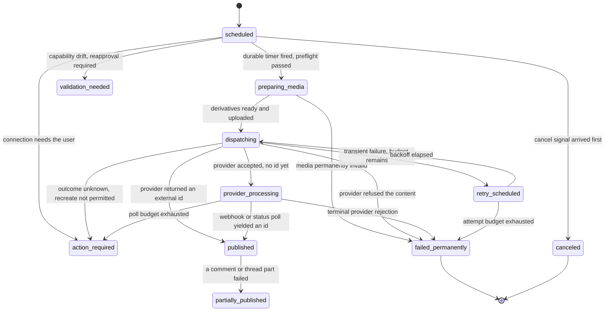

# @relay/worker

The Temporal workers and activities. Everything with an external side effect
that must survive a process restart runs here.

The targets this app exists to hit:

| Target | Where it is enforced |
| --- | --- |
| 99.5% of valid scheduled posts execute | retry policies, the attempt budget, `action_required` instead of a silent drop |
| p95 dispatch latency under 60 seconds | one durable timer per job, no polling loop between the timer and the create |
| **zero** duplicate creates | the design in "How one create stays one create", proven by `src/chaos` |

---

## The publish state machine

Fifteen states, defined once in `@relay/contracts` (`PUBLISH_TRANSITIONS`). The
worker never invents a state and never takes a transition the contract does not
allow. Both a campaign (the content item) and each per-target variant carry a
state; the campaign state is derived from its targets by `rollUpCampaignState`.



Three rules the code holds without exception:

1. **`published` requires provider evidence.** An external post id, or a
   permalink the provider returned. A 2xx from a media container step, an upload
   session or a "processing accepted" response is `provider_processing`. This is
   the single most important correctness rule in the product.
2. **A successful target is never rolled back.** If one target published and
   another did not, the campaign is `partially_published`. It is never relabelled
   failed while an external post exists.
3. **A failed first comment does not fail the root post.** The root stays
   `published`, the campaign becomes `partially_published`, and the comment item
   carries its own state and its own remediation.

---

## How one create stays one create

The create call is the only place in the system where a retry can produce a
second post that a user can see. Four mechanisms, layered, all exercised by
`src/chaos/duplicate-publication.test.ts`:

1. **The in-flight row is written first.** `beginPublishAttempt` records the
   attempt and its idempotency token **before** the network call, and reports
   back any publication a previous attempt already produced. A worker that dies
   mid-create finds its own footprint when the workflow resumes, adopts it, and
   transitions to `published` without calling the provider again.
2. **Temporal never retries the create.** `ACTIVITY_OPTIONS.publish` sets
   `maximumAttempts: 1`. A Temporal-level retry would re-enter the provider call
   without re-running the adoption check. The retry loop lives in the workflow
   instead, so every attempt begins with `beginPublishAttempt`.
3. **A provider without an idempotency token gets probed.**
   `ensureNotAlreadyPublished` searches by our token, or by recent posts on the
   account inside the attempt window, before the create runs.
4. **An unknown outcome is never assumed to be a failure.** If the probe cannot
   answer definitively and the connector declares `recreateOnUnknown: false`, the
   target goes to `action_required` with "we could not confirm whether this
   posted". A possible duplicate is worse than a possible manual retry.

A duplicated provider webhook is handled by `SignalInbox`: the first confirmation
for a target wins and later ones are discarded, so a redelivery cannot produce a
second receipt. Receipts themselves are idempotent on `(publishJobId, targetId)`.

---

## Workflow catalogue

| Workflow | Workflow id | What it owns |
| --- | --- | --- |
| `publishPostWorkflow` | `publish:{ws}:{job}` | the durable timer, campaign preflight, the roll-up. No provider call at all |
| `publishTargetWorkflow` | `publish:{ws}:{job}:{target}` | one target, one external post, its receipt and its analytics schedule |
| `threadSequenceWorkflow` | `thread:{ws}:{job}:{target}` | ordered comments and thread parts, each with its own delay |
| `repeatPostWorkflow` | `repeat:{ws}:{series}` | a cadence with an end date or a count, one receipt per occurrence |
| `analyticsSyncWorkflow` | `analytics:{ws}:{conn}[:{receipt}]` | provider-appropriate polling with deterministic jitter |
| `tokenRefreshWorkflow` | `token:{ws}:{conn}` | proactive refresh at 70% of credential life, incident on failure |
| `rssPollWorkflow` | `rss:{ws}:{feed}` | SSRF-safe polling, GUID / link / fingerprint dedupe |
| `automationRuleWorkflow` | `rule:{ws}:{rule}:{runKey}` | trigger, conditions, actions, cooldown, expiry, execution budget |
| `webhookDeliveryWorkflow` | `whd:{ws}:{delivery}` | signed delivery, exponential retry with jitter, dead-letter |
| `dataDeletionWorkflow` | `delete:{ws}:{request}` | cancel, revoke, delete objects, tombstone analytics |

Workflow ids are derived from the resource, so a duplicate start is a Temporal
no-op rather than a second post.

**Signals** every long-lived workflow understands: `cancel`, `pause`, `resume`,
`reschedule`, `killSwitch`, `providerConfirmation`.
**Queries**: `status`, which returns a `WorkflowStatusView` safe to show to an
operator or a user.

Cancellation during `dispatching` is honoured only while no provider call has
started. Otherwise the workflow completes the attempt, records the receipt, and
surfaces "this published before the cancellation took effect".

---

## Layout

```text
src/
  activities/
    types.ts          the activity contract: 43 signatures, ids and instants only
    index.ts          createActivities(): context, span, failure normalization
  workflows/
    core/*.core.ts    the deterministic bodies, written against WorkflowRuntime
    *.workflow.ts     thin Temporal entry points, one per registered workflow
    temporal-runtime.ts  the only file that imports @temporalio/workflow
    inputs.ts         workflow inputs and outputs
    outputs.schema.ts zod schemas for values crossing a child workflow boundary
  runtime/
    types.ts          WorkflowRuntime, SignalInbox, status views
    retry-policies.ts one policy per activity class
    deterministic.ts  hashing, jitter and backoff, all pure
  fallback/           the degraded inline scheduler for local development
  testing/            the virtual clock, the fake runtime and the simulator
  chaos/              the mandatory duplicate-publication suite
  worker.ts           bootstrap, mode selection, graceful shutdown
  main.ts             the process entry point and the application seam
```

### Why the bodies are not written against `@temporalio/workflow`

Every workflow body takes a `WorkflowRuntime`: a clock, a durable sleep, a
condition, child workflows and a signal inbox. Two implementations exist. The
Temporal adapter is the real one. The test harness is a virtual clock that runs
a thirty day timer in microseconds and never opens a socket.

The effect is that the logic is fully covered by fast tests, the Temporal file
stays small enough to read in one sitting, and a workflow body physically cannot
call `Date.now` or `Math.random`, because neither is in scope.

---

## Determinism

- No `Date.now`. Use `runtime.now()`.
- No `Math.random`. Use `jitterMs` or `backoffMs` from `runtime/deterministic.ts`,
  seeded from the workflow id.
- No IO of any kind in `workflows/core`. Activities only.
- No iteration over an unordered collection. Use `stableSort`.
- No `Promise.race` whose winner depends on wall-clock latency. Use
  `runtime.awaitCondition`, which is decided by workflow state.

Jitter is applied to analytics polling, token refresh and feed polling. It is
**never** applied to a publish instant the user chose.

---

## Adding a workflow safely

1. **Write the body in `src/workflows/core/<name>.core.ts`** against
   `WorkflowRuntime` and `WorkerActivities`. Export a
   `ChildWorkflowDescriptor` whose `name` matches the exported workflow function
   you are about to write. If it will be started as a child, add a zod schema in
   `outputs.schema.ts` and wire it as `parseResult`.
2. **Add any new activity** to `WorkerActivities` in `activities/types.ts`, to
   `ACTIVITY_NAMES`, to the right proxy group in `workflows/temporal-runtime.ts`,
   and to `createActivities` in `activities/index.ts`. Those four places are the
   whole change. Inputs carry identifiers and instants: never a token, never a
   post body, never an email address.
3. **Add the thin entry point** `src/workflows/<name>.workflow.ts` and export it
   from `src/workflows/index.ts`. The exported name is the workflow type name.
4. **Add a replay case** to `src/testing/replay.test.ts`. A workflow without one
   is not finished.
5. **If it touches publishing, add a chaos case.** Worker crash after the
   provider accepted, provider timeout, duplicated webhook, revoked token, DST
   transition, cancellation racing dispatch. Each asserts exactly one external
   create.
6. **Run `pnpm verify`.**

Changing an existing workflow that may have running executions is a different
problem: an old execution replays against new code. Either keep the change
behind `wf.patched`, or give the new behaviour a new workflow type and let the
old one drain.

---

## Testing

```bash
pnpm --filter @relay/worker test         # everything
pnpm --filter @relay/worker test -- chaos # the duplicate-publication suite
```

- `src/testing/virtual-clock.ts` is the scheduler: it advances virtual time only
  when the workflow has nothing left to do in the present, so a test never
  sleeps and a deadlock is reported rather than hanging.
- `src/testing/activity-simulator.ts` models the provider. `provider.createCount`
  is how many posts exist; `provider.callCount` is how many create calls were
  made. Asserting on both distinguishes "we never called twice" from "we called
  twice and got lucky".
- No test opens a socket, reads the filesystem or reads the wall clock.

---

## Running it

```bash
# durable, against the Temporal server in docker-compose
TEMPORAL_ADDRESS=localhost:7233 pnpm --filter @relay/worker start

# degraded, no Temporal server present
pnpm --filter @relay/worker start
```

Configuration comes from `loadConfigFor('worker')`. The task queue is
`TEMPORAL_TASK_QUEUE`, default `relay-publishing`.

### The inline fallback

When `TEMPORAL_ADDRESS` is unset or the server cannot be reached, the worker
starts `InlineScheduler`, which runs the same workflow bodies in process against
real timers. The product keeps working on a laptop.

It is honestly degraded and says so:

- it **throws** if `NODE_ENV=production`;
- its health check is always `fail`, never `warn`, so `/health` reports the
  service as down rather than healthy;
- it logs a warning naming the missing variable at start up and for every
  workflow it accepts;
- it does not survive a restart, does not deduplicate across processes, and does
  not support `continueAsNew`, so a repeating series runs one occurrence.

Never run it in production. Two copies of it would publish twice.

---

## The application seam

The worker declares what it needs (`WorkerActivities`, 43 methods) and
`@relay/application` implements it. `src/main.ts` is the only file that knows
that, and it loads the module by name so the worker is unit testable with no
application package present. Set `RELAY_WORKER_GATEWAY_MODULE` to point at a stub.

Every activity is verified callable at start up, so a misconfigured deployment
fails immediately with the missing activity named, rather than at 09:00 with a
missed post.
