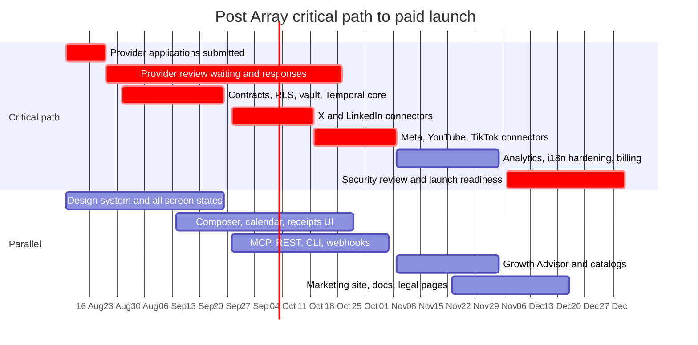

# 00. Executive Master Plan

Owner: founder / product lead. Status: approved baseline for V1 execution.
Written 4 August 2026. Source research: `docs/research/00`-`07`.
Every provider-dependent claim below is sourced from `docs/research/06-source-register.md`,
compiled 4 August 2026. Provider prices, policies and review requirements are volatile:
**re-verify before implementation** of the affected connector or billing path.

This document is planning only. It defines what we build, why, who decides what, and
what "done" means. `docs/planning/01-product-requirements.md` holds the functional
requirements and the traceability matrix.

---

## 1. Product vision

**Post Array is a multilingual social publishing control plane for people and agents.**

A user brings a brief or a finished asset, creates platform-native variants, gets them
approved once, publishes them reliably through official provider APIs, and sees exactly
what happened. The same workflow is available from five equal surfaces: the web app, a
REST API, a remote MCP server, a CLI, and signed webhooks. All five call the same
application services, the same authorization rules, the same validators and the same
Temporal workflows.

The category promise:

> Turn one sourced idea into platform-native content, approve it once, publish it
> reliably, and learn what to improve next.

Three commitments distinguish us from a scheduler:

1. **Nothing leaves the building unverified.** True previews, deterministic validation,
   an explicit approval policy, an immutable content version, and a publication receipt
   with the external post ID.
2. **Adapt, do not duplicate.** Explicit per-target variants and transcreation, never one
   master post truncated six ways.
3. **Agents are first-class but never privileged.** An agent gets scoped credentials and
   the same approval gate a human gets. There is no `publish_everywhere` tool.

`Post Array` is a working codename. The name decision is tracked in section 7.

---

## 2. Competitive position versus Postiz

Postiz validated the market. As of 4 August 2026, TrustMRR reports Stripe-verified MRR of
$182,430, 5,387 active subscriptions and $857,737 all-time revenue for Postiz, founded
July 2024 (source: TrustMRR Postiz profile, `06-source-register.md`; third-party display,
re-verify before quoting publicly). The founder has publicly disclosed roughly 17% churn
at about $20K MRR. That churn number is the strategic opening: when people stop
publishing, they stop paying.

Postiz is AGPL-3.0. **This is a clean room.** No Postiz code has been or will be copied,
adapted, linked or consulted. Behaviour is reconstructed from our own architecture, public
product observation and official provider documentation, each recorded with a retrieval
date in the source register.

### Where they are ahead

| Their strength | Our honest position at V1 |
| --- | --- |
| 30+ connectors listed | 6 target connectors, deep, with a published capability matrix. Icon count is not coverage. |
| Open-source distribution and GitHub discovery | Proprietary control plane. Connector SDK / MCP schemas / CLI open-sourcing is a V1.1 decision (section 7, D-07). |
| Established content and partner ecosystem | Starting from zero. Growth plan is `docs/research/04`. |
| Self-hosting option | Not offered. Managed only. |
| In-app AI image and video generation | Deliberately absent. See section 4. |

### Where we win

| Our differentiator | Why it matters commercially |
| --- | --- |
| One plan, 30 active channels, unlimited members, $29/mo or $300/yr | Postiz needs its $49 Pro tier for 30 channels. We are cheaper at the channel count agencies actually need, with no feature gate to explain. |
| Immutable publication receipts and attempt timelines | Turns "did it post?" support tickets into a self-serve screen. Directly attacks churn from lost trust. |
| Partial-success as a first-class state | Six targets, one fails: we never roll back the five that published or call the campaign failed. |
| Policy-aware Automation Rules instead of engagement Plugs | We can sell to brands and agencies whose platform accounts cannot risk a manipulation strike. |
| Multilingual depth: brand glossary, transcreation, locale approval | Postiz ships 14 active UI locales and literal translation. Transcreation with a brand glossary is a different product. |
| Governed agent surface: scoped grants, dry runs, approval levels 0-3, idempotency | Agent buyers are the fastest-growing segment and the one most damaged by an unsupervised publish. |
| Transparent metering: X pass-through at cost, shown before scheduling | "Unlimited X posting" is not a promise anyone can keep at $0.200 per URL post. |
| Explainable feedback with provider metric definitions and freshness | No black-box viral score. `Unavailable` is never rendered as `0`. |

### Positioning statement

For creators, lean multilingual brands, small agencies and agent-driven teams who need
publishing they can defend to a client or a platform, Post Array is the publishing control
plane that proves every post: one plan, one approval system, five surfaces, and a receipt
for everything. Unlike broad schedulers that compete on connector count and generated
media, we compete on correctness, safety and multilingual quality.

**We do not out-Postiz Postiz on connector count.** We win the first 1,000 paying
customers on reliability, safe agent publishing and multilingual quality, then compound
through the surfaces that reduce churn: API, MCP, CLI, workflow nodes and, later, embedded.

---

## 3. Scope

### 3.1 The one public plan

| Billing | Price | Effective monthly | Annual saving |
| --- | ---: | ---: | ---: |
| Monthly | $29/month | $29 | not applicable |
| Annual | $300/year | $25 | $48, or 13.8% |

No feature tiers. No Creator / Team / Pro / Agency split. Every subscriber gets every
shipped feature, 30 active channels, unlimited team members, and unlimited drafts and
standard scheduled posts under a published fair-use and anti-spam policy.

Approved marketing copy for the annual option: `$25/month billed annually, save $48/year`.
**Never `20% off`.** That label is not true for our prices.

Both intervals start a **seven-day full-product trial through Polar**. Polar collects a
payment method at checkout, charges `$0` at checkout, shows the exact conversion date and
amount, sends its reminder three days before conversion, and charges the selected
recurring price only if the customer has not cancelled (source: Polar trials docs,
`06-source-register.md`; re-verify before implementation). Entitlements are granted only
from verified Polar webhook state plus periodic reconciliation. **Never from the browser
redirect.** We do **not** claim a `$2 hold`: that statement is Postiz and
processor-specific and Polar's current documentation does not establish it.

Separately charged, always disclosed in advance: managed X API usage, passed through at
cost. As of 4 August 2026 X lists **$0.015 per post create** and **$0.200 per post create
containing a URL** (source: X API pay-per-use pricing, `06-source-register.md`; the X
developer console is authoritative and **prices must be re-verified before implementation
and before any pricing-page publication**).

Not sold, ever: AI image credits, AI video credits, an AI media add-on, lifetime access.

### 3.2 Stack (decided, not open)

Next.js 16 + React 19 + TypeScript (web), NestJS 11 (API), Supabase for
Postgres / Auth / Storage / RLS / selected Realtime, Temporal for durable publishing,
Redis or Valkey for rate limits, cache, short locks and idempotency acceleration, Polar
for billing, and DeepSeek `deepseek-v4-flash` behind a provider-neutral AI gateway.
pnpm workspaces + Turborepo. Node 22 LTS-compatible runtime.

Supabase over Neon because integrated auth, storage, Realtime and a first-class RLS model
remove weeks of assembly from a product already carrying social provider complexity. Neon
wins on branching; that is not our bottleneck. Supabase Realtime is for collaborative UI
updates, job status and presence **only**. It is never the scheduler. Temporal is the
scheduler.

### 3.3 V1 connectors

Target: **X, LinkedIn, Instagram, Facebook Pages, YouTube, TikTok.**
Launch fallback if provider approval delays a target: **Threads, Bluesky.**

A connector is not "supported" until `docs/connectors/definition-of-done.md` is satisfied.
"The provider does not support this" (`unsupported`) and "we have not built this yet"
(`not_implemented`) are different states with different UI treatments. Never conflate them.

### 3.4 Language scope, stated precisely

**30 content languages are planned. The shipped V1 interface is English only.**

The product is *built* for 30 locales: every string is an ICU message with a stable
intent-based key, layout uses logical CSS properties and tolerates RTL and 30-50% text
expansion, and a pseudo-locale runs in CI. Adding a locale is a catalog file plus a config
entry, not a refactor.

Public copy must always separate the two. Never write "the app supports 30 languages".
Approved forms: "English interface today, 30 content languages planned", or
"transcreation into 30 content languages; the interface is English at launch".

### 3.5 Included in V1 beyond the publishing core

Basic Growth Advisor, UGC planning, curated promotion opportunities (catalog-only, never a
model-invented URL), Creative Tool Radar (maximum five results, verified dates, affiliate
disclosure), and Markdown / JSON / YAML export from one validated schema.

### 3.6 Excluded from V1, deliberately

**No AI image generation and no AI video generation.** No endpoint, no UI affordance, no
entitlement, no quota, no usage meter, no dormant client, no marketing claim, no env var
that only a generator would need. Uploaded and imported media is fully supported:
upload, library, verified-URL import, validation, non-generative editing, crop, resize,
compression, thumbnails, alt text, provenance, scheduling and analytics.

Approved customer-facing explanation (no em dashes, use as written):

> We focus on helping you plan, approve, publish and learn. We do not generate images or
> video in V1 because brand-ready media needs more than a short prompt: it needs your
> complete visual system, accurate product details, licensed assets, people and usage
> permissions, and careful review. Creative models also change quickly. We recommend
> currently verified specialist tools and make it easy to bring their finished work into
> your campaigns while you keep creative control.

Also excluded from V1: social inbox and listening across every network, ads buying, a full
professional video editor, white-label embedded UI beyond an early API/SDK beta, and a
universal viral score that hides incompatible metrics.

### 3.7 Never, at any version

Browser automation, cookie replay, scraping, unofficial posting APIs, automated likes or
follows, unsolicited replies or DMs, engagement pods, spam replies, fabricated engagement,
fabricated UGC, manufactured backlinks, bulk directory submission. A request to build any
of these is rejected with an explanation, in product and in the roadmap.

---

## 4. The critical decisions and why

### D-A. One plan at $29/$300, no tiers

**Why.** Tiers exist to price-discriminate on channel count, which is exactly the axis
Postiz uses and exactly the axis that makes agencies churn when they add a client. One
plan removes the upgrade conversation, removes the comparison grid, removes the "which
tier has the API" support ticket, and makes the sales page a single decision.

**Cost.** We leave money on the table with 60-account agencies and we have no cheap entry
point for a one-channel creator. Accepted. Margin is protected through the disclosed
30-active-channel boundary and fair use, not through hidden feature gates.

**Guardrail.** Hold gross margin above 75% excluding passed-through X and provider usage.
If support or connector cost breaks that, adjust the *disclosed* channel or fair-use
boundary. Never introduce a feature tier.

### D-B. No AI media generation in V1

**Why.** Three independent reasons, all of which survive scrutiny. First, a short
onboarding description cannot reproduce a brand's visual system, product details, approved
claims, licensed assets and likeness permissions. Second, media models change monthly in
quality, price, latency, licensing and safety controls; hard-coding one buys permanent
churn. Third, generated media pulls in rights, consent, disclosure and provenance review
that must not hide behind a one-click scheduler button.

**Cost.** Postiz advertises AI image and video allowances on every tier. We will lose
deals to that line item. Accepted, and answered directly with the Creative Tool Radar plus
frictionless import of finished assets.

**Enforcement.** This is a CI-checkable rule, not a preference. See section 9, R-05.

### D-C. Temporal for durable publishing, from day one

**Why.** Scheduled publishing needs persistent timers, retries, idempotency, human pauses,
refresh-token recovery, platform-specific media processing and long-running analytics
collection. A cron table plus a Redis queue produces duplicate posts under worker crash,
provider timeout and webhook race conditions. Postiz's founder publicly described the
Redis-to-Temporal move as one of their best technical decisions. We start where they
ended up.

**Cost.** Temporal is real operational surface: workers, namespaces, replay tests on every
workflow change. Accepted, and it is why QA/platform ops is a named role, not a
part-time duty.

### D-D. Entitlements from verified Polar webhook state plus reconciliation only

**Why.** The browser redirect is attacker-controlled and unreliable. Granting access from
`?success=true` is the single most common billing vulnerability in this category.

**Implementation.** A `billing_webhook_inbox` table stores event ID, signature state, body
hash, receive and process timestamps, and result. Processing is idempotent. A scheduled
reconciliation job compares our `entitlements` against Polar subscription state and emits
a drift metric. Webhook delivery is not the only source of truth.

### D-E. Five surfaces, one authorization and approval system

**Why.** The moment the MCP server has its own publish path, it has its own bugs, its own
approval bypass and its own audit gap. Publishing logic lives in `packages/application`.
A Next.js route handler or a Nest controller that contains publishing logic is a review
blocker, not a style note.

**Test.** The same draft scheduled from web, API, MCP and CLI must produce receipts that
differ only in the `creation_surface` field.

### D-F. Curated catalogs, never model-invented URLs

**Why.** The single fastest way to destroy trust in a Growth Advisor is one plausible,
dead directory URL. The model returns catalog IDs and evidence IDs. A deterministic
post-processor rejects unknown IDs, invalid dates, unverified claims, results above the V1
caps (10 opportunities, 5 tools) and any action implying automatic submission. An empty
state is always better than an invented recommendation.

### D-G. Supabase, with security in reviewed SQL

**Why.** Supabase gives us auth, storage, Realtime and an RLS-native client model in one
integration. But an ORM cannot replace a security policy: RLS policies and grants live in
reviewed SQL migrations, and new tables are not exposed to the Data API by default. Token,
billing, entitlement, connector-secret and privileged scheduling tables are never reachable
from a browser client.

### D-H. X cost is metered and shown before the action

**Why.** X charges per operation and charges materially more for posts containing a URL.
A flat plan that silently absorbs $0.200 per link post loses money on exactly the users
who publish most. Show the estimated cost before scheduling and the reconciled actual cost
on the receipt. Copy pattern: "X estimates $0.20 API usage for this link post", not
"1 credit".

### D-I. English-only interface at V1, built for 30

**Why.** Twelve human-reviewed locales at launch would consume roughly four weeks of a
team of six and delay the connector critical path. Building the i18n discipline from day
one costs almost nothing; retrofitting it costs a rewrite. So we pay the cheap cost now
and defer the expensive one.

---

## 5. Assumptions

Each assumption names how we will know if it is wrong.

| # | Assumption | Falsified if | Owner |
| --- | --- | --- | --- |
| A-01 | Provider production approval for at least four of the six target connectors arrives within 12 weeks of week-1 submission | Fewer than four approved by end of week 12 | Founder |
| A-02 | X, LinkedIn, Meta, Google and TikTok pricing, scopes and review rules are as recorded on 4 August 2026 | Any re-verification before a connector starts contradicts the register | Technical lead |
| A-03 | $29/$300 clears 75% gross margin excluding X pass-through | Cohort unit economics after 60 days show otherwise | Founder |
| A-04 | Polar supports a seven-day trial on both intervals with payment method collected, `$0` at checkout, reminder and self-service cancellation | Polar sandbox behaviour differs from current docs | Backend, platform |
| A-05 | `deepseek-v4-flash` is available at the identifier and pricing recorded, with JSON output and tool calls | DeepSeek changelog retires or reprices the model | Technical lead |
| A-06 | A team of 5 to 7 can reach paid launch in 20 working weeks | Phase exit criteria slip twice consecutively | Technical lead |
| A-07 | Agent-native creators and small agencies will pay for governed publishing without generated media | Fewer than 8 of 25 design partners convert at trial end | Founder |
| A-08 | 30 active channels and unlimited members is a defensible fair-use boundary | Median support minutes per account exceed budget in beta | Founder |
| A-09 | Supabase RLS plus application authorization is sufficient tenant isolation without a separate database per tenant | Any RLS test suite gap or a real cross-tenant read | Technical lead |
| A-10 | The owner will populate opportunity and tool catalogs before public beta | Catalogs still empty at Phase 3 exit; ship the empty state and say so | Founder |

---

## 6. Recommended team

### 6.1 The 6-person baseline (recommended)

| Role | Code | Primary ownership |
| --- | --- | --- |
| Technical lead / architect | `TL` | Architecture, ADRs, Temporal workflows, security model, code review, provider technical review responses |
| Backend engineer, connectors | `BE-CONN` | Connector contract, X, LinkedIn, Meta, YouTube, TikTok adapters, capability snapshots, error taxonomy, provider simulators |
| Backend engineer, platform | `BE-PLAT` | Auth, tenancy, RLS, billing and Polar, media pipeline, short links, API, MCP, CLI, webhooks, AI gateway |
| Frontend engineer, product | `FE-PROD` | Composer, calendar, receipts, action center, approvals, analytics, settings, developer console |
| Frontend engineer, product + growth | `FE-GROWTH` | Design system implementation, onboarding, billing screens, Growth Advisor UI, marketing site, docs site |
| Product designer | `DES` | Flows, all screen states, design system tokens, accessibility, RTL and expansion tolerance, public site |
| QA and platform operations | `QAO` | Test strategy, RLS and duplicate-publication suites, Temporal replay tests, accessibility automation, CI/CD, observability, status page, runbooks |

The founder acts as product manager, catalog editor, legal and provider-approval owner.
That is a real half-time job in this product and it is on the critical path.

Seventh hire, if budget allows: a second `BE-CONN`. Connectors are the schedule risk and
they parallelize cleanly. Do not spend the seventh headcount on more frontend.

### 6.2 The 2-3 person variant: "Two connectors, one surface"

If the team is 2 to 3 people, **the scope must change, not the schedule**. Named variant:

| Change | Detail |
| --- | --- |
| Connectors | **X and LinkedIn only** at V1. Instagram, Facebook Pages, YouTube and TikTok become V1.1. Threads or Bluesky replaces one only if X or LinkedIn approval fails. |
| Surfaces | Web plus REST API plus **read-and-draft-only MCP** at V1. Consequential MCP tools, CLI and third-party OAuth developer console move to V1.1. |
| Growth Advisor | Strategy, four-week plan and export only. Opportunities and Tool Radar move to V1.1 and the tabs are absent, not empty-and-broken. |
| Automation Rules | RSS trigger and time trigger only. Analytics-threshold triggers move to V1.1. |
| Analytics | Account-level and post-level ingestion with definitions and freshness. Experiments and comparison move to V1.1. |
| Design | Buy a designer for 6 weeks rather than skipping design. The state matrix is not optional. |
| Timeline | 20 weeks becomes 26 to 30 weeks even with the reduced scope. Say so out loud at the start. |

What must **not** be cut at any team size: RLS on every tenant table, envelope-encrypted
token vault, idempotency on every write, immutable content versions, publication receipts,
audit log, Temporal durability, the approval system, WCAG 2.2 AA, and the AI-media
exclusion. Those are the product.

---

## 7. Open decisions

Every row has a named owner, a deadline and a recommended default that ships if no decision
is made by the deadline. There is no "TBD".

| ID | Open item | Decision owner | Deadline | Recommended default if undecided |
| --- | --- | --- | --- | --- |
| D-01 | Final product name, domain and trademark clearance | Founder | Fri 21 Aug 2026 (end week 2) | Keep `Post Array` as internal codename, register the best available `.com` at week 2, and ship under it. All copy is in `packages/i18n`, so a rename is a catalog edit. |
| D-02 | Legal entity, jurisdiction and counsel engagement | Founder | Fri 21 Aug 2026 | Single-member entity in the founder's jurisdiction, Polar as merchant of record handling sales tax and VAT, counsel engaged for Terms, Privacy, DPA and AUP review before public beta. |
| D-03 | Which fallback connector ships if a target is not approved by week 12 | Technical lead + founder | Fri 30 Oct 2026 (end week 12) | **Bluesky first** (lowest approval risk, official protocol), Threads second. Ship the fallback and label the delayed target `awaiting provider review` on the public capability page. Never label it `coming soon` without a date. |
| D-04 | Object storage: stay on Supabase Storage or add Cloudflare R2 | Technical lead | Fri 27 Nov 2026 (end week 16) | Stay on Supabase Storage for V1 behind the storage adapter. Move to R2 only when measured monthly egress exceeds $150. |
| D-05 | Temporal Cloud versus self-operated Temporal | Technical lead | Fri 18 Sep 2026 (end week 6) | **Temporal Cloud.** A 6-person team must not operate a Temporal cluster. Revisit at 2,000 workspaces. |
| D-06 | Fair-use numeric boundary published in the fair-use policy | Founder + technical lead | Fri 27 Nov 2026 | Publish soft limits: 500 external publications per workspace per day, 30 active channels, 90 scheduled comment or thread items per day. Exceeding triggers a conversation, not a silent block. |
| D-07 | Open-source the connector SDK, MCP schemas and CLI | Founder | Fri 26 Mar 2027 (V1 + 10 weeks) | Do not open-source at V1. Publish the MCP tool schemas and OpenAPI publicly as documentation. Revisit after 100 paying customers. |
| D-08 | Affiliate and referral commission rate, hold period and payout rail | Founder | Fri 27 Nov 2026 | 20% of the first 12 months of net revenue, 45-day refund and fraud hold, payouts through Polar where supported. Disclosure is mandatory and no commission is conditional on a positive review. |
| D-09 | Support coverage commitment published before checkout | Founder | Fri 4 Dec 2026 | Email and in-app support, one business day first-response target, business hours in one time zone, stated plainly. **Do not promise 24/7 or an SLA until staffing supports it.** |
| D-10 | Which 12 locales are human-reviewed first for V1.1 | Founder + design | Fri 12 Feb 2027 | English, Spanish, Portuguese, French, German, Italian, Japanese, Korean, Simplified Chinese, Arabic, Hindi, Indonesian (matches `03-product-ux-and-localization.md`). |
| D-11 | Analytics retention window offered to customers | Founder + technical lead | Fri 27 Nov 2026 | Retain metric observations from connection date for 24 months, configurable down per workspace, subject to provider terms. Publish it. |
| D-12 | Prepaid X usage balance versus post-paid pass-through | Founder + backend platform | Fri 13 Nov 2026 (end week 14) | **Prepaid balance** with a low-balance action-center item. It caps our credit exposure and makes the cost visible before the action, which the plan already requires. |
| D-13 | Whether a limited developer sandbox is public at launch | Technical lead | Fri 4 Dec 2026 | Yes. Sandbox with the fake provider, no live publishing, no payment method required. It is the cheapest developer acquisition surface we have. |
| D-14 | Beta labelling policy for a connector approved but thinly tested | Technical lead + QA | Fri 20 Nov 2026 (end week 15) | A connector that is approved but has not met the full definition of done ships labelled `beta` on the capability page with the exact missing capabilities enumerated. It is never labelled `supported`. |

---

## 8. Success criteria

### 8.1 Correctness gates (binary, must all pass to launch)

| Gate | Target |
| --- | --- |
| Valid scheduled post execution | **99.5%**, excluding provider outage, revoked user authorization, invalid content and account enforcement |
| p95 scheduler dispatch latency | **under 60 seconds** |
| Duplicate publications | **zero** across replay, worker crash after provider acceptance, provider timeout, duplicated webhook, revoked token at execution and DST transition tests |
| Cross-workspace data access | **zero**, with an RLS test per tenant table per role |
| Accessibility | **WCAG 2.2 AA** on every shipped screen, in both themes |
| Secrets in source | **zero**, enforced by secret scanning in CI |
| AI media generation surface | **zero** endpoints, UI affordances, entitlements, meters, dormant clients or marketing claims |

### 8.2 Product and commercial targets

| Metric | Launch target | 90 days after launch |
| --- | --- | --- |
| Signup to first verified publication | median under 10 minutes | median under 7 minutes |
| Design partners in beta | 25 recruited, 15 actively publishing | not applicable |
| Trial to paid conversion | 25% of trials that reach a first verified publication | 30% |
| Activation (first verified publication within 24 hours of signup) | 55% | 65% |
| Paying workspaces | 40 | 150 |
| Monthly logo churn | measured, not targeted | under 6% |
| Gross margin excluding X pass-through | above 75% | above 78% |
| Connectors meeting the full definition of done | 4 | 6 |
| Support minutes per paying workspace per month | measured | under 12 |
| P1 incidents (a publish path down) | 0 in the first 14 days | under 1 per quarter |

Do not report a metric we cannot source. Missing is `unavailable`, never `0`. That rule
applies to our own dashboards as much as to customer analytics.

---

## 9. Budget categories

Indicative monthly ranges for planning only. Not a quote. Re-verify every vendor price
before commitment.

| Category | What it covers | Pre-launch monthly | At 150 workspaces |
| --- | --- | ---: | ---: |
| People | 5 to 7 people, the dominant line by an order of magnitude | by far the largest | by far the largest |
| Managed data platform | Supabase Postgres, Auth, Storage, Realtime | $25 to $100 | $100 to $400 |
| Durable workflow | Temporal Cloud namespace and actions | $50 to $200 | $200 to $600 |
| Cache and rate limiting | Managed Redis or Valkey | $10 to $50 | $50 to $150 |
| Hosting and edge | Web, API, worker, MCP, links service, CDN | $50 to $200 | $200 to $700 |
| Provider API fees | X pay-per-use is **passed through at cost**, not absorbed. LinkedIn, Meta, Google and TikTok have no per-post fee today but do have quota ceilings. | $50 to $150 (testing) | pass-through plus test budget |
| AI inference | DeepSeek `deepseek-v4-flash` text only, with per-workspace cost budgets | $20 to $100 | $150 to $500 |
| Billing | Polar merchant-of-record fees, currently 5% + $0.50 per transaction on the Starter plan plus an international-card fee (re-verify) | transaction-based | transaction-based |
| Observability | Sentry, OpenTelemetry backend, PostHog, uptime and status page | $50 to $150 | $150 to $400 |
| Email | Transactional email for auth, approvals, receipts, billing | $20 to $50 | $50 to $150 |
| Security and compliance | Secret scanning, dependency scanning, KMS, an external penetration test before public beta | one-time test $5k to $15k | annual |
| Legal | Entity, Terms, Privacy, DPA, AUP, trademark clearance | one-time $3k to $10k | annual review |
| Design and brand | Contract design support, iconography, illustration if needed | project-based | project-based |
| Localization | Human review of 12 locales, deferred to V1.1 | $0 at V1 | project-based |
| Contingency | Provider rejection remediation, incident response, replatform of one connector | 15% of the above | 15% |

Cost-control rules that are product requirements, not finance preferences: per-workspace
AI cost budgets with hard timeouts, cost estimates shown before any metered provider
action, and a provider-cost-per-active-subscription dashboard from Phase 1.

---

## 10. Critical path

Week 1 is Monday 10 August 2026. A holiday freeze runs 21 December 2026 to 1 January 2027.

### Phase gates

| Phase | Dates | Exit criteria |
| --- | --- | --- |
| **0. Proof and applications** (weeks 1-2) | 10 Aug to 21 Aug 2026 | ADRs recorded for Supabase, Temporal, Prisma-plus-SQL-RLS, Polar, provider-neutral AI and clean room. Provider developer accounts created and **all six review submissions started**. Clickable UX prototype user-tested. One text connector and one video upload proven in sandboxes. Threat model and clean-room policy written. No unknown fatal provider restriction. |
| **1. Trustworthy core** (weeks 3-6) | 24 Aug to 18 Sep 2026 | Monorepo, CI/CD, environments, observability. Auth, workspaces, roles, invitations, RLS with a passing isolation suite. Media pipeline and immutable content-version model. Composer shell with per-target variants and validation. Temporal scheduling skeleton with idempotency and receipts. Polar sandbox and entitlement model. **An internal user can draft, approve, schedule, cancel and observe a simulated connector with full audit history.** |
| **2. Connectors and agents** (weeks 7-12) | 21 Sep to 30 Oct 2026 | X and LinkedIn first, then Meta; YouTube and TikTok in parallel subject to approval. MCP, REST, webhooks, CLI and the Codex / Claude Code / Hermes skills. Agent approval policies and scoped service accounts. DeepSeek draft, transcreation and preflight. **Closed alpha with four live connectors including at least one media connector, and an agent-created draft published through human approval.** |
| **3. Analytics and beta** (weeks 13-16) | 2 Nov to 27 Nov 2026 | Metric ingestion with definitions, freshness, comparisons and experiment tags. i18n hardening, RTL, accessibility and responsive passes. Connection health, status page, support runbooks. Usage meters and billing reconciliation. Basic Growth Advisor with versioned schemas and export. **25 design partners, a reliable two-week beta, deletion and export tested end to end.** |
| **4. Paid launch** (weeks 17-20 plus freeze) | 30 Nov 2026 to 8 Jan 2027 | Provider-review gaps closed or transparently marked beta or unavailable. Onboarding and time-to-first-publish optimized. Public docs, examples, changelog, roadmap and status. Security review, legal review and an incident simulation completed. **Every section 8.1 gate green.** |

**Target paid launch: Tuesday 12 January 2027.**

### The three true critical-path items

1. **Provider approvals.** Started week 1, not week 7. LinkedIn Community Management review
   needs business verification and a demo recording. Meta needs app and business
   verification. YouTube unaudited projects can only upload privately. TikTok unaudited
   posts are private and creator-info and consent UI must be implemented before review.
   Every one of these is a multi-week external dependency we do not control. Prepare the
   review assets in week 1: public product URL, Terms, Privacy, AUP, data deletion, support
   contact, verified company and domain, screen recordings of OAuth, connection choice,
   composer, explicit consent, privacy controls, preview, publish, analytics, disconnect
   and deletion, and reviewer accounts with safe seeded data. No dead links, no placeholder
   legal text, no permissions requested for future features.
2. **Contracts and the durable core.** `packages/contracts` (connector, capability, draft,
   receipt, error, metric, entitlement schemas) blocks every other package. It is ticket 3
   in `02-development-handoff.md` for a reason. Nothing else parallelizes until it lands.
3. **The fake provider.** The composer, the Temporal workflow, the receipt UI, the MCP
   tools and the CLI are all built and tested against the in-repo provider simulator before
   any real adapter exists. If the simulator slips, everything downstream slips.

---

## 11. Major risks

Scored as probability x impact. Every risk has a named owner and a specific mitigation,
not a monitoring intention.

| ID | Risk | P | I | Owner | Mitigation | Trigger and response |
| --- | --- | --- | --- | --- | --- | --- |
| R-01 | A target connector is rejected or delayed past week 12 | High | High | Founder | Applications in week 1. Six applications in flight for six slots. Fallbacks (Bluesky, Threads) built against the same connector contract. | At week 12, invoke D-03. Ship the fallback and mark the target `awaiting provider review` with the exact blocking requirement stated. |
| R-02 | Duplicate publication reaches a customer account | Low | Critical | Technical lead | Deterministic Temporal workflow IDs, unique publish idempotency key per workspace, unique external post ID per provider account, status query before any create retry, mandatory duplicate tests on every publishing change. | Any duplicate in staging halts the release train until root-caused. In production it is a P1 with customer notification. |
| R-03 | X pricing changes and breaks unit economics | Medium | High | Founder | Cost is passed through at cost, never absorbed. Estimates shown before scheduling; actuals reconciled on the receipt. D-12 prepaid balance caps exposure. | Any X price change triggers same-day pricing-page and in-app copy update and a customer notice. |
| R-04 | Cross-tenant data leak | Low | Critical | Technical lead | Tenancy enforced three times: edge authentication, application authorization, PostgreSQL RLS. RLS test per table per role. External penetration test before public beta. | Any leak is a P0: revoke, notify, publish an incident report. |
| R-05 | AI-media exclusion erodes through a "harmless" experiment | Medium | High | Technical lead | CI check that fails the build on generation-related identifiers, endpoints, entitlement keys, meter names and marketing strings. It is a merge blocker. | Any CI hit is reverted, not waived. Reintroduction requires a written product decision, not a pull-request comment. |
| R-06 | Growth Advisor emits an invented URL or an unverified claim | Medium | High | Founder | Model returns catalog IDs and evidence IDs only. Deterministic post-processor rejects unknown IDs, invalid dates, over-cap results and any auto-submission implication. Empty state ships if the catalog is empty. | Any invented URL in evaluation blocks the Advisor from beta until the post-processor is fixed. |
| R-07 | Temporal operational complexity overwhelms a small team | Medium | Medium | QA and platform ops | Temporal Cloud (D-05). Replay test on every workflow change. Runbooks before beta, not after the first incident. | Two consecutive workflow incidents triggers a dedicated hardening week. |
| R-08 | Scope creep from connector requests during beta | High | Medium | Founder | Connector scorecard, not instinct. No connector is added in V1 after week 7. Requests go on a public roadmap. | Any new-connector request in V1 is answered with the roadmap link, not a ticket. |
| R-09 | Polar trial behaviour differs from documentation | Low | High | Backend, platform | Full sandbox rehearsal of trial start, reminder, conversion, cancellation, failed payment and repeat-trial abuse prevention in Phase 1, not Phase 4. | Any divergence updates the pricing-page and checkout copy before launch. Never ship copy that the payment flow does not deliver. |
| R-10 | An accessibility or i18n retrofit at the end | Medium | Medium | Design | WCAG 2.2 AA is a merge requirement per screen. Pseudo-locale in CI from Phase 1. Logical CSS properties enforced by lint. | Any screen merged without its state matrix and contrast check is reopened. |
| R-11 | Founder capacity becomes the bottleneck (catalogs, legal, provider reviews, support) | High | High | Founder | Timebox: catalogs are seeded with a small verified set, not a complete one. Legal is delegated to counsel. Provider review responses are drafted by the technical lead. | If two phase gates slip on founder-owned items, hire contract support for catalog editorial. |
| R-12 | Churn repeats the category pattern (people stop publishing, they stop paying) | High | High | Founder | Retention comes from surfaces, not features: API, MCP, CLI, n8n node, webhooks, receipts that become an audit record. Analytics and Growth Advisor give value in weeks a customer does not publish. | Measure workflow-surface adoption per cohort from day one. Under 30% adoption at 90 days is a product problem, not a marketing one. |

---

## 12. Launch recommendation

**Build it. Launch paid on Tuesday 12 January 2027, with a 6-person team, the six target
connectors in flight from week 1, and every scope boundary in this document held.**

The reasoning is three sentences long. Postiz proved a small company can take real revenue
in this category by changing the distribution and the interface rather than the feature
list, and their own disclosed churn shows where they are weak. Our differentiation is
correctness, safety and multilingual quality, all of which are engineering decisions we
control, unlike connector count which is gated by other companies' review queues. The
single plan at $29 and $300 with 30 channels and unlimited members is a genuinely simpler
offer than a four-tier grid, and it is defensible because we are not paying for image and
video generation.

### Launch on these conditions, and not otherwise

1. Every gate in section 8.1 is green. These are binary. A 98% execution rate is a
   no-launch, not a rounding difference.
2. At least **four** connectors meet the full definition of done. Anything approved but
   thin ships labelled `beta` with the missing capabilities enumerated (D-14).
3. Support, status, refund and cancellation, fair-use and provider-cost pages are
   **published before checkout is enabled**. Not after. A customer must be able to read
   what they are buying before paying.
4. Terms, Privacy, DPA and AUP have been reviewed by counsel.
5. An external penetration test has been completed and its findings are closed or
   explicitly accepted in writing.
6. The pricing page contains only the two intervals and no comparison grid, the annual
   copy reads `$25/month billed annually, save $48/year`, and the words `20% off` and
   `$2 hold` appear nowhere in the product or the site.

### Launch shape

Do not run a big-bang public launch. Run this sequence:

1. **Closed alpha** at Phase 2 exit: 10 hand-picked users, four connectors, daily contact.
2. **Design-partner beta** through Phase 3: 25 partners, free during beta, two-week
   stability requirement before anyone is charged.
3. **Paid launch** on 12 January 2027 to the beta list and the waitlist first, with
   monitored canaries and a rollback plan per connector.
4. **Public launch** (Product Hunt, directories, workflow ecosystems, agent directories)
   two weeks after paid launch, once the first cohort has published without a P1.

Publishing under someone else's brand name is a promise. Make it once, keep it every time,
and prove it with a receipt.
