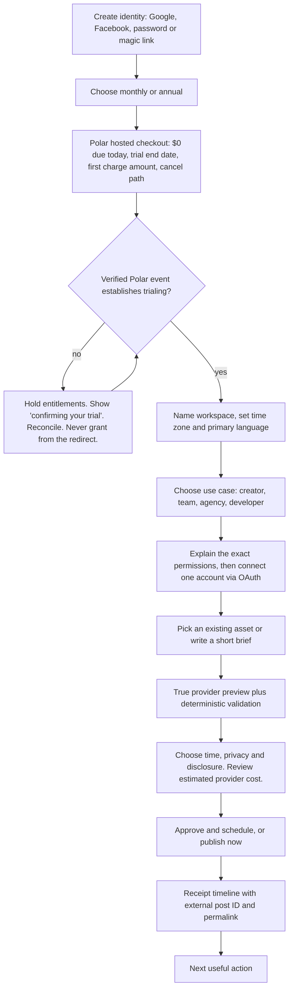
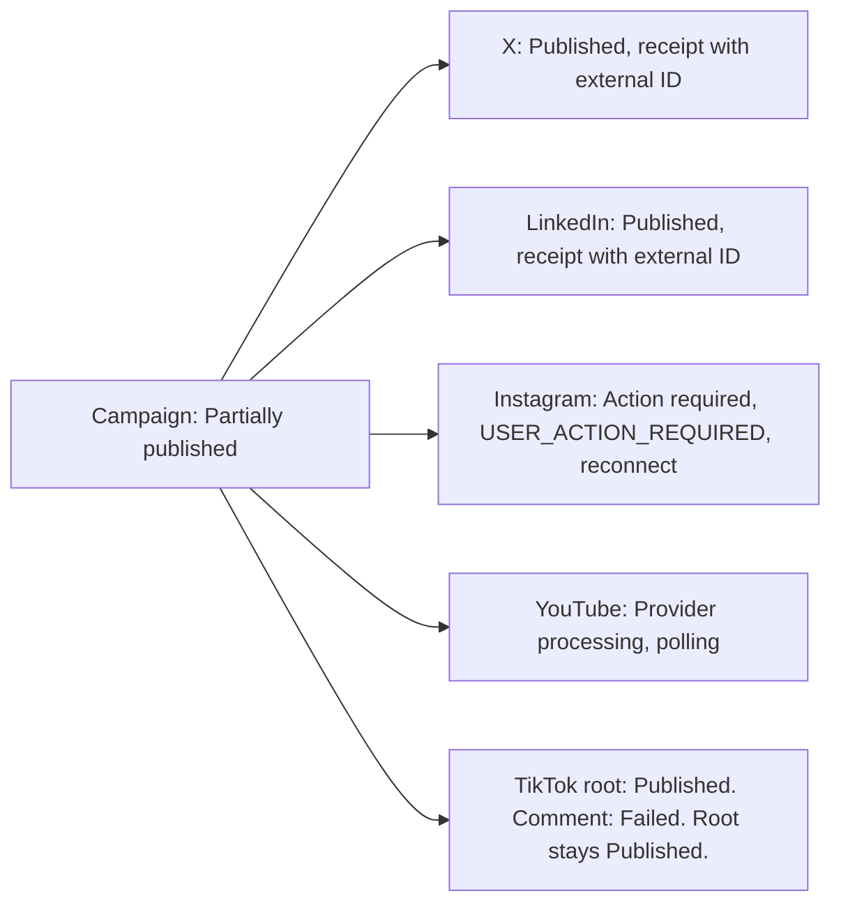
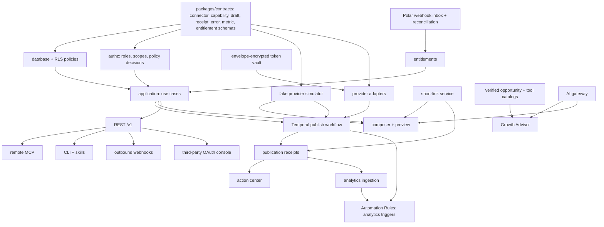

# 01. Product Requirements

Owner: founder / product lead. Status: approved baseline for V1 execution.
Written 4 August 2026. Companion to `docs/planning/00-executive-master-plan.md`.
Authoritative scope: `docs/research/07-feature-parity-and-product-behavior.md`.
Build specification: `docs/research/02-development-handoff.md`.
Provider claims are sourced from `docs/research/06-source-register.md`, compiled
4 August 2026. Volatile claims are marked **re-verify before implementation**.

Read this if you are implementing a feature. Section 9 is the traceability matrix: it maps
every row of the pricing-page feature matrix and every launch acceptance checklist item to
a phase, an owner, a dependency, acceptance criteria and a test approach.

---

## 1. Personas and jobs to be done

The four initial ideal customer profiles from `docs/research/04-marketing-and-growth.md`
section 3. Do not design for enterprise social teams. Their listening, inbox, compliance
archiving, procurement and SSO/SCIM requirements will consume the roadmap before we have
product-market fit.

### A. Agent-native technical creator

Solo founder, developer advocate, AI educator or product builder. Lives in Codex, Claude
Code, Hermes, Markdown, GitHub, n8n and APIs. Publishes to X, LinkedIn and increasingly
YouTube, TikTok and Instagram.

| Job to be done | What success looks like | What we must not do |
| --- | --- | --- |
| "Publish from where I already work, without opening a dashboard" | An MCP tool call or a CLI command produces a real scheduled post with a receipt | Make MCP a thin second-class wrapper with different rules |
| "Let my agent draft, but never let it surprise me" | Approval levels 0-3, dry run, scoped service account, per-agent kill switch | Ship a `publish_everywhere` tool or an agent that publishes by default |
| "Know what a post actually cost me" | X cost estimate before scheduling, reconciled actual on the receipt | Show "1 credit" |
| "Reproduce my workflow in a repo" | Stable `--json` CLI output, YAML plan export, OpenAPI, versioned MCP schemas | Emit unstable shapes that break a committed script |

Buying trigger: an agent workflow that currently ends in a manual copy-paste.

### B. Multilingual creator or lean brand

Publishes across two or more languages or markets. Pain is literal translation,
inconsistent voice, repetitive cross-posts and scattered analytics.

| Job to be done | What success looks like | What we must not do |
| --- | --- | --- |
| "Adapt one idea into five markets without sounding translated" | Transcreation with a brand glossary, forbidden idioms, honorifics, protected product names, and a rationale when there is no clean local equivalent | Call machine translation "native copy" |
| "Keep each market's link and CTA correct" | Per-locale CTA and link destination, per-market UTM, per-market short link | Silently reuse one destination everywhere |
| "See which market responded, in that market's terms" | Per-locale analytics with provider definitions and freshness | Roll five markets into one cross-platform leaderboard |
| "Approve the Japanese version before it publishes" | Locale-scoped approver role | Let a non-speaker approve a locale they cannot read |

Buying trigger: a mistranslated post that reached a real audience.

### C. Small content or automation agency

3 to 15 people, 10 to 60 social accounts, many approvals, client reporting.

| Job to be done | What success looks like | What we must not do |
| --- | --- | --- |
| "Keep client A's accounts and data away from client B" | Customer groups, brand scoping, per-brand roles, RLS-enforced isolation, moving an account preserves its history | Rely on UI filtering for isolation |
| "Get client sign-off without giving them a seat" | Approval request with a scoped shareable link, decision recorded and attributed | Ask a client to create an account to click approve |
| "Prove to the client that it published" | Publication receipt with external post ID, permalink, content hash, timestamps, approver and attempt history, exportable | Show a green checkmark and nothing else |
| "Add a client without a pricing conversation" | 30 active channels and unlimited members on one plan | Gate members or connectors behind a tier |
| "Not get a client's account restricted" | Policy-aware Automation Rules, cadence and duplicate checks, no engagement manipulation available at all | Ship auto-like, auto-follow or coordinated reposting |

Buying trigger: an approval thread lost in email or Slack.

### D. SaaS or workflow builder (post-V1 target)

Wants social publishing inside its own product without becoming a platform API expert.

| Job to be done | What success looks like | What we must not do |
| --- | --- | --- |
| "Let my users connect their own accounts through my product" | Third-party OAuth app, PKCE, exact redirect allowlist, granular scopes, consent screen, revocation | Issue one long-lived all-powerful workspace token |
| "Never explain a platform API error to my users" | Six-class error taxonomy with user-safe remediation copy | Leak a raw provider payload into a user-facing message |
| "Bill my users, not absorb surprises" | Usage events, cost estimates, disclosed pass-through | Absorb X cost silently |

Buying trigger: their second customer asking for scheduled posting.
Highest switching cost, potentially lowest churn. Their full embedded product is post-V1.

---

## 2. Functional requirements

Requirement IDs are stable and are referenced from the traceability matrix in section 9,
from tickets, and from tests. Every requirement below is V1 unless marked otherwise.

### 2.1 Identity, tenancy and authorization

- **FR-001** Sign in with Google, Facebook, email and password, and email magic link or OTP,
  through Supabase Auth. Password sign-in uses breached and common-password controls where
  available.
- **FR-002** Username alias login. A username is a verified alias to an existing
  email-and-password identity resolved by a server-only endpoint. Normalize with Unicode
  NFKC and a conservative lowercase policy, reserve confusable and system names, rate-limit
  heavily, and return an identical response for existing and non-existing aliases so the
  endpoint cannot enumerate accounts. A username is never sufficient without the password
  or a second factor.
- **FR-003** Workspaces with owner, billing customer, default locale and time zone.
- **FR-004** Brands within a workspace carrying voice, audience, approved claims, blocked
  terms, locale rules, domains and disclosure defaults.
- **FR-005** Customer groups: group connected accounts by brand or client, filter calendar
  and analytics by group, scope roles per group. Moving an account between groups preserves
  its full history and receipts.
- **FR-006** Roles: owner, admin, manager, editor, approver, analyst, viewer. Unlimited
  members. Every action is attributed to an actor.
- **FR-007** Invitations with expiry, revocation and role preselection.
- **FR-008** Authorization is enforced three times: authentication at the edge,
  authorization in the application service, tenant isolation in PostgreSQL RLS. "The user
  is logged in" is never a policy. Every tenant-owned row carries `workspace_id` and is
  reached through a workspace-scoped repository, never a bare Prisma client.
- **FR-009** Audit log of actor type and ID, action, target, before and after hashes, IP
  and user agent where appropriate, and correlation ID. Privileged reads of tokens and
  customer data are audited.
- **FR-010** MFA required for workspace owners and for service-account creation, billing
  changes, social reconnection, and token export or revocation, where the provider supports
  it. Passkeys are V1.1.
- **FR-011** Per-workspace emergency kill switch and one-click revoke and disconnect.

### 2.2 Connections and connectors

- **FR-020** Connect, reconnect, pause, inspect permissions and disconnect up to **30 active
  external identities** per workspace. One channel is one connected profile, Page, channel,
  group, publication or other external posting identity.
- **FR-021** Every connector implements the versioned `SocialConnector` interface defined in
  `02-development-handoff.md` section 7.
- **FR-022** Capability snapshots are **data, not code**. They record account-specific
  limits for text length, media counts, types, sizes, aspect ratios, thumbnails, title and
  description, privacy choices, destinations, mention lookup and native tagging, first
  comments, threads, drafts, analytics, delete, and AI-disclosure controls. The snapshot
  version used at approval is stored, and capabilities are revalidated immediately before
  publish.
- **FR-023** A capability we have not built is `not_implemented`. A capability the provider
  does not offer is `unsupported`. These render differently in the UI and on the public
  capability page. Never label a connector `supported` until
  `docs/connectors/definition-of-done.md` is satisfied.
- **FR-024** Connection row shows platform and exact account identity, connected by and
  date, permission and capability summary, token health and expiry when knowable, last
  successful post, last analytics sync, production or beta limitation, and the actions
  reconnect, inspect permissions, pause, disconnect.
- **FR-025** Public capability matrix generated from versioned connector metadata and
  manually reviewed, so marketing cannot promise what an adapter cannot deliver.
- **FR-026** Six-class provider error taxonomy: `USER_ACTION_REQUIRED`, `CONTENT_INVALID`,
  `TRANSIENT_PROVIDER`, `PERMANENT_PROVIDER`, `INTERNAL`, `UNKNOWN`. Only known-safe
  transient operations are retried. When provider idempotency is unavailable, query status
  or external ID before repeating a create.
- **FR-027** `connection_incidents` records invalid token, permission loss, review
  restriction and the user remediation taken.

### 2.3 Composer and content

- **FR-030** One canonical master draft. A clearly labelled `Global edit` writes compatible
  fields to all selected targets. Opening a target creates an explicit override that does
  not change the master or any other target. `Reset to master` removes the override after
  confirmation. Inheritance and override state is always visible.
- **FR-031** Every target shows state: ready, inherited, overridden, warning, or error.
  Selecting multiple targets never conceals divergence. `Apply to all` states exactly which
  fields are compatible before applying.
- **FR-032** Live per-provider, per-account character and media limits shown near the
  relevant field and in the account rail, sourced from the versioned capability snapshot.
  Warning before the limit. Deterministic validation at schedule time and again at dispatch.
- **FR-033** Native mention resolution. A mention search resolves to a provider external ID
  and stores it. A plain-text display string is never published as if it were a native tag.
  Capability and permission errors are visible.
- **FR-034** Native destination selection where the official API permits it: X communities,
  LinkedIn organizations, Facebook Pages and groups, YouTube channel and privacy, and other
  connector destinations. Destinations are stored by provider external ID with a refresh
  time.
- **FR-035** True per-target preview showing the root post and each ordered comment or
  thread item.
- **FR-036** Immutable `content_versions`. Every publish attempt references one. Content is
  never silently changed after approval; reapproval is required when content, account,
  locale, media, disclosure, privacy, time or target changes beyond workspace policy.
- **FR-037** Comment and thread sequences. Each subsequent item can override author account,
  copy, media and delay where the provider permits. Delay presets 1, 2, 5, 10, 15, 30, 60
  and 120 minutes plus a custom duration. Execution time is shown with the time zone.
- **FR-038** Repeated posts with cadence plus an end date or occurrence count, edit-next and
  edit-series controls, a maximum repetition ceiling, cancellation, duplicate and policy
  checks, and an independent receipt per occurrence.
- **FR-039** Posting Sets: a reusable saved group of target accounts, platform copy or
  placeholders, media placement rules, platform privacy and settings, first-comment and
  thread skeletons with delays, signature choice, approval policy and preferred slot
  behaviour. Applying a Set creates an independent editable draft. Editing a Set never
  changes an already approved or scheduled post.
- **FR-040** Signatures scoped by brand, platform and locale, containing approved closing
  text, hashtags, links, disclosures or CTA. One can auto-add by context. The exact applied
  signature becomes part of the immutable content version and is never duplicated on edit or
  retry.
- **FR-041** Autosave with visible saved, offline and conflict state. An offline draft is
  never lost.
- **FR-042** Non-generative picture editor: crop, resize, rotate, format conversion,
  compression, canvas and background, platform aspect presets, thumbnail and alt text. The
  edited asset is versioned, the original is preserved, and platform validation reruns.
- **FR-043** Media pipeline: direct signed uploads, MIME sniffing rather than trusting
  extensions, SHA-256 checksum and duplicate detection, malware scan, decompression-bomb
  limits, `ffprobe`-class metadata extraction in an isolated worker, rights and consent
  declaration, platform validation before approval and again before publish, derivatives
  generated only as required, signed short-lived fetch URLs. No product watermark is ever
  inserted into content destined for TikTok. Alt text is required or explicitly waived where
  the platform supports it.
- **FR-044** Cross-posting: choose several accounts and create explicit native variants.
  Blind identical posting is not offered. Partial success is handled honestly (FR-060).

### 2.4 Scheduling, approval and publishing

- **FR-050** Calendar with day, week, month and list views. List view filters by scheduled,
  draft, published and failed. Week is the default for teams; list or agenda is the default
  on small screens.
- **FR-051** Drag to reschedule produces a confirmation showing exact before and after time
  and warns about DST transitions and campaign conflicts. A keyboard and list alternative
  exists for every drag operation. No content is lost.
- **FR-052** Time is stored as an ISO instant plus an IANA time zone. Never a naive local
  time. A schedule is never computed in the browser's time zone.
- **FR-053** Approval requests and decisions, with an approval policy per workspace and per
  brand, and a scoped shareable approval link for a stakeholder without a seat.
- **FR-054** Durable publishing on Temporal, exactly as specified in
  `02-development-handoff.md` section 9: save the immutable version, validate and estimate
  cost, obtain approval, create a `publish_job` with a deterministic workflow ID, sleep
  durably to the UTC instant, revalidate connection, capabilities, content, media, cadence,
  entitlement and approval policy, prepare media, publish with an idempotency token where
  supported, confirm through response or polling or webhook, store the receipt, notify, then
  schedule analytics fetches.
- **FR-055** Idempotency on every write. A unique publish idempotency key per workspace, a
  unique external post ID per provider account, and an outbox for every database-to-workflow
  and webhook transition.
- **FR-056** `Published` requires an external ID or equivalent provider evidence. A 2xx from
  a media-container step is not `Published`.
- **FR-057** Cancel, pause and reschedule are explicit workflow signals.
- **FR-058** Deterministic jitter is used only for analytics polling, never for a user's
  chosen publish time.
- **FR-059** The full state model on both the campaign and each platform target: Draft,
  Validation needed, Approval requested, Approved, Scheduled, Preparing media, Dispatching,
  Provider processing, Published, Partially published, Action required, Retry scheduled,
  Failed permanently, Canceled, Deleted externally.
- **FR-060** Partial success. When one target succeeds and another fails, the campaign is
  `Partially published`. Never roll back a successful target. Never label the campaign
  failed without naming the external posts that already exist. A failed comment never marks
  an already-published root post as failed.
- **FR-061** Publication receipt showing provider, account, external post ID, permalink,
  content and media version and checksum, scheduled local time and time zone, actual
  dispatch and publish time, creation surface (web, API, MCP, CLI, RSS, automation rule),
  human or policy approval, provider cost estimate and actual charge where applicable,
  attempt history with sanitized provider responses, retry and remediation, the root post
  plus each delayed comment or thread item, and the latest analytics sync time. Authorized
  roles can download or share the report.
- **FR-062** Action center, one queue for: connection expires soon, connection refresh or
  review or role required, draft fails provider validation, approval overdue, schedule
  conflict or cadence warning, provider outage or processing delay, root published but a
  comment or thread segment failed, analytics unavailable or stale, RSS feed invalid or
  stalled, webhook delivery failing, usage balance needed for a metered provider action.

### 2.5 Automation

- **FR-070** Automation Rules replace Postiz's Internal and Global Plugs. Sentence builder:
  `When [trigger], if [conditions], then [actions], after [delay], until [end condition]`.
  An advanced structured editor and an API representation are available.
- **FR-071** Triggers: specific time or next approved slot, new RSS or Atom item, inbound
  authenticated webhook, new media or content imported through the API, post published or
  failed or partially published, scheduled comment or thread item completed or failed,
  analytics threshold where provider policy permits the follow-up action, connection expiry
  or refresh required, manual or API or MCP or CLI command, recurring cadence with an end
  date or count.
- **FR-072** Conditions: brand, campaign, account, platform, locale, content type, time and
  day and time zone and quiet hours, approved content status, minimum and maximum engagement
  threshold, time since publication, domain or hashtag or keyword presence, duplicate and
  similarity and cadence budget, provider capability, connection health, plan status, usage
  balance.
- **FR-073** Actions: create draft from template or source, adapt or transcreate text with
  DeepSeek, add signature or UTM or disclosure or approved first comment, request human
  approval, schedule or publish through the configured approval policy, wait and continue a
  thread sequence, notify workspace or email or webhook, pause a rule or connection on
  failure, repost or quote or follow-up comment only where the official API and platform
  policy allow and the user explicitly preauthorized it, and publish a prewritten follow-up
  from another connected account only when both accounts are owned and authorized, the
  provider allows it, the relationship is not presented as independent endorsement, and
  cross-account duplicate and cadence checks pass. This last action defaults to off.
- **FR-074** Before activation the rule screen shows affected accounts and the maximum
  possible external actions, an example execution, required approvals, provider restrictions
  and estimated metered cost, cadence and duplicate impact, and failure and pause behaviour.
- **FR-075** Every rule supports draft mode, a test event, pause, version history, recent
  runs, errors and a kill switch.
- **FR-076** Engagement-threshold rules require a measurement window, an expiry, a cooldown
  and a maximum execution count. Defaults: run once per source post, and do not execute if
  the metric is unavailable or stale. A milestone comment or repost gets a normal preview and
  a normal publication receipt. Reaching a threshold never bypasses approval or provider
  policy.
- **FR-077** Disallowed actions are not selectable for an incompatible provider. A request to
  build auto-like, auto-follow, unsolicited DMs or replies, trend manipulation, mass
  duplicate posting or browser and cookie automation is rejected with an explanation.
- **FR-078** RSS autopost: enter an RSS or Atom URL, server-side SSRF-safe validation showing
  feed title, latest items, images and timestamps, choose whether the current latest item
  counts as already seen, target all or specific channel groups, map fields into a template
  or ask DeepSeek to adapt the text, choose draft or approval or next free slot or fixed
  cadence or immediate publishing, GUID and link and content fingerprinting so an item is
  never republished unintentionally, and a feed-health view showing last poll, last new
  item, last created draft or post, and errors. **No image is generated.**

### 2.6 Links

- **FR-080** Detect URLs in root copy and in comment and thread items. Offer `Keep original`,
  `Track with short link`, UTM editing and branded-domain choice. Brand defaults are
  overrideable. Link shortening is explicit, never an invisible text mutation.
- **FR-081** Verify custom link domains through DNS before use. Default short-link domains
  are isolated from the main app and session domain, served by the separate `apps/links`
  service.
- **FR-082** At approval, freeze destination, UTM values and the exact public short URL into
  the immutable content version. The receipt records which link appeared on each platform.
  Changing a destination is an audited action and never silently alters historical reporting.
- **FR-083** The redirect service blocks unsafe schemes, localhost and private-network
  destinations, known abuse, credential and phishing destinations, and open-redirect chains.
  It supports expiry, emergency disable and an abuse-report path.
- **FR-084** Click analytics show total requests, deduplicated human clicks, suspected bots,
  a time series, coarse referrer, device and country classes, and destination history. Raw
  IP is not stored beyond the short security and deduplication window.
- **FR-085** First-party redirect clicks and provider-native link clicks are separate labelled
  data series with separate definitions. Neither is ever substituted for the other.

### 2.7 Analytics and feedback

- **FR-090** Account-level metrics, collected only where the provider officially returns them:
  followers or subscribers and change, profile or Page or channel views, impressions, reach,
  total video views and watch metrics, likes and reactions, comments and replies, shares and
  reposts and quotes, saves and bookmarks, link and profile clicks, published content count.
- **FR-091** Post-level metrics: impressions, reach, views and video plays, likes and
  reactions, comments and replies, shares and reposts and quotes, saves and bookmarks, link
  clicks and click-through rate where officially available, watch time, average view duration
  or percentage, and subscriber or follower change where supported.
- **FR-092** Store provider metric name, provider definition, observation timestamp, raw
  value, normalized label, unit and freshness. Preserve the raw provider response hash.
  Normalize only where definitions are meaningfully compatible. Show provider-specific
  denominators, because engagement rate may be per impression, reach, view, follower, or
  unavailable.
- **FR-093** A missing permission or unsupported metric renders as `Unavailable`, never `0`,
  and states why. No fabricated or unlabelled estimated metric. No universal viral score.
  Respect provider restrictions on combining or deriving API data.
- **FR-094** Feedback is framed as observations and experiments, never causality. Example
  approved phrasing: "This post received 42% more views than your median of the previous 10
  comparable posts", "Image posts and video posts are not directly comparable here", "The
  sample is small; test the hook again", "Comments increased after the first-comment delay
  changed from 30 to 5 minutes, but this does not prove causation."
- **FR-095** Users can tag experiments before publishing, with a hypothesis, variants, a
  success metric, a window and caveats, so analysis is not entirely post hoc.
- **FR-096** Three comment capabilities are labelled separately because provider support
  differs: (1) schedule a first comment or thread item, (2) read comment count, (3) fetch and
  reply to individual comments. V1 ships (1) and (2) wherever approved. A unified comment
  inbox with replies is V1.1 or later, connector by connector, through official APIs only.

### 2.8 AI (text only)

- **FR-100** Provider-neutral AI gateway. V1 provider is DeepSeek `deepseek-v4-flash`
  (source: DeepSeek model list, `06-source-register.md`; **re-verify before
  implementation**). Legacy `deepseek-chat` and `deepseek-reasoner` identifiers were retired
  24 July 2026 and must not be used. Models are replaceable without changing product code.
- **FR-101** Capabilities: draft from a brief and permitted source material, produce
  platform-native variants rather than truncating one master post, transcreate into 30
  content languages using the brand glossary and locale rules, offer hook, CTA, title,
  description, thread and alt-text options, explain platform-fit issues and duplicate risk
  and excessive hashtags and missing disclosure and unsupported claims and accessibility gaps
  and spam-like cadence, and summarize observed analytics with a falsifiable next experiment.
- **FR-102** Every AI change is a previewed diff with accept or reject. Never a silent
  replacement. Never a direct publish from model output without deterministic validation and
  the configured approval path.
- **FR-103** Structured JSON schema outputs, timeouts, retries, per-workspace cost budgets
  and fallbacks. Store model, prompt version, locale, source IDs, user edits and final
  approval, but do not log private prompt content into general telemetry.
- **FR-104** Retrieved content, webhook payloads and social text are untrusted prompt input.
  Delimit them. They can never modify tool policy.
- **FR-105** Do not train on customer content by default. Publish the policy and obtain
  separate consent for any improvement program.
- **FR-106** Evaluation suites per language and per major feature, measuring factual
  grounding, voice adherence, platform compliance, harmful output and unnecessary verbosity.
- **FR-107** **There is no image generation and no video generation.** No endpoint, no UI
  affordance, no entitlement, no quota, no meter, no dormant client, no env var that only a
  generator would need, and no marketing claim.

### 2.9 Growth Advisor

- **FR-110** Business-profile intake collecting product or site, description, category,
  target customer, regions and languages, objective, conversion event, existing channels,
  proof and assets, weekly capacity, known competitors, and prohibited claims and topics.
  Imported site copy and customer files are untrusted source material; citations stay
  attached and the user confirms the final facts.
- **FR-111** The profile is reflected back for confirmation with facts and assumptions
  visibly separated. An inferred claim never becomes marketing copy silently.
- **FR-112** One versioned `GrowthPlan` schema across UI, API, MCP and exports, with the nine
  sections defined in `02-development-handoff.md`: `business_snapshot`, `goals_and_metrics`,
  `audiences_and_channels`, `content_system`, `ugc_plan`, `opportunities`,
  `tool_recommendations`, `calendar_proposal`, `risks_and_unknowns`.
- **FR-113** V1 output caps: one strategy, three to five content pillars, four weeks of
  proposed briefs or slots (not automatically scheduled posts), one basic UGC campaign,
  **maximum 10** catalog-backed promotion opportunities, **maximum 5** catalog-backed tool
  recommendations.
- **FR-114** Five tabs: Strategy, Four-week plan, UGC, Opportunities, Tool Radar. The
  four-week plan uses rows or a calendar, not 28 decorative cards.
- **FR-115** Every recommendation supports Accept as draft, Add as calendar proposal, Edit,
  Dismiss with a reason, and Explain. A refresh creates a new version. An approved plan is
  never silently rewritten when the catalog or model changes.
- **FR-116** Export as Markdown, JSON and YAML from one validated schema. Structured output
  is suitable for source control or agent input and never contains secrets.
- **FR-117** UGC plan: campaign objective, participant profile, five prompt angles, brief,
  desired proof, rights and consent and disclosure checklist, incentive and disclosure
  reminders, review criteria, distribution, reuse plan and measurement. **No creator
  discovery or outreach, no fabricated testimonial, no contract automation, no synthetic
  UGC.**
- **FR-118** Promotion opportunities come only from the curated, versioned catalog. Each row
  shows official URL, type, audience, fit explanation, requirements, self-promotion and
  submission rules, cost, effort and last-verified date. Actions are `Open`, `Prepare
  submission`, `Create pitch draft` and `Mark submitted`. **There is no bulk-submit button.**
  V1 does not submit forms, create accounts, scrape or email contacts, post into communities,
  buy or exchange links, bypass moderation, or promise SEO or reach.
- **FR-119** Creative Tool Radar: **at most five** contextual results. Each shows `Best for`,
  why it fits, limitations, required skills, output handoff, rights and privacy caveats,
  price last checked, last-verified date and affiliate disclosure. Ranking is independent of
  affiliate commission. High-impact records are reviewed weekly and all active records
  monthly.
- **FR-120** Generation retrieves only from the confirmed business profile, approved brand
  sources and active catalog records. The model returns catalog IDs and evidence IDs, never
  free-form URLs. A deterministic post-processor rejects unknown IDs, invalid dates,
  unverified claims, results above the V1 caps, and any action implying automatic submission.
  If catalog data is stale, say so. If the catalog is empty, show the empty state.
- **FR-121** Admin catalog workflow with draft, reviewed, active, stale and retired states,
  an audit and change record, and mandatory URL and rule verification before any record
  becomes customer-visible.

### 2.10 Surfaces: API, MCP, CLI, webhooks, developer platform

- **FR-130** REST API versioned at `/v1` with published OpenAPI and generated TypeScript and
  Python clients. Endpoints cover accounts, capabilities, drafts, validation, preview,
  scheduling, status, cancel, receipts, analytics and webhooks. Idempotency header required
  on create, schedule and publish. Cursor pagination and explicit time zones. Async
  operations return an operation or job ID. Rate limits by workspace, credential, route,
  connector cost and abuse risk.
- **FR-131** Remote MCP over Streamable HTTP with MCP OAuth, exposing the tool set in
  `02-development-handoff.md` section 13: `list_accounts`, `get_capabilities`,
  `get_calendar`, `draft_post`, `validate_post`, `preview_post`, `request_approval`,
  `schedule_post`, `publish_post`, `cancel_post`, `get_post_status`, `get_analytics`,
  `get_growth_plan`, `generate_growth_plan`, `list_growth_opportunities`,
  `create_campaign_from_plan`. Each tool description states its side effects, required
  approval and scope. Results are compact and structured with resource links, not calendar
  dumps. **There is no `publish_everywhere` tool.**
- **FR-132** Agent approval levels. Level 0: read and validate automatically. Level 1: create
  and edit drafts automatically. Level 2: schedule within preapproved accounts, hours,
  cadence, locale, domains and look-ahead. Level 3: explicit human confirmation for immediate
  publish, a new account or domain, a bulk action, commercial or political or sensitive
  content, changed privacy, or a threshold breach. Bulk is configurable, default more than
  five external publications in one request or more than three accounts for substantially
  similar content.
- **FR-133** Service accounts scoped to brands, social accounts, platforms, locales, daily
  cadence, approved domains and a maximum look-ahead window. Owner and admin privileges do
  not automatically flow into a connected agent session. Per-agent kill switch, recent tool
  calls, denied attempts, token expiry and revocation are visible. A dry-run playground with
  seeded data is provided.
- **FR-134** CLI with human-readable output and stable `--json` output, covering auth,
  accounts, validate, schedule, status and analytics. Reviewed skills for Codex, Claude Code
  and Hermes that explain the workflow and call the MCP, API or CLI. **A skill contains no
  secrets and no platform workarounds.**
- **FR-135** Outbound webhooks for `connection.connected`, `connection.action_required`,
  `draft.created`, `approval.requested`, `approval.decided`, `post.scheduled`,
  `post.dispatching`, `post.published`, `post.partially_published`, `post.failed`,
  `comment.published`, `comment.failed`, `analytics.updated`, `rss.item_processed`,
  `rule.run_completed`, `rule.run_failed`, `subscription.changed`. Users choose all events
  and accounts or a filtered subset. Test delivery, signing-secret rotation, retry with
  exponential backoff and jitter, delivery logs, response inspection, redelivery,
  disable-on-persistent-failure and a dead-letter review queue.
- **FR-136** Inbound integration: an authenticated endpoint that creates a draft or starts a
  named automation rule from JSON. Inbound data never bypasses validation, account scope or
  approval. Signature verification happens before any side effect is parsed, with a replay
  window and event deduplication.
- **FR-137** Custom integrations framework: generic OAuth and API-key connection framework,
  inbound and outbound webhooks, URL import, scoped secrets and a test mode. **No arbitrary
  customer code runs inside trusted workers.** A custom connector SDK is V1.1 or later.
- **FR-138** Third-party OAuth developer console. Register app name, logo, type
  (public or confidential), homepage and privacy and terms URLs, and an exact redirect-URI
  allowlist. Authorization uses OAuth 2.1-style authorization code with PKCE, exact redirect
  matching and short-lived codes. Consent asks for workspace, allowed brands and accounts and
  granular scopes, explains read versus consequential permissions, and **cannot bundle
  billing or connection administration into a vague `full access` scope**. A verified grant
  issues short-lived access tokens and rotating refresh credentials that work across REST and
  remote MCP; the CLI uses a device or authorization-code flow; API keys remain separate for
  workspace-owned automation. Developers can rotate secrets, use sandbox mode, inspect
  redacted request and webhook logs, see rate-limit state, and disable or delete an app.
  Users can inspect and revoke any grant. Every call records app or client, grant subject,
  workspace, scope and the downstream publication receipt. Token naming, UI and code are
  independently designed; nothing is copied from Postiz.
- **FR-139** **Rate limits, approval rules, publication receipts and audit identity are
  identical whether an action comes from the web app, an OAuth app, MCP, the CLI or an API
  key.** This is the single most important cross-surface requirement in the product.

### 2.11 Billing

- **FR-140** One public plan: $29/month or $300/year. Annual copy is `$25/month billed
  annually, save $48/year`. **Never `20% off`.** No feature tiers, no comparison grid. 30
  active channels. Unlimited team members. Unlimited drafts and standard scheduled and
  published posts under a published fair-use and anti-spam policy, with no monthly UI counter.
- **FR-141** Seven-day full-product trial on both intervals through Polar hosted checkout.
  Before the user confirms, show `$0 due today`, the trial end date, the first charge amount
  and renewal interval, the cancellation path, and any separately metered provider usage.
  Polar sends its reminder three days before conversion. Billing settings repeat the exact
  date and amount and link directly to Polar's self-service customer portal.
- **FR-142** Entitlements are granted only after a verified Polar event or reconciliation
  establishes `trialing`. **Never from the browser redirect.** A `billing_webhook_inbox`
  table stores event ID, signature state, body hash, receive and process timestamps and
  result, processed idempotently. Entitlements are driven by verified subscription state
  (`trialing`, `active`, `past_due`, `canceled`, `unpaid`) and reconciled periodically
  because webhook delivery is not the only source of truth.
- **FR-143** Cancellation before conversion schedules no charge and produces a durable
  confirmation stating "You will not be charged". Calm confirmation, no retention dark
  patterns. If payment fails at conversion, show `past due` remediation and follow the
  documented grace policy. Never silently delete or dispatch content.
- **FR-144** Enable Polar's repeat-trial abuse prevention plus product-side rate and risk
  controls. Do not fingerprint cards ourselves. **Do not claim a `$2` verification hold.**
- **FR-145** Usage events for managed X and provider cost and for AI text tokens. Show
  current usage and estimated cost before the action. X cost estimate appears before
  scheduling and the reconciled actual appears on the receipt. As of 4 August 2026 X lists
  $0.015 per post create and $0.200 per post create containing a URL (source: X API
  pay-per-use pricing, `06-source-register.md`; **re-verify before implementation**; the X
  developer console is authoritative). "Unlimited X posting" is never promised. **No media
  generation product or meter exists in V1.**
- **FR-146** On downgrade or cancellation, preserve data and block new over-limit actions.
  Never silently disconnect social accounts. Grace period on failed payment, then read-only
  mode, with the scheduled-action policy stated explicitly in Terms.
- **FR-147** Disclosed referral and affiliate program with tracked attribution, a fraud and
  refund hold, an immutable commission ledger and a payout and export workflow. Clear terms
  and disclosure. **No commission conditional on a positive review.**

### 2.12 Security, privacy and operations

- **FR-150** RLS on every tenant table, with a test per table per role attempting
  cross-workspace access and asserting failure.
- **FR-151** Envelope-encrypted token vault with a KMS-managed master key. Store ciphertext,
  nonce, algorithm and key version separately. Workers decrypt only immediately before a
  provider request. Tokens never appear in Temporal histories, logs, traces, analytics,
  client payloads or support tools. Key rotation and credential re-encryption are supported.
- **FR-152** OAuth authorization code plus PKCE with an unpredictable `state` and an exact
  redirect allowlist. Hardened callback handling. Login OAuth and social-publisher OAuth are
  separate systems; publisher credentials live only in our server-side vault.
- **FR-153** SSRF protections on every media and RSS URL fetch: HTTP and HTTPS only, DNS and
  IP checks before and after each redirect, private-network denial, size and time limits.
- **FR-154** CSP, secure cookies, CSRF protections, origin checks, upload isolation, secret
  scanning and dependency scanning in CI, and a protected production environment.
  **Only `.env.example` placeholders. No secrets in any file, including tests and fixtures.**
- **FR-155** Data retention classes, a deletion workflow that also cancels Temporal
  workflows, revokes providers, deletes objects and tombstones analytics as required, and a
  data-export workflow. Backups with point-in-time recovery and rehearsed restores.
- **FR-156** Observability: every flow carries `correlation_id`, `workspace_id`, `job_id`,
  `connection_id` and provider, with sensitive IDs hashed or redacted in broad telemetry.
  Dashboards for publish success by provider and content type and account type, schedule and
  provider latency, error classes and remediation completion, token refresh health, duplicate
  prevention events, webhook lag and failure, analytics freshness and coverage, AI latency
  and cost and eval regression by locale, provider cost per active subscription and gross
  margin, and Polar reconciliation and entitlement drift.
- **FR-157** Public status page by web, API, MCP and connector, with honest partial outages,
  incident history and maintenance notices.
- **FR-158** Support surfaces: searchable documentation, connector capability pages, email
  and in-app support, in-app feedback with a diagnostic correlation ID after consent,
  connection and job-level troubleshooting, data export and deletion, and a security contact.
  **Do not promise 24/7 response or an SLA until staffing supports it.**

### 2.13 Interface, design and localization

- **FR-160** Designed light and dark themes plus a system option. Both are designed, not
  inverted. AA contrast verified in both.
- **FR-161** Every screen designs its loading, empty, error, partial-success, offline,
  permission-denied and rate-limited states.
- **FR-162** WCAG 2.2 AA on every shipped screen: full keyboard support, logical focus order,
  visible focus, no drag-only operation, semantic labels and field-tied errors, a list or
  table alternative to the calendar with keyboard rescheduling, status never conveyed by
  colour alone, tooltips never the sole source of critical information, screen-reader
  announcements for save state, validation changes, upload progress, schedule confirmation
  and publish result, 44px minimum touch targets, and 200% zoom and reflow without horizontal
  page scrolling except in intentional data grids that have an accessible alternative.
- **FR-163** Responsive at 360, 390, 768, 1024, 1280, 1440 and 1920px. The composer becomes a
  guided sequence with a persistent summary bar. The calendar becomes an agenda or list.
  Tables become meaningful rows with detail views. Approval and the publication receipt
  remain fully functional on mobile.
- **FR-164** **30 content languages are planned. The shipped V1 interface is English only.**
  Every string is an ICU message with a stable intent-based key in `packages/i18n`. No
  literal user-facing English in a component, controller or error. No string concatenation
  and no interpolation of a translated fragment into another translated string. Layout uses
  logical CSS properties, tolerates RTL and 30-50% text expansion, and a pseudo-locale runs
  in CI. **Adding a locale is a catalog file plus a config entry.** Never claim "the app
  supports 30 languages" without distinguishing interface from content.
- **FR-165** Three locale concepts stay separate and never overwrite each other: product UI
  locale, user content language, and social audience locale or market.
- **FR-166** Brand transcreation settings per locale: audience and market, formality,
  pronouns and honorifics, forbidden idioms, emoji and hashtag norms, protected untranslated
  product names, approved claims and regional legal disclosures, CTA and link destination by
  market, and native-reviewer-approved examples. AI returns a rationale and an uncertainty
  note when an idiom or claim has no clean local equivalent. Machine translation is never
  described as native human copy without review.
- **FR-167** Product copy voice: direct, calm, specific, human. "Instagram needs a
  professional account", not "Authentication failed". "This will publish to 6 accounts now",
  not "Execute workflow". Avoid revolutionary, magical, effortless, viral, autonomous,
  game-changing, seamless, unleash. **No em dashes in product-visible copy.**

---

## 3. Non-functional requirements

| ID | Requirement | Target | How it is measured |
| --- | --- | --- | --- |
| NFR-01 | Valid scheduled post execution | **99.5%** | Successful executions divided by valid scheduled posts over a rolling 30 days. **Defined exclusions:** provider outage (evidenced by provider status or a `TRANSIENT_PROVIDER` 5xx cluster), revoked user authorization, content invalidated by a provider rule change after approval, and account enforcement by the provider. Every exclusion is individually attributable to a `publish_attempt` classification. Nothing else is excluded. |
| NFR-02 | Scheduler dispatch latency | **p95 under 60 seconds** from the scheduled instant to the first provider request | Emitted per `publish_job` and dashboarded by provider. Actual dispatch and publish timestamps are shown to the user on the receipt. |
| NFR-03 | Duplicate publications | **Zero** | Mandatory chaos suite: worker crash after the provider accepted the request, provider timeout, duplicated webhook, revoked token at execution, and DST transition. Plus unique publish idempotency key per workspace and unique external post ID per provider account as database constraints. |
| NFR-04 | Tenant isolation | **Zero** cross-workspace reads or writes | RLS test per tenant table per role attempting cross-workspace access and asserting failure. Runs in `pnpm verify`. |
| NFR-05 | Accessibility | **WCAG 2.2 AA** on every shipped screen in both themes | Automated axe-class checks in CI plus manual keyboard and screen-reader passes per screen. AA is a merge requirement, not a follow-up ticket. |
| NFR-06 | Data deletion window | Account deletion is acknowledged immediately, provider tokens revoked and Temporal workflows cancelled **within 1 hour**, customer data deleted **within 30 days**, subject to lawful billing-record retention and documented backup rotation | Deletion runbook rehearsed before public beta. YouTube and other providers impose their own obligations, including a 30-day deletion requirement in relevant cases (source: YouTube API Services policies, `06-source-register.md`; **re-verify before implementation**). |
| NFR-07 | Data export window | Self-service export of drafts, content versions, receipts, analytics observations and audit events available **within 24 hours** of request, in JSON plus CSV where tabular | Export job monitored; failures surface in the action center. |
| NFR-08 | API availability | 99.5% monthly for the publish path; status page reports per surface and per connector | Uptime monitor plus canary publish against the fake provider every 5 minutes. |
| NFR-09 | Web performance | Composer interactive under 2.5s on a mid-tier laptop over broadband; no animation exceeds 200ms; motion respects `prefers-reduced-motion` | Lighthouse-class budget in CI on the composer, calendar and receipt routes. |
| NFR-10 | Webhook delivery | Signed, replay-safe, idempotent, exponential retry with jitter, delivery logs, redelivery, and a dead-letter review queue | Delivery lag and failure rate dashboards; disable-on-persistent-failure tested. |
| NFR-11 | Security posture | Envelope-encrypted tokens, no secrets in source, secret and dependency scanning in CI, external penetration test before public beta | CI gates plus the penetration-test report with findings closed or explicitly accepted in writing. |
| NFR-12 | Localization readiness | Pseudo-locale passes in CI with zero truncation, missing interpolation or hardcoded-string findings; RTL test locale renders every screen without mirrored media controls, timelines or brand logos | CI job plus visual regression at representative widths in LTR and RTL. |
| NFR-13 | Cost transparency | Every metered provider action shows an estimate before the action and a reconciled actual on the receipt | Contract test asserting the estimate exists before any X create is dispatched. |
| NFR-14 | Observability coverage | Every request and job carries `correlation_id`, `workspace_id`, `job_id`, `connection_id` and provider; sensitive IDs are hashed or redacted in broad telemetry | Log-schema lint plus a redaction test asserting no token or provider payload reaches telemetry. |
| NFR-15 | Support responsiveness | Email and in-app support, one business day first-response target, business hours in one stated time zone | Measured from launch. Not marketed as an SLA until staffing supports it (see D-09 in `00-executive-master-plan.md`). |

---

## 4. Release scope

### 4.1 V1 (paid launch, target 12 January 2027)

Everything in section 2 marked V1. In one paragraph: workspaces, brands, customer groups and
roles; five sign-in methods plus username alias; six target connectors with Threads and
Bluesky as approval-delay fallbacks; the master-plus-override composer with live limits,
native mentions and destinations and true previews; calendar, queue, approvals, delayed
comment and thread sequences, repeats, Sets and Signatures; durable Temporal scheduling with
immutable content versions and publication receipts; Automation Rules, RSS autopost,
first-party tracked short links; normalized analytics with provider definitions and
freshness; text-only AI; the Basic Growth Advisor with UGC planning, curated opportunities
and Creative Tool Radar; REST, MCP, CLI, webhooks and a scoped developer OAuth platform;
Polar billing with the seven-day trial; and an English interface built for 30 locales.

### 4.2 V1.1 (target within 10 weeks of launch)

| Item | Why deferred |
| --- | --- |
| The remaining two of the six target connectors, if approval was delayed | External dependency, not our build |
| Twelve human-reviewed UI locales (D-10) | Roughly four weeks of team capacity; the i18n machinery already exists so this is catalogs plus review |
| Unified comment inbox and replies, connector by connector, official APIs only | Provider support is uneven; needs its own moderation and rate model |
| Passkeys | Core auth must stabilize first |
| Custom connector SDK | Needs a stable connector contract with six real adapters behind it |
| n8n native node, then Make, Zapier and Pipedream packages | Higher retention value than more connectors, but needs a stable `/v1` API |
| Agency client reporting and shareable report links | Beta feedback will define the shape |
| Experiment comparison beyond the trailing-baseline view | Needs real analytics volume |
| Analytics 90-day windows where the provider allows | Provider-dependent |

### 4.3 Later (months 6 to 12)

Remaining high-demand providers selected by a connector scorecard, not instinct. All 30 UI
locales human-reviewed. Embedded SDK and white-label beta. Optional open-source connector
SDK and CLI (D-07). Import and webhook templates for creative tools, still without in-app
generation.

### 4.4 Never

Browser automation, cookie replay, scraping, unofficial posting APIs, automated likes or
follows, unsolicited DMs or replies, engagement pods, spam replies, fabricated engagement,
fabricated UGC, manufactured backlinks, bulk directory submission, and a universal viral
score that hides incompatible metrics.

AI image and video generation are excluded from V1 and are a separate product decision that
requires a real brand-kit model, a rights and likeness consent workflow, provenance,
disclosure, a provider evaluation harness, cost controls and demonstrated customer demand.
Until all of those exist, do not ship a hidden or dormant generator endpoint and do not imply
external tool output is automatically safe.

---

## 5. Main user journeys

### J-1. Signup to first verified publication in under 10 minutes

Target: median under 10 minutes at launch, under 7 minutes at 90 days.

Rules for this journey. The checkout page shows one plan and two intervals with no
comparison grid. `Cancel in Settings before this date and you will not be charged` sits
beside the primary action. Brand voice, teammates, more connections and complex automation
are asked for only **after** first value. If the provider is still processing, the state is
`Provider processing`, never a premature success.

**Failure branches.** Checkout abandoned: the workspace exists in a no-entitlement state and
the user can return to checkout. OAuth denied or scopes reduced: name the missing permission
and the exact provider setting, offer retry. Provider account is ineligible (an Instagram
consumer account, for example): say "Instagram needs a professional account" and link the
provider's instructions. Media fails validation: keep the draft, name the failing rule and
the exact limit.

### J-2. Agency approval

An editor composes a master draft targeting six accounts across two clients, overrides the
LinkedIn and X copy, adds a first comment with a 5-minute delay, applies the client's Set and
Signature, and requests approval. The approver receives an action-center item and an email.
For a client without a seat, the approver sends a scoped shareable approval link.

The approval surface shows account identity and platform, the exact content and media
version, local time and time zone (and UTC when useful), privacy and audience and disclosure
state, the required approver and current decision, estimated plan usage and provider cost,
and cadence and duplicate warnings. Actions are plainly named: Save draft, Request approval,
Schedule, Publish now. Never "Launch" or "Run".

On approval the content version is frozen, including the exact short URL and the applied
signature. A subsequent edit to content, account, locale, media, disclosure, privacy, time or
target beyond workspace policy **requires reapproval**.

**Failure branches.** Approval overdue: it appears in the action center with the scheduled
time at risk. Approver lacks locale competence: a locale-scoped approver is required and the
UI says so. Approval link expires: it is revoked and re-issued, never silently extended.

### J-3. Agent-driven publish

An agent connected over remote MCP with a scoped service account calls `list_accounts`, then
`get_capabilities`, then `draft_post`, then `validate_post`, then `preview_post`. Those are
Level 0 and Level 1: automatic.

It then calls `schedule_post` with an idempotency key. If the target accounts, hours,
cadence, locale, domains and look-ahead are all preapproved, this is Level 2 and it proceeds.
If the request is an immediate publish, touches a new account or domain, is a bulk action
(more than five external publications in one request, or more than three accounts for
substantially similar content), involves commercial or political or sensitive content,
changes privacy, or breaches a threshold, it is **Level 3** and requires explicit human
confirmation. The agent receives `approval_required` with the approval request ID, not an
error.

The resulting receipt is byte-identical to a web-created receipt except for
`creation_surface: mcp`, the grant subject and the client identity.

**Failure branches.** Scope missing: return the exact required scope, never a generic 403
message. Idempotency key replayed: return the original result, do not create a second post.
Rate limited: return the reset time and the current usage. Agent misbehaving: the per-agent
kill switch stops it and the denied attempts are visible in Agent settings.

### J-4. Trial to conversion

Day 0: trial starts, entitlements granted from a verified Polar event. Billing shows
`Trial, 7 days remaining`, the exact conversion date and amount, the interval, the Polar-managed
payment method, invoices, usage balance and a one-click link to Polar's customer portal.

Day 4: Polar sends its reminder three days before conversion. Our in-app billing screen
repeats the same date and amount. The numbers must match exactly.

Day 7: Polar charges the selected recurring price if the customer has not cancelled. A
verified webhook moves the subscription to `active` and entitlements are reconciled.

**Failure branches.** Cancelled before conversion: no charge is scheduled and a durable
confirmation states "You will not be charged". Calm confirmation, no retention dark patterns.
Payment fails at conversion: state moves to `past due` with remediation, followed by the
documented grace policy then read-only mode. Scheduled content is never silently deleted and
never silently dispatched; the policy is stated explicitly in Terms and in the product.
Webhook never arrives: reconciliation corrects the entitlement within the reconciliation
interval and emits a drift metric.

### J-5. Failure recovery

A campaign targets six accounts. X and LinkedIn publish. Instagram's token was revoked. The
YouTube upload is still processing. The TikTok first comment fails after the root post
succeeded.

Required behaviour. The campaign is `Partially published`, never `Failed`. The successful
targets are never rolled back. The failure message names the affected account and action,
preserves the user's content, explains what happens next, and offers retry only where retry
is safe. Every failed target appears in the action center, not only in a toast. The Instagram
item links to reconnect; after reconnection, the user can retry that target alone and it gets
its own receipt with a new attempt appended to the same timeline. The TikTok comment failure
never changes the root post's `Published` state.

**Retry rules.** Only `TRANSIENT_PROVIDER` errors auto-retry, with exponential backoff and
jitter. `CONTENT_INVALID` and `PERMANENT_PROVIDER` never auto-retry. `USER_ACTION_REQUIRED`
waits for the user. Before any create retry where the provider offers no idempotency token,
query status or the external ID first.

---

## 6. Acceptance criteria (release gates)

Every one is binary. All must pass to launch.

| ID | Gate |
| --- | --- |
| AC-01 | A new user completes signup to a verified publication with a receipt in under 10 minutes, median across 10 observed sessions, without a tutorial video |
| AC-02 | The same draft scheduled from web, REST, MCP and CLI produces receipts differing only in `creation_surface`, grant subject and client identity |
| AC-03 | The chaos suite (worker crash after provider acceptance, provider timeout, duplicated webhook, revoked token at execution, DST transition) produces zero duplicate external posts |
| AC-04 | Every tenant table has an RLS test per role attempting cross-workspace access and asserting failure, and all pass |
| AC-05 | A repository-wide scan finds zero AI image or video generation endpoints, UI affordances, entitlement keys, quotas, meters, dormant clients, env vars or marketing strings |
| AC-06 | The pricing page shows only $29 monthly and $300 annual with no comparison grid, and the strings `20% off` and `$2 hold` appear nowhere in the product or the site |
| AC-07 | Entitlements cannot be obtained by replaying or forging the checkout success redirect; a test asserts this |
| AC-08 | A partial-success campaign renders as `Partially published` with per-target states, and the successful targets keep their receipts |
| AC-09 | A failed comment leaves the root post `Published` |
| AC-10 | Every screen has designed loading, empty, error, partial-success, offline, permission-denied and rate-limited states, verified in light and dark |
| AC-11 | WCAG 2.2 AA passes on every shipped screen in both themes, automated plus manual keyboard and screen-reader passes |
| AC-12 | The pseudo-locale CI job reports zero truncation, missing interpolation or hardcoded user-facing strings, and the RTL test locale renders every screen correctly |
| AC-13 | An X post containing a URL shows a cost estimate before scheduling and a reconciled actual on the receipt |
| AC-14 | A third-party OAuth app completes scoped consent, calls REST and remote MCP, appears in the audit trail, and can be revoked without affecting any unrelated connection |
| AC-15 | The Growth Advisor produces zero URLs that are not active verified catalog records; with an empty catalog it shows the empty state and no recommendation |
| AC-16 | No V1 action can bulk-submit listings, generate backlinks, scrape or contact people, fabricate UGC, or silently schedule a strategy |
| AC-17 | Automation Rules cannot be configured to perform a disallowed platform action; the option is not selectable |
| AC-18 | Every analytics value displays its provider definition and freshness, and an unsupported metric renders `Unavailable`, never `0` |
| AC-19 | Support, status, refund and cancellation, fair-use and provider-cost pages are published and reachable **before** checkout is enabled |
| AC-20 | At least four connectors satisfy `docs/connectors/definition-of-done.md`; any approved but incomplete connector is labelled `beta` with its missing capabilities enumerated |
| AC-21 | Deletion revokes provider tokens and cancels Temporal workflows within 1 hour and completes data deletion within 30 days, rehearsed end to end |
| AC-22 | `pnpm verify` (typecheck, lint, unit, contract, RLS, Temporal replay, secret scan) passes on the release commit |

---

## 7. Feature dependencies

Hard sequencing rules a junior developer must not violate:

1. **`packages/contracts` lands first.** Nothing else parallelizes until it does.
2. **The fake provider precedes every real adapter.** Composer, workflow, receipt UI, MCP
   tools and CLI are all built and tested against the simulator first.
3. **The token vault precedes the first real OAuth connection.** Never store a provider token
   in plaintext "temporarily".
4. **Receipts precede the action center and analytics.** Both read from the receipt model.
5. **REST `/v1` precedes MCP, CLI and webhooks.** They are surfaces over the same application
   services, not parallel implementations.
6. **The Polar webhook inbox precedes any entitlement check.** No feature reads a
   subscription state that was not verified.
7. **The catalog admin workflow precedes any Growth Advisor recommendation UI.** There is
   nothing to recommend from until records exist in `active` state.
8. **Analytics ingestion precedes analytics-threshold Automation Rules.** A rule that fires on
   a metric we cannot read is a bug generator.

---

## 8. Explicit exclusions

State these plainly in product, docs and sales. Distinguish "the provider does not support
this" from "we have not built this yet".

| Excluded | Category | What we say |
| --- | --- | --- |
| AI image generation | Product decision, V1 | We do not generate images. We recommend verified specialist tools and make importing their finished work easy. |
| AI video generation | Product decision, V1 | Same as above. |
| A full professional video editor | Product decision, V1 | We provide non-generative editing: crop, resize, rotate, convert, compress, thumbnail, alt text. |
| Social inbox and listening across every network | Product decision, V1 | Comment counts and scheduled comments ship where the provider allows. A unified inbox is V1.1 or later, connector by connector, official APIs only. |
| Ads buying and ad-account management | Product decision, never planned for V1 | Out of scope. |
| White-label embedded UI | Product decision, later | An early API and SDK beta only. |
| Self-hosting | Product decision | Managed only. |
| Browser automation, cookie replay, scraping, unofficial posting APIs | Policy, never | Official APIs only. |
| Auto-like, auto-follow, unsolicited DMs and replies, engagement pods, trend manipulation, mass duplicate posting | Policy, never | These violate platform rules and are not available at any price. A request to build one is rejected with an explanation. |
| Fabricated engagement, fabricated UGC, manufactured backlinks, bulk directory submission | Policy, never | The opportunity finder prepares useful submissions. The user submits. |
| A universal viral score | Product decision, never | We show provider definitions, freshness, and comparisons against your own trailing baseline. |
| A permanently free plan | Commercial decision | Seven-day full-product trial, then one plan. A developer sandbox without live publishing is available (D-13). |
| Lifetime access | Commercial decision | Creates permanent support liability. Not sold. |
| 24/7 support or a contractual SLA | Operational honesty | Not promised until staffing supports it. |
| A 30-language interface at V1 | Scope | 30 content languages are planned; the shipped V1 interface is English only. |

---

## 9. Traceability matrix

**This is the centrepiece of this document.** It enumerates every row of the "Complete
pricing-page feature matrix" in `docs/research/07-feature-parity-and-product-behavior.md`
(rows TM-01 to TM-35) and every item of that document's "Launch acceptance checklist"
(rows LC-01 to LC-18). No row is skipped and no row is summarized.

**Phase codes.** `V1-P1` weeks 3-6, `V1-P2` weeks 7-12, `V1-P3` weeks 13-16, `V1-P4` weeks
17-20, `V1.1`, `Later`, `Excluded`.

**Role codes.** `TL` technical lead, `BE-CONN` backend connectors, `BE-PLAT` backend platform,
`FE-PROD` frontend product, `FE-GROWTH` frontend growth and marketing, `DES` designer, `QAO`
QA and platform operations, `FOUNDER` product, catalog editorial, legal and provider approvals.

### 9.1 Pricing-page feature matrix

| ID | Feature | Decision | Phase | Owner | Depends on | Acceptance criteria | Test approach |
| --- | --- | --- | --- | --- | --- | --- | --- |
| TM-01 | Channels | Include, 30 active | V1-P1 core, V1-P2 per connector | BE-PLAT, BE-CONN | FR-020 to FR-024, token vault, contracts | Connect, reconnect, pause, inspect permissions and disconnect up to 30 active identities. Account type and capability shown. Token health and last successful action visible. The 31st connection is blocked with a clear message, never a silent failure. | Unit tests on the 30-channel entitlement boundary. Contract tests per connector for discovery, reconnect and disconnect. E2E connect-and-disconnect on the fake provider. RLS test that connections are workspace-scoped. |
| TM-02 | Unlimited posts | Include with fair use | V1-P1 | BE-PLAT | FR-140, fair-use policy (D-06) | Unlimited normal drafts, schedules and publishing with **no monthly UI counter**. Anti-spam, rate and provider-cost controls operate independently of plan. No surprise block for ordinary use. | Unit tests asserting no plan-derived post cap exists. Load test at the D-06 soft limit confirming a warning, not a block. UI audit confirming no monthly counter. |
| TM-03 | Unlimited team members | Include | V1-P1 | BE-PLAT, FE-PROD | FR-006, FR-007, FR-009 | Invite, remove, set role, scope to brand or account, set approval permissions. Owner, admin, editor, approver, analyst and viewer are each tested. Every action is attributed to an actor. | Authorization unit tests per role per action. RLS tests per role. E2E invite, accept, act, verify audit attribution. |
| TM-04 | Advanced Picture Editor | Include, **non-generative** | V1-P2 | FE-PROD, BE-PLAT | FR-042, FR-043, media pipeline | Crop, resize, rotate, format conversion, compression, canvas and background, platform aspect presets, thumbnail, alt text. Edited asset is versioned, the original is preserved, and platform validation reruns after every edit. | Unit tests on derivative generation and checksum. Golden-image regression per preset. Test asserting the original asset is still retrievable after N edits. Scan asserting no generation code path exists. |
| TM-05 | AI Copilot | Include, **text only** | V1-P2 | BE-PLAT, FE-PROD | FR-100 to FR-107, AI gateway | DeepSeek drafting, rewriting, shortening, tone, translation and transcreation, alt text, platform fit, claims and spam review. Every suggestion appears as a diff the user can accept or reject. **No automatic publish.** | Structured-output schema tests. Eval suite for grounding, voice, platform compliance and harmful output. Prompt-injection test using untrusted retrieved content. Test asserting no AI path reaches the publish workflow without approval. |
| TM-06 | Basic Growth Advisor | Include | V1-P3 | BE-PLAT, FE-GROWTH, FOUNDER | FR-110 to FR-121, catalogs, AI gateway | An approved business profile becomes a focused social strategy, a four-week posting plan, content pillars, cadence, one UGC concept, experiments and metrics. Facts and assumptions are visibly separated. Plans are editable and versioned. Markdown, JSON and YAML export from one schema. Accepted items become **drafts only**. | Schema-validation tests on `GrowthPlan`. Post-processor tests rejecting unknown IDs, invalid dates, over-cap results and auto-submission implications. Export round-trip test across the three formats. E2E accept-item-to-draft. |
| TM-07 | Promotion opportunity finder | Include, **curated** | V1-P3 | FOUNDER (catalog), BE-PLAT | FR-118, FR-120, FR-121 | Ranks reviewed launch, directory, integration, publication, partner and community opportunities by business fit. Each shows official URL, rules, source and last-verified date. **No invented links, no backlink guarantee, no bulk submission, no automated outreach.** | Adversarial eval asserting zero URLs outside the active catalog. Unit test rejecting a retired or stale record. UI audit confirming there is no bulk-submit control. Empty-catalog test showing the empty state. |
| TM-08 | Creative Tool Radar | Include, **curated** | V1-P3 | FOUNDER (catalog), FE-GROWTH | FR-119, FR-121 | Recommends current specialist image, video, UGC, research and automation tools for a specific workflow. **Maximum five contextual results.** Each shows verified date, limitations, rights, privacy and pricing caveats, and affiliate disclosure. Ranking is independent of commission. | Cap test asserting at most five results. Test asserting affiliate disclosure renders on every affiliate record. Test asserting a record past its review date renders `may have changed`. Ranking test asserting commission is not an input. |
| TM-09 | Basic UGC strategy | Include | V1-P3 | FE-GROWTH, FOUNDER | FR-117, FR-112 | Campaign objective, participant profile, five prompt angles, brief, consent, rights and disclosure checklist, distribution and measurement. **No creator discovery or outreach, no fake testimonial, no contract automation, no synthetic UGC.** | Schema test asserting all required UGC sections are present. Eval asserting no output suggests an undisclosed testimonial or fabricated customer content. Code audit confirming no outreach or contact-discovery path exists. |
| TM-10 | AI images | **Exclude V1** | Excluded | TL (enforcement) | none | Accept uploaded and imported images only. **No generate-image button, product, quota, billing event, endpoint, dormant client or misleading copy.** | CI check failing the build on generation-related identifiers, endpoints, entitlement keys, meter names and marketing strings. Repository-wide scan at every release. `.env.example` audit. |
| TM-11 | AI videos | **Exclude V1** | Excluded | TL (enforcement) | none | Accept uploaded and imported videos only. Same prohibitions as TM-10. | Same CI check and release scan as TM-10. |
| TM-12 | Custom integrations | Include | V1-P2 | BE-PLAT | FR-136, FR-137, FR-153 | Generic OAuth and API-key connection framework, inbound webhooks, outbound webhooks, URL import. **No arbitrary customer code inside trusted workers.** Scoped secrets and a test mode. Custom connector SDK is V1.1. | SSRF test suite on URL import including redirect chains and private-network targets. Secret-scope test asserting a custom integration cannot read another integration's secret. Test-mode E2E. |
| TM-13 | Public API | Include | V1-P2 | BE-PLAT | FR-130, FR-139, contracts | Accounts, capabilities, drafts, validation, preview, scheduling, status, cancel, receipts, analytics and webhooks. Published OpenAPI, required idempotency header, cursor pagination, scopes, sandbox, and generated TypeScript and Python clients. | OpenAPI schema diff test in CI. Idempotency replay test asserting the original result is returned and no second post is created. Pagination and scope tests per endpoint. Generated-client smoke test. |
| TM-14 | Webhooks | Include | V1-P2 | BE-PLAT | FR-135, FR-136, NFR-10 | Configurable endpoint, subscribed events, all or specific brands and accounts, test delivery, signatures, retries and logs. Signed, replay-safe and idempotent. Delivery inspection and redelivery available. | Signature verification test. Replay test asserting a duplicate delivery is a no-op. Retry-with-jitter test. Disable-on-persistent-failure test. Dead-letter queue test. |
| TM-15 | Post comments | Include where the official API permits | V1-P2 | BE-CONN, FE-PROD | FR-037, FR-060, FR-096, capability snapshot | Scheduled first comment, subsequent comment and thread parts, delayed sequence, per-part status. Provider capability is shown **before** composing. **One failed comment does not falsely fail an already-published root post.** | Capability-gating unit test per connector. Chaos test: root succeeds, comment fails, assert root remains `Published` and the campaign shows the comment failure separately. Delay-accuracy test across a DST boundary. |
| TM-16 | Repeated posts | Include | V1-P2 | BE-PLAT, FE-PROD | FR-038, FR-054, FR-055 | Repeat at a selected cadence with an end date or count, plus edit-next and edit-series controls. Duplicate and policy checks. Maximum repetition ceiling. Cancellation. **Each occurrence has its own receipt.** | Temporal replay test on the repeat workflow. Test asserting N occurrences produce N distinct receipts and N distinct idempotency keys. Edit-series test asserting already-published occurrences are unchanged. Duplicate-check test. |
| TM-17 | Post delays | Include | V1-P2 | BE-PLAT, FE-PROD | FR-037, FR-052, FR-054 | Delay between a root and subsequent items, or between a controlled sequence. Presets and a custom duration. UTC execution shown. Failure and pause semantics defined and visible. | Delay-precision test against the p95 dispatch budget. DST-transition test. Pause-mid-sequence test asserting remaining items do not fire. |
| TM-18 | Any supported channel | Include | V1-P1 policy, V1-P2 per connector | TL | FR-023, FR-025 | Every feature is available on every plan wherever the connector and account support it. **No plan-based connector gate.** The capability matrix distinguishes `unsupported` from `not_implemented`. | Test asserting no entitlement key references a specific connector. Snapshot test of the public capability page rendering both states distinctly. |
| TM-19 | Smart Agent | Include, **governed** | V1-P2 | BE-PLAT, TL | FR-131 to FR-134, FR-139 | The agent can inspect, draft, validate, request approval, schedule, check status, analyze and suggest next actions. MCP, API and CLI share the same scopes. **Immediate publish requires human confirmation by default.** | Approval-level test matrix covering levels 0-3 including the bulk thresholds. Test asserting no `publish_everywhere`-style tool exists. Scope-denial test returning the exact required scope. Kill-switch test. |
| TM-20 | Cross posting | Include | V1-P1 | FE-PROD, BE-PLAT | FR-030, FR-031, FR-044, FR-060 | Choose several accounts, create explicit native variants, apply compatible edits across selected targets. **No blind identical posting.** Target previews and validation per target. Partial success handled honestly. | E2E six-target campaign with per-target preview assertions. Partial-success chaos test. Test asserting `Apply to all` enumerates the compatible fields before applying. |
| TM-21 | Global master + channel overrides | Include | V1-P1 | FE-PROD, DES | FR-030, FR-031, FR-036 | Write a master draft, then override copy, formatting, media, settings and follow-up items for one target. Inheritance and override state is visible. `Reset to master` exists. **No edit leaks across targets.** Final variants are immutable once approved. | Property-based test: editing target A never mutates target B or the master. `Reset to master` round-trip test. Immutability test asserting an approved variant cannot be mutated in place. |
| TM-22 | Platform character and media counters | Include | V1-P1 | FE-PROD, BE-CONN | FR-022, FR-032 | Live provider and account-specific limits in the editor and the account rail. Counters come from versioned capabilities. Warning before the limit. Deterministic validation at schedule **and** at dispatch. | Unit tests per connector limit against fixtures. Test asserting the capability snapshot version stored at approval is the one revalidated at dispatch. UI test asserting the counter is adjacent to the field, not in a distant toast. |
| TM-23 | Native mentions and destinations | Include where the API permits | V1-P2 | BE-CONN, FE-PROD | FR-033, FR-034 | Search provider entities and select company, Page or person tags plus communities, groups, boards, channels or publications. Provider external IDs are stored. Capability and permission errors are visible. **A plain-text fallback never masquerades as a native tag.** | Contract test per connector for mention search and destination listing. Test asserting an unresolved mention cannot be published as a native tag. Expiry and refresh test on stored destination IDs. |
| TM-24 | Internal Plugs | **Replace with Automation Rules** | V1-P3 | BE-PLAT, FE-PROD | FR-070 to FR-077 | Trigger a follow-up action on the original post or account when an allowed condition is reached. Policy-checked trigger and action, preview, approval, disable and kill switch, full audit trail. | Policy-engine unit tests per trigger and action pair. Test asserting a disallowed action is not selectable for an incompatible provider. Threshold-rule test asserting run-once-per-source-post and no-execution-on-stale-metric defaults. |
| TM-25 | Global Plugs | **Replace with Automation Rules** | V1-P3 | BE-PLAT | FR-073, FR-076, FR-077 | Trigger an allowed action on another explicitly selected account or connection. Cross-account duplicate and manipulation checks. **No auto-like and no auto-follow.** Every target is preauthorized. Defaults to off. | Cross-account cadence and duplicate test. Test asserting the action is disabled without explicit preauthorization on both accounts. Test asserting auto-like and auto-follow are not implementable options anywhere in the schema. |
| TM-26 | Analytics | Include | V1-P3 | BE-PLAT, FE-PROD | FR-090 to FR-095, receipts | Account-level and post-level metrics, trends, comparison, exports, feedback and freshness. Raw definitions retained. **Unsupported metrics are absent or `Unavailable`, never `0`.** No fake universal score. | Metric-mapping unit tests per provider field. Test asserting a null provider value renders `Unavailable` with a reason. Test asserting no cross-platform composite score exists. Freshness-display test. |
| TM-27 | URL shortening and click analytics | Include | V1-P2 | BE-PLAT | FR-080 to FR-085, links service | Shorten chosen links, attach UTM metadata, redirect through default or branded domains, report total and deduplicated clicks. Abuse-safe redirect, bot filtering, privacy and retention controls, source label and destination history. | Open-redirect and unsafe-scheme test suite. Private-network destination test. Bot-classification test against a fixture set. Test asserting raw IP is purged after the security window. Test asserting the exact short URL is frozen into the approved content version. |
| TM-28 | Customer groups | Include | V1-P1 | BE-PLAT, FE-PROD | FR-005, FR-008 | Group accounts by brand or client, filter calendar and analytics, brand-specific roles, glossary and defaults. **Moving an account preserves its history.** Tenant permissions tested. | RLS tests per group-scoped role. Move-account test asserting all receipts, analytics and audit events remain attached. Filter test on calendar and analytics. |
| TM-29 | Calendar views | Include | V1-P1 | FE-PROD, DES | FR-050, FR-051, FR-052, FR-059 | Day, week, month and list views, filters, drag-reschedule, time zone display, and scheduled, draft, published and failed states. **Keyboard and list alternative required.** DST confirmation. **No content loss.** | Keyboard-rescheduling E2E. DST-boundary reschedule test. Drag-cancel test asserting no state change. Accessibility audit asserting no drag-only operation. |
| TM-30 | Dark/light mode | Include | V1-P1 | DES, FE-GROWTH | FR-160, FR-162 | Designed light and dark themes plus a system option. **AA contrast and visual regression in both modes.** | Automated contrast check on every token pair in both themes. Visual regression at 360, 768, 1280 and 1920px in both themes. Manual review that dark is designed, not inverted. |
| TM-31 | RSS auto-post | Include | V1-P3 | BE-PLAT, FE-PROD | FR-078, FR-153, FR-070 | Poll a validated RSS or Atom feed, dedupe by GUID, link and content, map title, body and image, select accounts, and choose draft, slot or immediate behaviour. **No repeat ingestion. SSRF-safe fetch.** Approval option. Error and feed-health dashboard. | SSRF suite on feed URLs including post-redirect IP re-checks. Dedupe test replaying a feed with changed titles and identical GUIDs. Feed-health state test. Test asserting no image is generated. |
| TM-32 | Posting Sets | Include | V1-P2 | FE-PROD, BE-PLAT | FR-039, FR-030 | Save a reusable multi-platform group of targets, variants, settings, comments, delays and default schedule behaviour. Create, edit, duplicate and delete. **Applying a Set creates independent editable versions.** | Test asserting editing a Set does not mutate an already scheduled or approved post created from it. Apply-Set E2E asserting the resulting draft is fully editable and independent. |
| TM-33 | Signatures | Include | V1-P2 | FE-PROD | FR-040, FR-036 | Reusable per-brand, per-platform and per-locale ending text, hashtags, links or disclosures, optionally auto-added. Previewed before approval. **No duplication when editing or retrying.** | Idempotency test: edit and retry a post with an auto-signature and assert exactly one signature in the final content version. Locale and platform variant selection test. |
| TM-34 | Third-party OAuth apps | Include | V1-P2 | BE-PLAT, TL | FR-138, FR-139, FR-152 | Developer app registration, consent, granular scopes and tokens usable across REST, remote MCP and CLI. Authorization code plus PKCE, exact redirect matching, secret and refresh rotation, grant revocation, audit identity and sandbox. | OAuth security suite: PKCE downgrade, redirect mismatch, code replay, refresh rotation, CSRF on the callback. Test asserting a revoked grant immediately fails on REST and MCP. Test asserting billing and connection-admin scopes cannot be bundled into one broad scope. |
| TM-35 | Affiliate/referral portal | Include | V1-P4 | BE-PLAT, FOUNDER | FR-147, D-08 | Approved partners receive disclosed links and codes, attribution reporting and commission status. Clear terms and disclosure, fraud and refund hold, immutable ledger. **No incentive conditional on a positive review.** | Ledger immutability test asserting adjustments are appended, never edited. Attribution test across refund and chargeback. Copy audit asserting no review-conditional incentive language exists. |

### 9.2 Launch acceptance checklist

| ID | Checklist item | Phase | Owner | Depends on | Acceptance criteria | Test approach |
| --- | --- | --- | --- | --- | --- | --- |
| LC-01 | The pricing page has only $29 monthly and $300 annual choices | V1-P4 | FE-GROWTH, FOUNDER | FR-140 | Exactly two intervals, one plan, correct prices. No third option, no hidden tier, no upsell. | Snapshot test of the pricing route. Copy lint asserting the only price strings present are `$29` and `$300`. |
| LC-02 | The plan comparison table is removed because there are no feature tiers | V1-P4 | FE-GROWTH, DES | LC-01 | No comparison grid anywhere on the site or in the app. | DOM assertion in the pricing E2E test that no comparison table element exists. Design review sign-off. |
| LC-03 | Both intervals start the verified Polar seven-day trial with a payment method, `$0 due today`, exact first-charge date and amount, reminder and self-service cancellation; annual copy states the truthful $48 / 13.8% saving | V1-P1 build, V1-P4 verify | BE-PLAT, FE-GROWTH | FR-141 to FR-144 | Checkout shows `$0 due today`, the trial end date, the first charge amount, the interval and the cancellation path before confirmation. Annual copy reads `$25/month billed annually, save $48/year`. **The string `20% off` appears nowhere. The string `$2 hold` appears nowhere.** Polar's reminder fires three days before conversion and the in-app date and amount match it exactly. | Polar sandbox rehearsal of the full lifecycle: start, reminder, convert, cancel-before-convert, failed payment, repeat-trial abuse prevention. Copy lint for the forbidden strings. Test asserting the in-app conversion date equals the Polar subscription `trial_end`. |
| LC-04 | Billing text clearly explains 30 active channels, fair use, X and provider pass-through, and the absence of AI media generation | V1-P4 | FOUNDER, FE-GROWTH | D-06, FR-145, FR-107 | All four statements are present, plain and reachable from the billing screen and the pricing page, before checkout. | Copy review checklist. Link-reachability test from both surfaces. |
| LC-05 | All non-AI-media features in the matrix have an owner, implementation ticket, test, documentation and truthful capability label | V1-P4 | TL, QAO | This matrix, section 9.1 | Every row TM-01 to TM-09 and TM-12 to TM-35 maps to a merged ticket, a passing test and a published documentation page, and the public capability label matches what the code does. | Automated audit script cross-referencing this matrix against the ticket tracker, the test names and the docs index. Manual review of the capability page against the connector fixtures. |
| LC-06 | V1 contains no image or video generation endpoint, UI, entitlement, usage meter, marketing claim or dormant secret requirement | V1-P1 onward, continuous | TL | TM-10, TM-11 | Repository-wide scan returns zero hits across code, routes, entitlement keys, meter names, `.env.example` and all marketing and product copy. | CI check on every commit, failing the build on a hit. Full release scan. `.env.example` diff review at each release. |
| LC-07 | Users can connect, globally compose, override a target, resolve a native mention or destination, preview, schedule, drag-reschedule, repeat, add delayed comments and thread parts, use a Set and a Signature, and inspect a receipt | V1-P2 | FE-PROD, BE-CONN | TM-01, TM-15 to TM-17, TM-20 to TM-23, TM-29, TM-32, TM-33 | One continuous E2E scenario performs all twelve operations and ends on a receipt with an external post ID. | A single named E2E test, `journey.full-composer.spec`, run against the fake provider on every CI run and against a live canary account nightly. |
| LC-08 | Users can shorten a chosen link, inspect the exact redirect destination and see privacy-safe click analytics separately from provider analytics | V1-P2 | BE-PLAT, FE-PROD | TM-27, FR-085 | The exact short URL is visible in every target preview and frozen into the approved version. Click analytics render in a separate labelled view from provider link clicks. | E2E shorten, approve, publish, click, and assert the click appears only in the first-party series. Test asserting the two series are never merged in any view. |
| LC-09 | A third-party app can complete scoped OAuth consent, call REST and remote MCP, appear in the audit trail and be revoked without affecting unrelated connections | V1-P2 | BE-PLAT | TM-34, TM-13, TM-19 | Full grant lifecycle works. Every call records app, grant subject, workspace, scope and the downstream receipt. Revocation is immediate and isolated. | OAuth lifecycle E2E across REST and MCP. Revocation test asserting other grants and all social connections remain functional. Audit-record assertion per call. |
| LC-10 | Growth Advisor separates facts and assumptions, produces a four-week plan plus a basic UGC strategy, exports the validated schema as Markdown, JSON and YAML, and converts only selected items into drafts or proposals | V1-P3 | BE-PLAT, FE-GROWTH | TM-06, TM-09 | Facts and assumptions are visually and structurally separate. The plan has four weeks. Export validates against the schema in all three formats. **Nothing is scheduled without an explicit user action.** | Schema validation per format. E2E asserting plan generation creates zero calendar entries until an item is explicitly accepted. Assumption-labelling assertion in the output schema. |
| LC-11 | Every shown opportunity and tool comes from an active verified catalog record with an official URL, rules and caveats, disclosure and a last-verified date; an empty state is used instead of an invented recommendation | V1-P3 | FOUNDER, BE-PLAT | TM-07, TM-08, FR-120, FR-121 | Zero recommendations reference a record that is not `active`. Every rendered record shows all four required fields. An empty catalog renders the empty state. | Adversarial eval across 200 generated plans asserting zero out-of-catalog URLs. Unit test rejecting `draft`, `stale` and `retired` records. Empty-catalog E2E. |
| LC-12 | No V1 action bulk-submits listings, generates backlinks, scrapes or contacts people, fabricates UGC, or silently schedules a strategy | V1-P3 | TL, FOUNDER | FR-118, FR-117, LC-10 | No such capability exists in code, in the API surface, in MCP tools or in the UI. | Code and route audit. MCP tool-inventory assertion. UI audit confirming no bulk-submit or outreach control. Eval asserting the model never proposes an automated submission action. |
| LC-13 | RSS and webhook automations support test mode and failure visibility | V1-P3 | BE-PLAT, FE-PROD | TM-14, TM-31, FR-075 | Both support a test event or test delivery and both surface failures in the action center with a remediation path. | Test-mode E2E for both. Failure-injection test asserting the action-center item appears with the correct remediation copy. |
| LC-14 | Views, comments and engagement display the provider definition and freshness | V1-P3 | FE-PROD, BE-PLAT | TM-26, FR-092, FR-093 | Every metric renders its provider name, provider definition, unit, denominator and observation freshness. Missing metrics render `Unavailable` with a reason. | Component test asserting the definition tooltip is populated for every rendered metric. Null-value test asserting `Unavailable`, never `0`. |
| LC-15 | Automation Rules cannot activate a disallowed platform action | V1-P3 | BE-PLAT, TL | TM-24, TM-25, FR-077 | Disallowed actions are not selectable for an incompatible provider and are rejected server-side even if the request is forged. | Policy-engine test matrix per provider per action. API test posting a forged disallowed rule and asserting server-side rejection with an explanation. |
| LC-16 | One failed target or comment creates a partial status, not a false all-or-nothing result | V1-P1 | BE-PLAT, FE-PROD | FR-059, FR-060, TM-15 | The campaign renders `Partially published`. Successful targets keep their receipts and are never rolled back. A failed comment leaves the root `Published`. | Chaos suite covering one-of-six failure, comment-after-root failure, and mid-sequence pause. UI assertion on the partial-status rendering. |
| LC-17 | API, MCP, CLI and the web app produce the same receipts and respect the same approval policy | V1-P2 | TL, BE-PLAT | FR-139, TM-13, TM-19 | The same draft scheduled from all four surfaces produces receipts differing only in `creation_surface`, grant subject and client identity. All four are blocked identically by an approval policy. | Cross-surface parity test scheduling one draft four ways and diffing the receipts. Approval-policy denial test on all four surfaces. |
| LC-18 | Support, status, refund and cancellation, fair-use and provider-cost pages are published before checkout | V1-P4 | FOUNDER, FE-GROWTH | D-06, D-09, FR-158 | All five pages exist, are reachable from checkout and from the footer, and are live **before** the checkout route is enabled in production. | Link-reachability test from the checkout route. Release gate: the checkout feature flag cannot be enabled while any of the five routes returns a non-200. |

### 9.3 How to use this matrix

1. **Every ticket references a row ID.** A pull request that touches a matrix feature and
   does not name its row in the description is incomplete.
2. **A row is done when its acceptance criteria pass and its test approach is implemented and
   green.** A feature that works but has no test is not done.
3. **Nothing is added to this matrix without a corresponding row in
   `docs/research/07-feature-parity-and-product-behavior.md`.** That document is the
   authoritative scope. If a feature is not there, it is not V1.
4. **Owners are accountable, not exclusive.** Anyone may implement; the named owner answers
   for the row at the phase gate.
5. **`Excluded` rows are audited every release, not once.** TM-10 and TM-11 have a permanent
   CI check because exclusions decay if nobody watches them.
