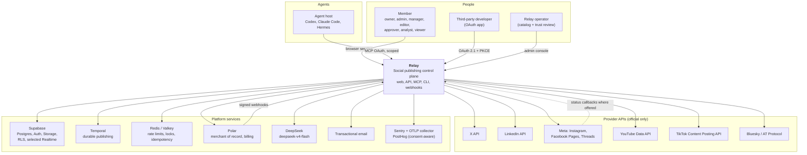
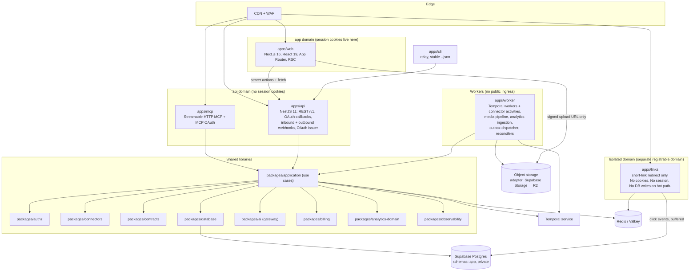
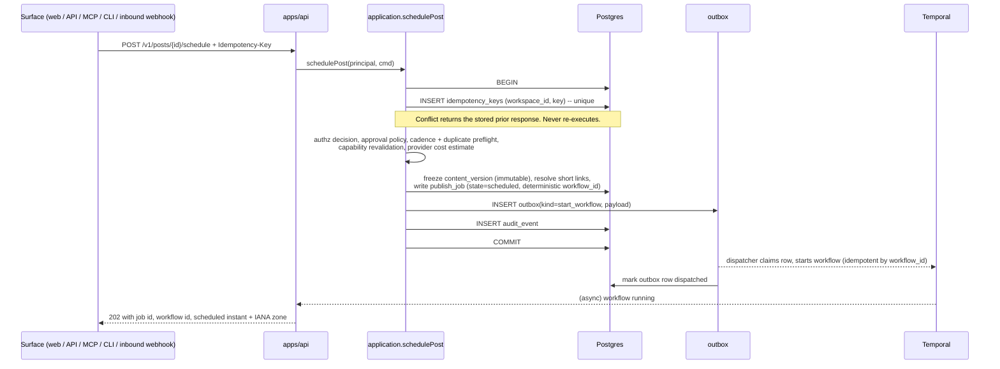
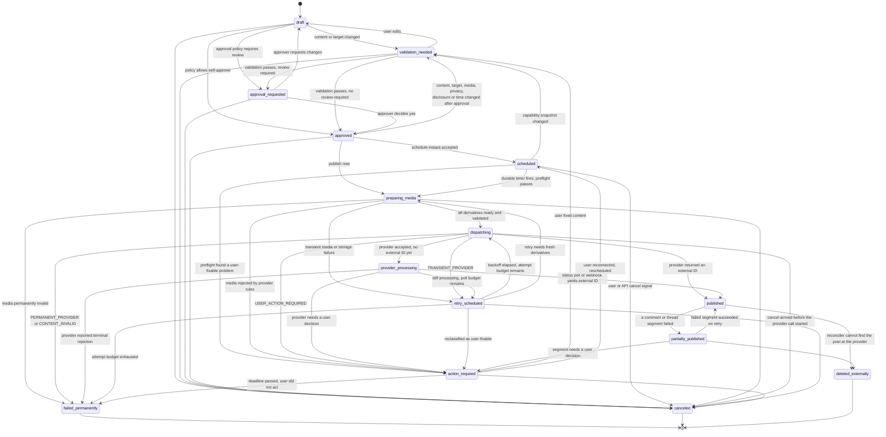
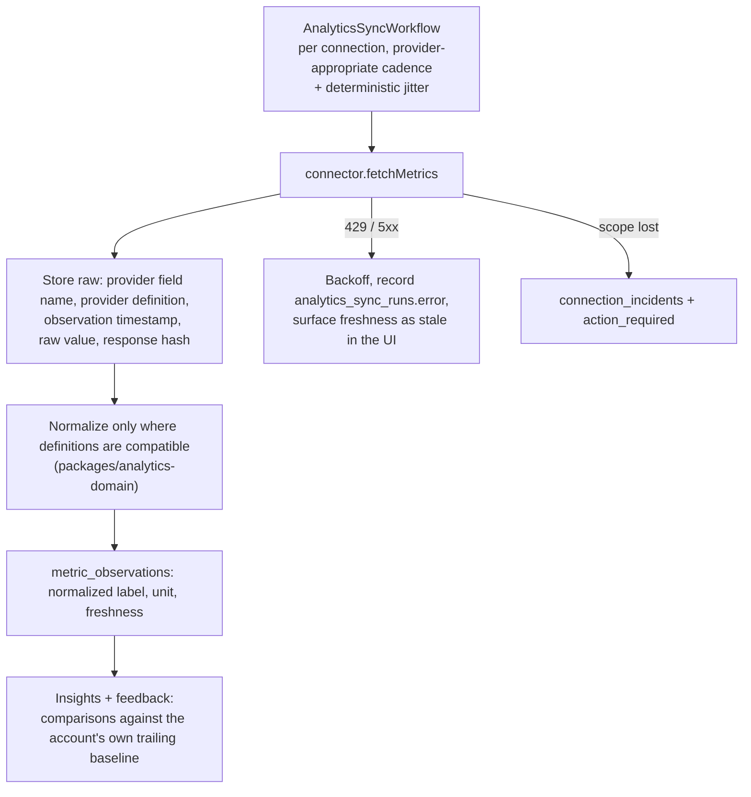
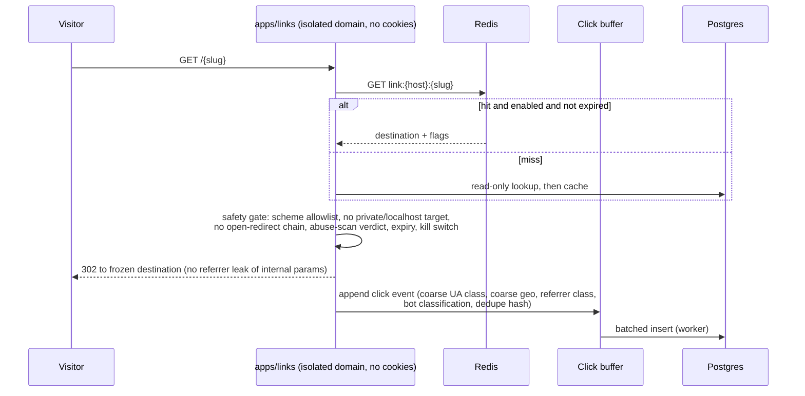
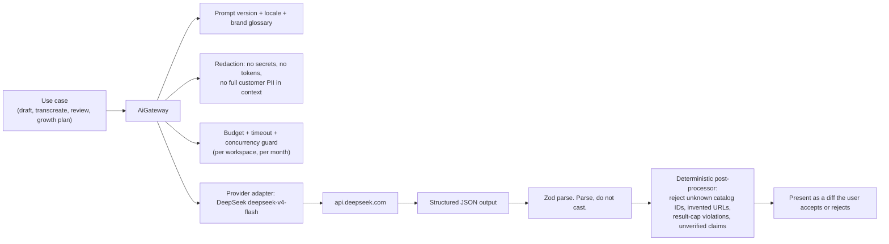

# 02. System Architecture

Owner: technical lead. Status: approved for implementation. Last revised 4 August 2026.

Scope authority is `docs/research/07-feature-parity-and-product-behavior.md`. Build
specification is `docs/research/02-development-handoff.md`. Engineering conventions are
`AGENTS.md`; where this document and `AGENTS.md` appear to disagree, `AGENTS.md` wins and
this document is wrong and must be fixed.

Provider-dependent claims cite `docs/research/06-source-register.md`, compiled 4 August
2026. Rows marked **re-verify before implementation** must be rechecked against the live
official source before the code that depends on them is written.

---

## 1. What the system is

Relay is a multi-tenant social publishing control plane. A workspace connects up to 30
active external posting identities, composes one master draft with explicit per-target
variants, gets it approved, and publishes it durably through official provider APIs, with
an immutable receipt for every external action.

Five surfaces are equal citizens: the web app, the REST API, a remote MCP server, a CLI,
and signed inbound webhooks. All five call the same use cases in `packages/application`,
the same policy engine in `packages/authz`, the same validators in `packages/contracts`,
and the same Temporal workflows. A surface is a transport plus a presentation layer. It is
never a place where publishing logic lives.

### Non-goals, restated so nobody re-litigates them in code review

- No AI image generation and no AI video generation in V1. No endpoint, UI, quota, meter,
  dormant client, environment variable or marketing claim. Uploaded and imported media is
  fully supported.
- No browser automation, cookie replay, scraping or unofficial posting APIs.
- No automated likes, follows, unsolicited replies or DMs, fabricated engagement,
  fabricated UGC, manufactured backlinks or bulk directory submission.
- No feature tiers. One public plan at $29/month or $300/year ($25/month effective,
  "save $48/year", 13.8%), 30 active channels, unlimited team members.
- Clean room. Postiz is AGPL-3.0. No code copied, adapted or consulted.

---

## 2. C4 level 1: system context



Threads and Bluesky are **launch fallbacks**. They ship only if provider approval delays
one of the six target connectors (X, LinkedIn, Instagram, Facebook Pages, YouTube,
TikTok). They are not additive scope.

---

## 3. C4 level 2: containers



### Why the short-link service is a separate app on a separate registrable domain

1. **Session safety.** The redirect service accepts arbitrary attacker-influenced paths and
   emits 302s to third-party destinations. If it shared a registrable domain with the app,
   a cookie scoped to `.<domain>` would be sent to it, and any redirect or reflection bug
   becomes a session-token exfiltration path. On its own domain there is no cookie to leak.
2. **Reputation isolation.** Short-link domains get flagged by safe-browsing and email
   filters when a customer abuses one. A block on the redirect domain must never take the
   product or the API offline.
3. **Blast radius.** The redirect path needs no database write and no tenant credential. It
   reads a Redis lookup and appends a click event to a buffer. A compromise there yields no
   token vault access.
4. **Latency and scale.** Redirects are the highest-RPS, lowest-value-per-request traffic in
   the system. Isolating them lets us scale and rate-limit them independently.

Branded customer domains are verified by DNS before use (`docs/research/07` section on
short links) and are also never the session domain.

---

## 4. Monorepo layout and dependency boundaries

The layout is exactly as in `AGENTS.md`. This section adds the enforcement rules.

```text
apps/       web  api  worker  mcp  cli  links
packages/   contracts  database  application  authz  connectors  design-system
            i18n  ai  billing  analytics-domain  observability  config  test-fixtures
```

Dependencies point inward. `contracts` depends on nothing.

| Layer | May import | May never import |
| --- | --- | --- |
| `contracts` | nothing in-repo | anything |
| `i18n`, `config`, `observability` | `contracts` | `application`, `database`, `connectors` |
| `authz` | `contracts` | `database`, `connectors` |
| `database` | `contracts` | `application`, `connectors` |
| `connectors` | `contracts`, `observability` | `database`, `application` |
| `ai`, `billing`, `analytics-domain` | `contracts`, `observability` | `database`, `application` |
| `application` | `contracts`, `authz`, `database`, `connectors`, `ai`, `billing`, `analytics-domain`, `observability` | any app |
| `design-system` | `react`, `@relay/i18n` | everything else |
| `apps/*` | `application`, `contracts`, `i18n`, `design-system`, `observability` | see below |

Hard lint failures (`eslint.config.js`, boundary rule):

- `apps/web` may not import `@relay/database` or `@relay/connectors`. The browser and the
  RSC layer never see a Prisma model or a provider payload shape.
- `apps/links` may not import `@relay/application`, `@relay/connectors` or `@relay/ai`. It
  gets a narrow `@relay/contracts` view model and a direct read client.
- Nothing imports another package's `src/**`. Use its public exports.
- A provider adapter never imports the domain. The domain never imports a provider adapter;
  it receives a `SocialConnector` through the registry.

**DECISION OWNER:** technical lead. **DEADLINE:** end of week 3 (Phase 1 start).
**RECOMMENDED DEFAULT:** if a boundary is genuinely blocking, add the missing type to
`packages/contracts` rather than relaxing the rule. Boundary exceptions require a comment
naming the ADR that permits them; there are currently zero.

---

## 5. Request flows

### 5.1 Read path (web)

```mermaid
sequenceDiagram
    participant B as Browser
    participant W as apps/web (RSC)
    participant A as apps/api
    participant P as packages/application
    participant DB as Postgres (RLS)

    B->>W: GET /w/{workspace}/calendar
    W->>W: Verify Supabase session cookie
    W->>A: GET /v1/calendar (workspace-scoped, correlation_id)
    A->>A: Authenticate (session or bearer), resolve principal
    A->>P: listCalendar(principal, query)
    P->>P: authz.decide(principal, "calendar:read", workspace)
    P->>DB: SET LOCAL relay.workspace_id / relay.actor_id; SELECT ...
    DB-->>P: rows (RLS also filters)
    P-->>A: normalized view models from @relay/contracts
    A-->>W: JSON
    W-->>B: HTML stream
```

Tenancy is enforced three times: authentication at the edge, authorization in the
application service, RLS in Postgres. "The user is logged in" is never a policy.

### 5.2 Write path (any surface), schedule a post



Every surface passes through this exact path. The MCP `schedule_post` tool, the CLI
`relay posts schedule`, the inbound integration webhook and the Automation Rules engine all
call `application.schedulePost`. There is no second implementation.

**Idempotency contract.** `Idempotency-Key` is required on create, schedule, publish and
cancel. Key scope is `(workspace_id, key)`. The stored record holds the request body hash,
the response status and body, and an expiry of 24 hours. A replay with the same key and a
*different* body hash is a `409 idempotency_key_reused`, not a silent overwrite.

---

## 6. Publishing state machine

These are the exact 15 states from `docs/research/07`. Both the campaign (content item) and
each per-target variant carry a state. The campaign state is derived from its targets.



Rules the implementation must honour:

- **`published` requires provider evidence.** An external post ID, or a permalink the
  provider returned. A 2xx from a media container creation step, an upload session, or a
  "processing accepted" response is `provider_processing`, never `published`. This is the
  single most important correctness rule in the product.
- **`partially_published` is a campaign-level truth.** If one target published and another
  failed, the campaign is `partially_published`. Never roll back the successful target and
  never label the whole campaign failed. The UI names the external posts that already
  exist and links to them.
- **A failed first comment does not fail the root post.** The root target stays `published`;
  the campaign becomes `partially_published`; the comment item carries its own state.
- **`deleted_externally`** is set only by the reconciler after a definite provider "not
  found" for a post we have a receipt for. An API timeout is not a deletion.
- **`action_required`** always carries a user-facing remediation with a named next step,
  sourced from `packages/i18n`, plus the sanitized provider evidence in the receipt.
- **Reapproval** is required when content, account, locale, media, disclosure, privacy,
  time or target changes beyond workspace policy. The transition is
  `approved -> validation_needed`, not a silent edit.

---

## 7. Temporal workflow designs

Temporal is the durable execution layer for anything with an external side effect that must
survive a process restart. Workflow code is deterministic; every provider call, database
write and storage operation is an Activity.

### 7.1 `PublishCampaignWorkflow`

Workflow ID: `publish:{workspace_id}:{publish_job_id}`. Deterministic, so a duplicate start
is a Temporal no-op rather than a duplicate post. One workflow per campaign; one child
workflow per target so that targets fail independently.

```mermaid
sequenceDiagram
    participant W as PublishCampaignWorkflow
    participant C as PublishTargetWorkflow (child, one per target)
    participant AC as Activities
    participant PR as Provider API

    W->>W: sleep until UTC instant (durable timer)
    W->>AC: preflightCampaign (entitlement, cadence, duplicate, approval still valid)
    alt preflight fails
        AC-->>W: user-fixable
        W->>AC: setState(action_required) + notify
        W->>W: await signal (fix / cancel / reschedule)
    end
    loop each target
        W->>C: start child (own workflow id, own retry policy)
    end
    C->>AC: revalidateCapabilities(connection)
    C->>AC: prepareMedia (derivatives, checksums, provider upload)
    C->>AC: setState(dispatching)
    C->>AC: publish(providerDraft, idempotencyToken?)
    AC->>PR: create
    alt external ID returned
        AC-->>C: {externalId, permalink}
        C->>AC: writeReceipt + setState(published)
    else accepted, no external ID
        C->>AC: setState(provider_processing)
        C->>AC: pollStatus with capped exponential backoff
    else transient
        C->>AC: setState(retry_scheduled); Temporal retry policy applies
    end
    loop each comment / thread segment in order
        C->>C: sleep(delay)
        C->>AC: publishSegment
    end
    C-->>W: target outcome
    W->>AC: deriveCampaignState (published | partially_published | ...)
    W->>AC: emit outbox events (webhooks, notifications, analytics schedule)
```

Retry policy per activity class:

| Activity class | Initial | Backoff | Max attempts | Non-retryable |
| --- | --- | --- | --- | --- |
| `prepareMedia` | 5 s | 2.0 | 5 | `CONTENT_INVALID`, `PERMANENT_PROVIDER` |
| `publish` (create) | 15 s | 2.0 | 4 | `CONTENT_INVALID`, `PERMANENT_PROVIDER`, `USER_ACTION_REQUIRED` |
| `pollStatus` | 10 s | 1.6, cap 5 min | budget 45 min | terminal provider rejection |
| `fetchMetrics` | 30 s | 2.0 | 5 | `USER_ACTION_REQUIRED` |
| `writeReceipt` / DB | 1 s | 2.0 | unlimited | none (must eventually succeed) |

**Crash safety on the create call.** `publish` is the one activity where a retry could
duplicate an external post. The activity therefore does, in order:

1. Write an `publish_attempts` row with `state=in_flight` and the attempt's idempotency
   token **before** the network call.
2. Call the provider, preferring the provider's own idempotency mechanism where it exists
   (**re-verify before implementation** per connector; source register 4 August 2026).
3. On any retry, first call `getStatus` / search by our idempotency token or by recent
   posts on the account within the attempt window. If an external ID matching this attempt
   is found, adopt it and transition to `published` instead of creating again.
4. Only create again when step 3 definitively found nothing.

If step 3 cannot be answered definitively for a given provider, the connector declares
`recreateOnUnknown: false` and the target goes to `action_required` with "We could not
confirm whether this posted. Check the account and tell us what happened." A possible
duplicate is worse than a possible manual retry.

### 7.2 Other workflows

| Workflow | ID pattern | Trigger | Notes |
| --- | --- | --- | --- |
| `PublishTargetWorkflow` | `publish:{ws}:{job}:{target}` | child of campaign | own retries, own receipt |
| `RepeatSeriesWorkflow` | `repeat:{ws}:{series}` | repeat cadence (1,2,3,4,5,6,7,14,30 days) | uses `continueAsNew` each occurrence; each occurrence spawns its own `PublishCampaignWorkflow` and its own receipt; ends on end date or count |
| `AnalyticsSyncWorkflow` | `analytics:{ws}:{connection}` | per connection, cron schedule | deterministic jitter only here, never on a user publish time |
| `TokenRefreshWorkflow` | `token:{ws}:{connection}` | timer at 70% of token life | on failure raises `connection.action_required` |
| `RssPollWorkflow` | `rss:{ws}:{feed}` | cadence | SSRF-safe fetch activity, GUID/URL/content fingerprint dedupe |
| `AutomationRuleWorkflow` | `rule:{ws}:{rule}:{runKey}` | trigger event | policy check before any action; kill switch is a signal |
| `WebhookDeliveryWorkflow` | `whd:{ws}:{delivery}` | outbox | exponential retry with jitter, dead-letter after budget |
| `DeletionWorkflow` | `delete:{ws}:{request}` | deletion request | cancels workflows, revokes providers, deletes objects, tombstones |
| `BillingReconcileWorkflow` | `billing:reconcile:{date}` | daily schedule | reconciles Polar state against `entitlements` |

**Signals:** `cancel`, `pause`, `resume`, `reschedule(instant, zone)`, `killSwitch`.
Cancellation during `dispatching` is honoured only if the provider call has not started;
otherwise the workflow completes the attempt, records the receipt, and surfaces "This
published before the cancellation took effect" with a delete-at-provider option where the
connector supports `deletePost`.

**Replay tests are mandatory** for every workflow change (`AGENTS.md`, testing). Histories
are recorded into `packages/test-fixtures` and replayed in CI.

**Search attributes** on every workflow: `workspace_id`, `provider`, `connection_id`,
`job_id`, `correlation_id`. No token, no post body, no PII ever enters a workflow input,
activity input, search attribute or history. Activities fetch credentials by
`connection_id` at the moment of use and discard them.

---

## 8. Event flows and the outbox pattern

Two systems must never diverge: what the database says happened, and what the outside world
was told. We use a transactional outbox for all database-to-elsewhere transitions.

```mermaid
sequenceDiagram
    participant UC as Use case
    participant DB as Postgres
    participant D as Outbox dispatcher (worker)
    participant T as Temporal
    participant WH as Customer webhook endpoint
    participant RT as Supabase Realtime

    UC->>DB: BEGIN; domain writes; INSERT outbox(...); COMMIT
    loop poll + LISTEN
        D->>DB: SELECT ... WHERE dispatched_at IS NULL<br/>ORDER BY id FOR UPDATE SKIP LOCKED LIMIT n
        alt kind = start_workflow / signal_workflow
            D->>T: start or signal (idempotent by workflow id)
        else kind = webhook_event
            D->>T: start WebhookDeliveryWorkflow
            T->>WH: POST signed payload (HMAC, timestamp, event id)
        else kind = realtime_hint
            D->>RT: publish non-authoritative UI hint
        end
        D->>DB: UPDATE outbox SET dispatched_at = now()
    end
```

Rules:

- Nothing outside the transaction is called inside the transaction. No provider call, no
  Temporal start, no HTTP request while holding a database transaction.
- The outbox is at-least-once. Every consumer is idempotent: Temporal by workflow ID,
  webhooks by event ID (customers are told to dedupe on `event.id`), Realtime carries only
  hints that the client re-fetches.
- **Supabase Realtime is a UI nicety, never the scheduler and never authoritative.** A
  Realtime message says "the calendar changed"; the client then reads the API. If Realtime
  is down, the product is slower to update, not wrong.
- Outbox rows older than 7 days and dispatched are archived, then deleted.
- An outbox row that fails 10 dispatch attempts moves to `outbox_dead_letter` and pages
  on-call. This is one of the named dashboards in doc 09.

Outbound event names are exactly the list in `docs/research/07`: `connection.connected`,
`connection.action_required`, `draft.created`, `approval.requested`, `approval.decided`,
`post.scheduled`, `post.dispatching`, `post.published`, `post.partially_published`,
`post.failed`, `comment.published`, `comment.failed`, `analytics.updated`,
`rss.item_processed`, `rule.run_completed`, `rule.run_failed`, `subscription.changed`.

---

## 9. Media pipeline

No generation. Upload, import, inspect, edit non-generatively, derive, validate, publish.

```mermaid
graph LR
    A["Browser or API client"] -->|1. request signed upload| API
    API -->|2. short-lived signed PUT| A
    A -->|3. direct upload| ST[("Object storage")]
    A -->|4. notify complete| API
    API -->|5. outbox| MW["MediaIngestWorkflow (worker)"]
    MW --> M1["MIME sniff (content, not extension)"]
    M1 --> M2["Size + decompression-bomb limits"]
    M2 --> M3["SHA-256 checksum, duplicate detect"]
    M3 --> M4["Malware scan"]
    M4 --> M5["ffprobe metadata in isolated sandbox"]
    M5 --> M6["Rights / consent declaration required"]
    M6 --> M7["media_assets row: ready"]
    M7 --> D1["Derivatives on demand:<br/>crop, resize, rotate, compress,<br/>format convert, thumbnail, platform preset"]
    D1 --> V1["Platform validator at approval"]
    V1 --> V2["Platform validator again at dispatch"]
```



- Uploads go **direct to storage** with a short-lived signed URL. Media bytes never pass
  through the API process.
- The original is retained; edits create `media_derivatives` with their own checksum. The
  picture editor is non-generative only: crop, resize, rotate, format conversion,
  compression, canvas/background, platform aspect presets, thumbnail, alt text.
- Alt text is required for image posts where the platform supports it, or explicitly
  waived with a recorded reason.
- Validation runs twice: once before approval (so the approver sees the truth) and again
  immediately before dispatch (because capabilities and account state drift).
- Provider fetch URLs are signed and short-lived. **TikTok pull-from-URL requires a
  verified owned domain** (source register, TikTok Content Sharing guidelines, 4 August
  2026, **re-verify before implementation**).
- **No Relay watermark is ever inserted**, and specifically never for TikTok.
- URL imports use the same SSRF-safe fetcher as RSS: scheme allowlist (http/https only),
  DNS and IP checks before *and* after each redirect, private and link-local network
  denial, redirect depth cap, size cap, time cap.

Failure states: `upload_incomplete` (client vanished, expires in 24 h), `scan_failed`
(quarantined, user notified, never attachable), `metadata_failed` (usable but flagged; the
platform validator may still reject), `derivative_failed` (retried, then `action_required`
on the affected target only).

---

## 10. Analytics ingestion



Non-negotiables:

- Missing or unsupported data renders as **`Unavailable`**, never `0`, and never an
  estimate without a visible label and stated methodology.
- Every metric carries the provider's own field name and definition. "Engagement rate" is
  shown with its denominator because the denominator differs per provider.
- Provider-reported link clicks and Relay short-link clicks are **two separate series with
  separate definitions**. Neither is ever substituted for the other.
- Respect provider restrictions on combining or deriving API data (YouTube API Services
  policies, source register 4 August 2026, **re-verify before implementation**).
- Cost matters: analytics reads are billable on X. Sync cadence is per connector, is
  configurable, and is included in the provider-cost dashboard.

---

## 11. Short-link redirect architecture



- The destination, UTM values and the exact public short URL are **frozen into the content
  version at approval**. The receipt records which link appeared on each platform.
- Changing a destination later is an audited, permissioned action and never rewrites
  historical reporting. Reports show the destination that was active at that time.
- Raw IP is used only for bot classification and deduplication and is discarded inside a
  short security window. Never store sensitive personal data in a slug or query parameter.
- Emergency disable is a single flag flip that propagates through Redis in seconds, plus an
  abuse-report path.
- Enumeration is rate-limited per source and slugs are not sequential.

---

## 12. AI gateway

`packages/ai` is provider-neutral by contract. Product code calls capabilities, never a
vendor SDK.



Rules:

- Model output **never** publishes anything. It produces a suggestion, a draft or a plan.
  Deterministic validation plus the configured approval path stands between the model and
  any external action.
- Retrieved web content, RSS bodies, social text, webhook payloads and uploaded documents
  are **untrusted prompt input**. They are delimited and explicitly declared unable to
  change tool policy or authorization. Account IDs are resolved server-side.
- The Growth Advisor model returns **catalog IDs and evidence IDs, never free-form URLs**.
  A post-processor rejects unknown IDs and enforces the V1 caps: at most 10 promotion
  opportunities, at most 5 Creative Tool Radar results, 4 weeks of proposed briefs. Tool
  results show last-verified date, limitations, rights/privacy caveats and affiliate
  disclosure.
- Prompt content is not logged into general telemetry. Model, prompt version, locale,
  source IDs, user edits and final approval are recorded.
- Customer content is not used to train models by default; any improvement program requires
  separate published consent.
- There is **no image or video generation capability in the gateway**, not even a disabled
  one. `AiCapability` is a closed union that does not contain a media generation member, so
  adding one is a visible, reviewable type change.

DeepSeek identifiers: `deepseek-v4-flash` (default) and `deepseek-v4-pro`. Legacy
`deepseek-chat` and `deepseek-reasoner` were retired 24 July 2026 (DeepSeek API changelog,
source register 4 August 2026, **re-verify before implementation**).

---

## 13. Failure, partial success and recovery

| Failure | Detection | System behaviour | User-visible state |
| --- | --- | --- | --- |
| Worker crashes after provider accepted | Temporal replays the activity | Status query by idempotency token adopts the existing external ID | `published`, one attempt row marked adopted |
| Provider create times out, result unknown | activity timeout | Status query; if inconclusive and connector says `recreateOnUnknown: false`, stop | `action_required`: "We could not confirm whether this posted." |
| One of five targets fails | child workflow outcome | Other targets keep their receipts | campaign `partially_published`, target `failed_permanently` |
| First comment fails, root published | segment activity | Root receipt untouched | campaign `partially_published`, segment `action_required` |
| Token revoked at execution | 401 from provider | Classified `USER_ACTION_REQUIRED`, `connection_incidents` row, connection paused | `action_required` with reconnect button |
| Provider 429 | error classifier | Backoff honouring `Retry-After`, workspace-level throttle | `retry_scheduled` with next attempt time |
| Provider outage | error-rate breach per connector | Circuit breaker opens, jobs hold in `retry_scheduled`, status page component degraded | banner naming the connector, not a generic failure |
| DST boundary at the scheduled time | scheduling validator | Confirmation shown at schedule time; UTC instant stored alongside IANA zone | explicit confirmation before saving |
| Duplicate Polar webhook | `billing_webhook_inbox` unique event ID | Second delivery is a no-op | none |
| Outbox dispatcher down | dispatch lag metric | Rows accumulate, nothing is lost, alert fires | delayed webhooks, correct database |
| Redis unavailable | health check | Rate limiting fails closed for consequential writes, open for reads; idempotency falls back to Postgres | brief write slowdown |
| Storage unavailable | activity error | `preparing_media` retries; no partial publish | `retry_scheduled` |
| Analytics provider fails | sync run error | Freshness marked stale | "Last updated <time>", never a fabricated number |

Recovery is always a named, reversible operator or user action. The runbooks are in
`docs/planning/09-infrastructure-devops-and-observability.md` section 14.

---

## 14. Build versus buy

| Concern | Decision | Why |
| --- | --- | --- |
| Postgres, Auth, Storage, Realtime | **Buy** (Supabase) | Identity, storage and RLS integration are solved; our differentiation is publishing reliability |
| Durable execution | **Buy** (Temporal) | Timers, retries, replay determinism and history are years of work to reproduce badly |
| Billing, tax, checkout, portal | **Buy** (Polar, merchant of record) | Merchant of record removes VAT/sales-tax liability; hosted checkout removes PCI scope |
| Text AI | **Buy behind our own gateway** (DeepSeek) | The gateway is ours so the provider is replaceable |
| Object storage | **Buy with an adapter** (Supabase Storage now, R2 later) | Egress cost is the reason the adapter exists on day one |
| Error and trace collection | **Buy** (Sentry, OTLP collector) | Commodity |
| Connector adapters | **Build** | This is the product. No third-party posting aggregator, ever |
| Approval, tenancy, idempotency, receipts | **Build** | This is the trust surface. It cannot be outsourced |
| Short-link redirect | **Build** | Must be domain-isolated, abuse-controlled and tied to content versions |
| Composer and calendar | **Build on primitives** (Tiptap, a themed calendar, TanStack Table) | Behaviour is bespoke; widgets are not |
| Media transcoding | **Build thin, buy heavy later** | ffmpeg in an isolated worker covers V1; revisit if video volume justifies a service |
| Rate limiting | **Build on Redis** | Needs per-workspace, per-credential, per-route and per-connector-cost dimensions no vendor models |

---

## 15. Architecture decision records

### ADR-001: Supabase over Neon

**Status:** Accepted, 4 August 2026.

**Context.** We need Postgres, end-user authentication with Google, Facebook, password and
magic link, object storage, and lightweight realtime for collaborative UI. Neon offers
best-in-class serverless Postgres with branching and autoscaling; Supabase offers a more
integrated assembly. The comparison table is in `docs/research/02` section 3.

**Decision.** Supabase for Postgres, Auth, Storage, RLS and selected Realtime.

**Consequences.**
- We avoid assembling auth, storage and realtime ourselves in a product already carrying
  six provider integrations and a durable publishing engine.
- We accept weaker database branching than Neon. Mitigation: preview environments use a
  seeded ephemeral database, not a production branch (doc 09 section 2).
- The Supabase browser client is used **only** for authentication and, where genuinely
  useful, Realtime subscriptions. It is never used to read tokens, billing, entitlements,
  connector secrets or scheduling tables. Those live in the `private` schema with no Data
  API exposure and no `anon`/`authenticated` grants.
- New tables are not automatically exposed to the Data API and require explicit grants plus
  RLS. We treat that as the standard, not a deadline to wait for (Supabase changelog,
  source register 4 August 2026, **re-verify before implementation**).
- Reversibility: the data access layer is Prisma plus SQL against plain Postgres. Moving to
  another Postgres host costs us Auth, Storage and Realtime adapters, not the schema.

### ADR-002: Temporal over a Redis queue

**Status:** Accepted, 4 August 2026.

**Context.** Publishing is a long-lived, multi-step, externally-observable process: sleep
for weeks, revalidate, prepare media, dispatch, poll a provider, publish ordered delayed
comments, write receipts, then schedule analytics. A Redis job queue gives us at-least-once
delivery and little else: no durable timers measured in weeks, no deterministic replay, no
per-step retry policy, no built-in history to answer "what exactly happened to this post".
Rebuilding those on Redis is how duplicate posts get shipped.

**Decision.** Temporal for all durable publishing, retries, delays, repeats, analytics
sync, token refresh, RSS polling, automation rules, webhook delivery and deletion. Redis
stays for rate limits, short locks, idempotency acceleration and caching.

**Consequences.**
- Duplicate prevention becomes tractable: deterministic workflow IDs, replay tests in CI,
  and a documented adopt-existing-external-ID path.
- We take on an operational dependency and a determinism constraint on workflow code.
  Mitigation: replay tests are a merge gate (`AGENTS.md`).
- Provider tokens and post bodies must never enter workflow inputs or history. Activities
  fetch by ID.
- Temporal Cloud versus self-hosted is decided in doc 09 section 7 (recommendation:
  Temporal Cloud at launch).

### ADR-003: Prisma plus hand-written SQL for RLS

**Status:** Accepted, 4 August 2026.

**Context.** We want type-safe data access without pretending an ORM can express a security
policy. Prisma does not model row level security, grants, policy predicates or
`SET LOCAL` session context.

**Decision.** Prisma for schema modelling, typed queries and migrations of shape. **All RLS
policies, grants, roles, schema separation and security-relevant constraints live in
hand-written, reviewed SQL migrations** in `packages/database/migrations`. Every query runs
through a workspace-scoped repository that sets the request's session context, never a bare
Prisma client.

**Consequences.**
- Security review reads SQL, not generated artefacts.
- Prisma migration output is checked in and hand-edited when it would drop or bypass a
  policy. A migration that touches a tenant table without a matching policy fails CI.
- Some hot paths use raw SQL where Prisma's generated query is wrong or slow. That is
  expected, not a smell.
- Every tenant table has an RLS test that attempts cross-workspace access and asserts it
  fails. This is a merge gate.

### ADR-004: Polar for billing

**Status:** Accepted, 4 August 2026.

**Context.** A one-person-scale company selling a single global SaaS plan needs sales tax
and VAT handled, hosted checkout, a customer portal, trials and usage-based billing for X
API pass-through.

**Decision.** Polar as merchant of record. One public plan: $29/month or $300/year
($25/month effective, "save $48/year", 13.8%). Seven-day trial on both intervals.

**Consequences.**
- Polar collects and remits relevant sales tax and VAT; our own income tax obligations are
  unaffected. Polar fees are percentage plus fixed, with an international-card fee where
  applicable (Polar fees docs, source register 4 August 2026, **re-verify before launch**).
- The trial collects a payment method, charges `$0` at checkout, shows the exact conversion
  date and amount, sends Polar's pre-conversion reminder, and converts only if the customer
  has not cancelled. Cancellation is self-service.
- **We do not claim a "$2 hold."** Polar's current trial documentation establishes
  payment-method collection and a deferred charge, not that specific authorization amount.
- **Entitlements come only from verified Polar webhook state plus periodic reconciliation.**
  The browser success redirect grants nothing. `billing_webhook_inbox` stores event ID,
  signature state, body hash, receive and process timestamps and result, and processing is
  idempotent.
- Usage events are emitted for managed X API cost and AI text tokens. **No media generation
  product, meter or usage event exists in V1.**
- Reversibility: entitlement evaluation is our own code reading our own `entitlements`
  table. Swapping the billing provider replaces the webhook adapter and the checkout link.

### ADR-005: Provider-neutral AI gateway

**Status:** Accepted, 4 August 2026.

**Context.** DeepSeek `deepseek-v4-flash` is the chosen model on price and capability, but
model identifiers and pricing change quickly: the legacy `deepseek-chat` and
`deepseek-reasoner` identifiers were retired on 24 July 2026.

**Decision.** All AI use goes through `packages/ai`. Product code names a capability, a
prompt version and a locale. The gateway owns provider selection, redaction, budgets,
timeouts, structured output parsing and the deterministic post-processor.

**Consequences.**
- Changing or evaluating a model is a config and adapter change, not a product change.
- Every AI call is budgeted per workspace per month and every call is attributable.
- The capability union deliberately has no image or video generation member.
- We run an evaluation suite per content language for factual grounding, voice adherence,
  platform compliance, harmful output and verbosity.

### ADR-006: Clean-room implementation

**Status:** Accepted, non-negotiable, 4 August 2026.

**Context.** Postiz is AGPL-3.0. Its public product behaviour is a legitimate competitive
reference; its source code is not a legitimate implementation reference for a proprietary
product.

**Decision.** No Postiz code is copied, adapted, or consulted while implementing. Product
behaviour is derived from our own architecture, public product observation and official
provider documentation, each recorded with a retrieval date in
`docs/research/06-source-register.md`.

**Consequences.**
- Contributors do not read the Postiz repository while writing Relay code. Anyone who has
  read it says so before touching an adjacent module.
- Naming, token prefixes, API shapes and UI structure are independently designed. We do not
  reuse their token prefix or interface.
- Provenance is recorded in the README and defended in the source register.
- This is enforced socially and by review, not by a linter. Treat a "this is how they did
  it" comment in a PR as a blocking finding.

### ADR-007: English-only V1, built for 30 languages

**Status:** Accepted, 4 August 2026.

**Context.** The product plans 30 **content** languages for drafting and transcreation. A
30-locale reviewed **interface** at launch is not achievable and shipping machine-translated
UI would damage trust.

**Decision.** **The shipped V1 interface is English only.** The product supports 30 content
languages for the material users write and publish. Every interface string is an ICU
message with a stable intent-based key in `packages/i18n`. Adding a locale is a catalog
file plus a config entry, not a refactor.

**Consequences.**
- Marketing and documentation must always distinguish interface from content. Never say
  "the app supports 30 languages" without that distinction.
- No literal user-facing English in a component, controller or error. No string
  concatenation. No interpolating a translated fragment into another translated string.
- Layout tolerates RTL and 30-50% text expansion from day one: logical CSS properties, no
  fixed widths on text containers.
- A pseudo-locale runs in CI and catches missing ICU parameters, plural gaps, truncation and
  hard-coded strings. Catalog lint also fails on em dashes in product-visible copy.
- Cost: a small ongoing discipline tax on every PR. Benefit: locale 2 through 30 cost days
  each instead of a quarter.

---

## 16. Open items

Every item has a named decision owner, a deadline and a recommended default. Nothing here
is a bare "TBD".

| # | Open item | Decision owner | Deadline | Recommended default |
| --- | --- | --- | --- | --- |
| 1 | Temporal Cloud versus self-hosted | technical lead | end of week 2 | Temporal Cloud (reasoning in doc 09 section 7) |
| 2 | Per-connector `recreateOnUnknown` value | connectors lead | before that connector's first publish | `false`. A possible duplicate is worse than a manual retry |
| 3 | Analytics sync cadence per provider | connectors lead + product | end of week 13 | 6 h for the first 48 h after publish, then daily, then weekly after 30 days |
| 4 | Default short-link domain registration | founder | end of week 2 | a separate registrable domain, not a subdomain of the app domain |
| 5 | Bulk-action threshold for agent escalation | product + trust | end of week 7 | more than 5 external publications per request, or more than 3 accounts for substantially similar content |
| 6 | Object storage move to R2 | technical lead | review at 1 TB egress per month | stay on Supabase Storage until the adapter's cost dashboard justifies the move |
| 7 | Which fallback connector ships if a target is delayed | product | week 10 | Bluesky first (simpler approval), Threads second |
| 8 | Whether Realtime is used beyond calendar and job status | web lead | end of week 6 | no. Poll or re-fetch. Realtime stays non-authoritative |
| 9 | AI monthly budget per workspace | founder | before paid launch | the `.env.example` default of 25 USD, with an in-app usage view before the cap is reached |
| 10 | Repeat-series maximum occurrences | product | end of week 9 | 52, with an explicit end date or count required at creation |
