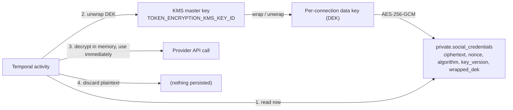
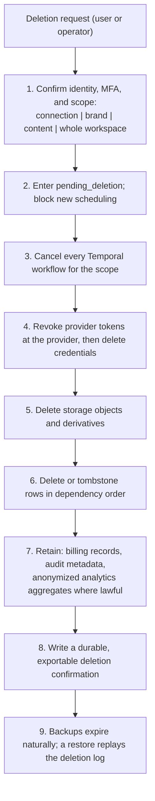

# 03. Database and Tenancy

Owner: technical lead (schema), security lead (policies and encryption). Status: approved
for implementation. Last revised 4 August 2026.

The domain model below is `docs/research/02-development-handoff.md` section 5, made
concrete. Retention follows `docs/research/05-trust-safety-and-legal.md` section 8. Scope
authority remains `docs/research/07-feature-parity-and-product-behavior.md`.

Read `AGENTS.md` first. Two of its rules govern this entire document: every tenant-owned row
has `workspace_id`, and every query goes through a workspace-scoped repository rather than a
bare Prisma client.

---

## 1. Principles

1. **Postgres is the system of record.** Temporal holds execution state, Redis holds
   ephemeral state, storage holds bytes. Everything that must survive is in Postgres.
2. **Two schemas.** `app` holds tenant business data that a browser may read under RLS.
   `private` holds credentials, billing, OAuth internals and audit. `private` has no Data
   API exposure and no grants to `anon` or `authenticated`. Ever.
3. **RLS on every tenant table**, in `app` and in `private`. `private` is protected by
   *both* the absence of a grant and a policy, because defence in depth means the second
   control assumes the first one failed.
4. **Identifiers** are UUIDv7-style sortable IDs from `newId(prefix)` in
   `@relay/contracts`. Public IDs carry a type prefix (`post_`, `conn_`, `ws_`). The
   database column type is `uuid`; the prefix is a presentation concern applied at the
   contract boundary.
5. **Time** is stored as `timestamptz` (a UTC instant) plus a separate `text` IANA time
   zone column wherever a human chose the time. Never a naive local timestamp.
6. **Money** is integer minor units plus an ISO 4217 code. Never a float, never a `numeric`
   that someone will later divide.
7. **Missing is `NULL` and renders as `Unavailable`.** Never `0`.
8. **Immutability where evidence matters.** `content_versions`, `publish_attempts`,
   `publication_receipts`, `audit_events` and `commission_ledger` are append-only, enforced
   by trigger and by the absence of `UPDATE`/`DELETE` grants.

---

## 2. Schema split

```mermaid
graph TB
    subgraph "schema: app  (browser-readable under RLS)"
        A1["workspaces, memberships, brands, campaigns"]
        A2["content_items, content_versions, post_variants"]
        A3["social_connections (no secrets), provider_destinations, mention_entities"]
        A4["media_assets, media_derivatives"]
        A5["publish_jobs, publish_attempts, publication_receipts"]
        A6["metric_definitions, metric_observations, experiments, insights"]
        A7["short_links, growth_*, tool_catalog, webhook_endpoints"]
    end

    subgraph "schema: private  (server-only, no Data API, no anon/authenticated grants)"
        P1["social_credentials  (envelope-encrypted tokens)"]
        P2["oauth_transactions, oauth_clients, oauth_grants, api_keys"]
        P3["polar_customers, subscriptions, entitlements, usage_events,<br/>billing_webhook_inbox"]
        P4["audit_events, security_events, admin_access_log"]
        P5["outbox, outbox_dead_letter, idempotency_keys"]
        P6["short_link_clicks_raw (short-lived), abuse_signals"]
        P7["affiliate_partners, referral_attributions, commission_ledger, payout_batches"]
    end

    APP["packages/application via service role"] --> A1
    APP --> P1
    BROWSER["Browser via Supabase client"] -->|"SELECT only, RLS, narrow grants"| A1
    BROWSER -.->|"no grant, no policy, no route"| P1
```



### Why credentials, billing, OAuth and audit are never browser-exposed

- **Credentials.** A social access token is a bearer capability to post as the customer's
  brand. Exposure is not a data leak, it is an impersonation vector at the provider, and it
  damages our provider approvals. The browser never needs a token, so the browser never
  gets a path to one.
- **Billing.** Entitlements are an authorization input. A client that can read
  `entitlements` will eventually be a client someone tries to make *write* them. Billing
  state is derived from verified Polar webhook events plus reconciliation, evaluated
  server-side, and returned only as a computed boolean set.
- **OAuth internals.** `oauth_transactions` holds PKCE verifiers and state; `oauth_clients`
  holds hashed client secrets; `oauth_grants` holds refresh-token material. All three are
  attack surface with zero product value in the browser.
- **Audit.** An audit log that the audited party can read is a map of what the detection
  looks like. Members see a curated, tenant-scoped activity feed built from a view over
  `audit_events` that omits IP, user agent, actor internals and detection metadata.

The rule for a new table is a single question: *does a browser need to read this to render
a screen?* If no, it goes in `private`.

---

## 3. Domain model

Column lists below name the columns that carry meaning or constrain behaviour. Every table
also has `id uuid primary key`, `created_at timestamptz not null default now()` and, where
mutable, `updated_at timestamptz not null default now()`. Every tenant table has
`workspace_id uuid not null references app.workspaces(id) on delete restrict`.

### 3.1 Identity and tenancy (`app`, except where noted)

| Table | Important columns | Notes |
| --- | --- | --- |
| `users` | `supabase_user_id uuid unique`, `status`, `locale`, `time_zone`, `mfa_enrolled_at` | Mirror of the Supabase identity. Not tenant-scoped |
| `user_aliases` | `user_id`, `alias_normalized citext unique`, `alias_display`, `verified_at` | Username login is a verified alias to an existing identity, never its own auth provider. NFKC + conservative lowercase, confusable and system names reserved |
| `workspaces` | `owner_user_id`, `name`, `slug unique`, `default_locale`, `default_time_zone`, `status`, `polar_customer_ref` | `status` in `active, past_due, read_only, suspended, pending_deletion` |
| `memberships` | `user_id`, `workspace_id`, `role`, `state`, `invited_by`, `accepted_at` | Unique `(workspace_id, user_id)`. Unlimited team members |
| `roles`, `role_permissions` | `role`, `permission` | owner, admin, manager, editor, approver, analyst, viewer. Seeded data, not user-editable in V1 |
| `brand_scopes` | `membership_id`, `brand_id` | Optional narrowing of a membership to specific brands |
| `service_accounts` | `workspace_id`, `name`, `scopes[]`, `brand_scope[]`, `account_scope[]`, `platform_scope[]`, `locale_scope[]`, `daily_cadence_cap`, `max_lookahead_days`, `disabled_at` | A workspace-scoped automation identity, never an omnipotent session |
| `api_keys` (**private**) | `workspace_id`, `prefix`, `secret_hash`, `scopes[]`, `expires_at`, `last_used_at`, `created_by` | Only the prefix is ever shown again |
| `audit_events` (**private**) | `workspace_id`, `actor_type`, `actor_id`, `client_id`, `action`, `target_type`, `target_id`, `before_hash`, `after_hash`, `ip`, `user_agent`, `correlation_id` | Append-only. See section 8 |

### 3.2 Brands and content (`app`)

| Table | Important columns | Notes |
| --- | --- | --- |
| `brands` | `workspace_id`, `name`, `voice`, `approved_claims jsonb`, `blocked_terms text[]`, `locale_rules jsonb`, `domains text[]`, `disclosure_defaults jsonb` | Customer groups in the UI are brands |
| `business_profiles` | `brand_id`, `version`, `site_urls text[]`, `description`, `category`, `markets text[]`, `icp`, `objective`, `conversion_event`, `proof jsonb`, `competitors jsonb`, `constraints jsonb`, `completeness_score`, `confirmed_at`, `confirmed_by` | Versioned. AI never silently promotes an assumption to a fact |
| `brand_sources` | `brand_id`, `kind`, `uri`, `checksum`, `consent_state`, `retrieved_at` | Untrusted source material with citations attached |
| `glossary_terms` | `brand_id`, `locale`, `term`, `preferred`, `prohibited`, `context` | Used by transcreation |
| `campaigns` | `brand_id`, `objective`, `tags text[]`, `experiment_id`, `utm_defaults jsonb` | |
| `content_items` | `brand_id`, `campaign_id`, `title`, `state`, `created_surface`, `created_by_actor` | `state` is one of the 15 publishing states; campaign-level derived |
| `content_versions` | `content_item_id`, `version int`, `body jsonb`, `checksum`, `creation_method`, `ai_model`, `ai_prompt_version`, `frozen_at` | **Immutable.** Unique `(content_item_id, version)` |
| `post_variants` | `content_version_id`, `connection_id`, `locale`, `body jsonb`, `settings jsonb`, `inherit_mask jsonb`, `state`, `capability_snapshot_id` | One row per target. `inherit_mask` records which fields are inherited from master versus overridden |
| `provider_destinations` | `connection_id`, `kind`, `external_id`, `label`, `refreshed_at`, `expires_at` | X communities, LinkedIn organizations, Pages, groups, boards, channels |
| `mention_entities` | `connection_id`, `external_id`, `display_label`, `kind`, `resolved_at`, `expires_at` | A plain-text fallback never masquerades as a native tag |
| `approval_requests` | `content_version_id`, `requested_by`, `policy_snapshot jsonb`, `due_at`, `state` | |
| `approval_decisions` | `approval_request_id`, `decided_by`, `decision`, `comment`, `decided_at` | Append-only |
| `comments_threads` | `content_version_id`, `parent_variant_id`, `ordinal`, `delay_seconds`, `author_connection_id`, `body jsonb`, `state` | Presets 1, 2, 5, 10, 15, 30, 60, 120 minutes plus custom |
| `sets` | `brand_id`, `name`, `definition jsonb` | Applying a Set creates an independent editable draft |
| `signatures` | `brand_id`, `platform`, `locale`, `body`, `auto_add_rule jsonb` | The applied signature becomes part of the immutable content version |
| `growth_strategies` | `business_profile_id`, `version`, `plan jsonb`, `model`, `prompt_version`, `state`, `approved_at` | Immutable per version. `plan` validates against the versioned `GrowthPlan` schema |
| `growth_opportunities` | `official_url`, `category`, `region`, `audience`, `submission_method`, `cost`, `rules`, `source`, `reviewer`, `last_verified_at`, `next_review_at`, `state` | Global catalog, not tenant data. `state` in `draft, reviewed, active, stale, retired` |
| `strategy_opportunity_matches` | `strategy_id`, `opportunity_id`, `fit_explanation`, `evidence_ids uuid[]`, `user_decision`, `result` | A suggestion, never a promised backlink. Max 10 per plan |
| `tool_catalog` | `official_url`, `use_cases`, `inputs_outputs`, `price_model`, `rights_caveats`, `affiliate_status`, `last_verified_at`, `change_history jsonb`, `state` | Global catalog. Max 5 results shown, with verified date and affiliate disclosure |

There is no table, column, enum member or JSONB key anywhere in this schema for AI image or
AI video generation. Adding one is a schema migration that a reviewer will see.

### 3.3 Connections, media and publishing

| Table | Schema | Important columns | Notes |
| --- | --- | --- | --- |
| `social_connections` | `app` | `workspace_id`, `brand_id`, `provider`, `account_type`, `external_account_id`, `display_identity jsonb`, `status`, `scopes text[]`, `capability_snapshot jsonb`, `capability_version`, `last_success_at`, `paused_at` | **No secret material.** Unique partial index on `(provider, external_account_id, workspace_id) WHERE status = 'active'` |
| `social_credentials` | **private** | `connection_id`, `ciphertext bytea`, `nonce bytea`, `algorithm`, `key_version`, `wrapped_dek bytea`, `access_expires_at`, `refresh_expires_at` | Envelope encrypted. Section 7 |
| `oauth_transactions` | **private** | `state`, `pkce_verifier`, `redirect_uri`, `workspace_id`, `expires_at` | Minutes of life, then deleted by the retention job |
| `oauth_clients` | **private** | `owner_workspace_id`, `name`, `client_type`, `secret_hash`, `redirect_uris text[]`, `logo_url`, `privacy_url`, `terms_url`, `status` | Exact redirect matching only. No wildcards |
| `oauth_grants` | **private** | `client_id`, `user_id`, `workspace_id`, `scopes text[]`, `brand_scope uuid[]`, `connection_scope uuid[]`, `refresh_hash`, `expires_at`, `revoked_at`, `last_used_at` | Rotating refresh credentials |
| `media_assets` | `app` | `workspace_id`, `storage_key`, `origin`, `mime`, `bytes`, `sha256`, `duration_ms`, `width`, `height`, `alt_text`, `alt_text_waived_reason`, `rights_declaration jsonb`, `scan_state` | Unique `(workspace_id, sha256)` for duplicate detection |
| `media_derivatives` | `app` | `media_asset_id`, `purpose`, `storage_key`, `sha256`, `spec jsonb` | Original always retained |
| `publish_jobs` | `app` | `workspace_id`, `content_version_id`, `intended_at timestamptz`, `intended_time_zone text`, `state`, `approval_policy jsonb`, `idempotency_key`, `temporal_workflow_id`, `cost_estimate_minor`, `cost_currency` | Unique `(workspace_id, idempotency_key)` |
| `publish_attempts` | `app` | `publish_job_id`, `post_variant_id`, `attempt_no`, `attempt_token`, `started_at`, `ended_at`, `classification`, `sanitized_response jsonb`, `retry_after` | **Immutable after `ended_at`.** `classification` is the six-member error taxonomy |
| `publication_receipts` | `app` | `publish_attempt_id`, `connection_id`, `external_post_id`, `permalink`, `content_version_id`, `content_checksum`, `published_at`, `creation_surface`, `approver`, `cost_actual_minor`, `link_snapshot jsonb` | **Immutable.** Unique `(provider, connection_id, external_post_id)` |
| `provider_limits` | `app` | `connection_id`, `window`, `observed_remaining`, `reset_hint_at`, `policy_version` | Rolling observations, used by the cost and cadence preflight |
| `connection_incidents` | `app` | `connection_id`, `kind`, `detected_at`, `remediation_key`, `resolved_at` | Drives the Action Center |

### 3.4 Analytics, links, billing, affiliate, compliance

| Table | Schema | Notes |
| --- | --- | --- |
| `metric_definitions` | `app` | Provider field, normalized name, provider's own definition text, unit, availability, aggregation rule. Global reference data |
| `metric_observations` | `app` | `workspace_id`, `receipt_id` or `connection_id`, `metric_definition_id`, `observed_at`, `raw_value jsonb`, `normalized_value numeric`, `freshness_at`, `response_hash`. `NULL` means unavailable |
| `analytics_sync_runs` | `app` | Coverage, cursor, errors, provider cost per run |
| `experiments`, `insights` | `app` | Hypothesis, variants, success metric, window, caveats. Insights carry evidence IDs, confidence wording and model version |
| `short_links` | `app` | `workspace_id`, `domain`, `slug`, `destination_url`, `utm jsonb`, `enabled`, `expires_at`, `abuse_scan_result`, `created_by`. Unique `(domain, slug)` |
| `short_link_clicks` | `app` | Link, coarse timestamp bucket, country, device class, referrer class, bot classification, dedupe key. Aggregated. No raw IP |
| `short_link_clicks_raw` | **private** | Raw signals used only for bot classification and dedupe. Deleted within the security window (default 7 days) |
| `polar_customers`, `subscriptions`, `entitlements`, `usage_events` | **private** | Entitlements derived from verified Polar state plus reconciliation, never from a browser redirect |
| `billing_webhook_inbox` | **private** | `event_id unique`, `signature_state`, `body_hash`, `received_at`, `processed_at`, `result`. Idempotent processing |
| `affiliate_partners`, `referral_attributions`, `commission_ledger`, `payout_batches` | **private** | Ledger is append-only with immutable adjustments; hold and refund state; fraud flags |
| `webhook_endpoints`, `webhook_deliveries` | `app` | Signing secret is stored in `private.webhook_secrets`, not here |
| `consents`, `deletion_requests`, `data_exports` | `app` | Versioned and auditable |
| `outbox`, `outbox_dead_letter`, `idempotency_keys` | **private** | Section 4 of doc 02 |

### 3.5 Required constraints (from `docs/research/02` section 5)

```sql
-- One active connection per external identity per workspace.
create unique index social_connections_active_identity_uq
  on app.social_connections (provider, external_account_id, workspace_id)
  where status = 'active';

-- Publish idempotency is unique inside a workspace.
alter table app.publish_jobs
  add constraint publish_jobs_idempotency_uq unique (workspace_id, idempotency_key);

-- An external post is recorded exactly once.
alter table app.publication_receipts
  add constraint publication_receipts_external_uq
  unique (provider, connection_id, external_post_id);

-- Every attempt references an immutable content version.
alter table app.publish_attempts
  add constraint publish_attempts_version_fk
  foreign key (content_version_id) references app.content_versions (id);

-- Cannot schedule before approval when approval is required.
alter table app.publish_jobs
  add constraint publish_jobs_approval_before_dispatch
  check (
    approval_required = false
    or approved_at is null
    or intended_at >= approved_at
  );

-- Foreign keys validate workspace ownership, not just row existence.
alter table app.post_variants
  add constraint post_variants_ws_fk
  foreign key (workspace_id, connection_id)
  references app.social_connections (workspace_id, id);
```

The last pattern is important and is used throughout: composite foreign keys that include
`workspace_id` make a cross-tenant reference impossible at the storage layer, not merely
unlikely. Each referenced table therefore carries a `unique (workspace_id, id)` index.

### 3.6 Indexes that matter

| Index | Why |
| --- | --- |
| `publish_jobs (workspace_id, state, intended_at)` | Queue and calendar reads, and the stuck-job reconciler |
| `content_items (workspace_id, brand_id, state, updated_at desc)` | Calendar and list views |
| `metric_observations (workspace_id, receipt_id, metric_definition_id, observed_at desc)` | Post analytics without a scan |
| `metric_observations brin (observed_at)` | Time-range analytics over a large append-only table |
| `audit_events (workspace_id, created_at desc)` and `(target_type, target_id)` | Activity feed and object history |
| `short_links (domain, slug)` unique | Redirect lookup on cache miss |
| `short_link_clicks (short_link_id, bucket_at)` | Click time series |
| `outbox (dispatched_at nulls first, id)` partial `where dispatched_at is null` | Dispatcher scan stays small |
| `social_connections (workspace_id, status, provider)` | Connection rail and health checks |
| `publish_attempts (publish_job_id, attempt_no)` | Attempt timeline on the receipt |

Every index on a tenant table leads with `workspace_id` unless it exists specifically for a
cross-tenant operator query, because every production query is workspace-scoped.

---

## 4. Row level security

### 4.1 The session context contract

The application sets three GUCs per request, inside the transaction, using `SET LOCAL` so
they cannot leak across pooled connections.

```sql
-- Set by the workspace-scoped repository at the start of every transaction.
set local relay.workspace_id = 'e0a1...';
set local relay.actor_id     = 'u_91b3...';
set local relay.actor_role   = 'editor';
```

```sql
create or replace function app.current_workspace_id() returns uuid
language sql stable
as $$ select nullif(current_setting('relay.workspace_id', true), '')::uuid $$;

create or replace function app.current_actor_role() returns text
language sql stable
as $$ select coalesce(nullif(current_setting('relay.actor_role', true), ''), 'none') $$;
```

`current_setting(..., true)` returns `NULL` rather than raising when unset, so a query that
forgot to set context sees **zero rows** instead of every row. Failing closed is the point.

### 4.2 Base tenant policy pattern

Applied to every table in `app` that has `workspace_id`:

```sql
alter table app.content_items enable row level security;
alter table app.content_items force row level security;   -- applies to the owner too

revoke all on app.content_items from anon, authenticated;
grant select on app.content_items to authenticated;
grant select, insert, update, delete on app.content_items to relay_app;

-- Read: your workspace only.
create policy content_items_tenant_read
  on app.content_items for select
  using (workspace_id = app.current_workspace_id());

-- Write: your workspace only, and the new row cannot be moved to another workspace.
create policy content_items_tenant_write
  on app.content_items for insert
  with check (workspace_id = app.current_workspace_id());

create policy content_items_tenant_update
  on app.content_items for update
  using (workspace_id = app.current_workspace_id())
  with check (workspace_id = app.current_workspace_id());
```

`force row level security` matters: without it the table owner bypasses policies, and
migrations run as the owner. `with check` on update matters: without it, a tenant can
`UPDATE ... SET workspace_id = <other tenant>` and hand their row away, or steal one.

### 4.3 Role-sensitive policy

Approval is a permission, not a UI state, so it is also enforced in the database:

```sql
create policy approval_decisions_insert_by_approver
  on app.approval_decisions for insert
  with check (
    workspace_id = app.current_workspace_id()
    and app.current_actor_role() in ('owner', 'admin', 'manager', 'approver')
  );
```

Application-layer authorization in `packages/authz` remains the primary and more expressive
control. The database policy is the backstop that catches a bug in the primary control.

### 4.4 Immutability by policy

```sql
-- No UPDATE and no DELETE policy exists for these tables, and no grant is issued.
alter table app.content_versions enable row level security;
alter table app.content_versions force row level security;
grant select, insert on app.content_versions to relay_app;   -- deliberately no update/delete

create policy content_versions_read
  on app.content_versions for select
  using (workspace_id = app.current_workspace_id());

create policy content_versions_append
  on app.content_versions for insert
  with check (workspace_id = app.current_workspace_id());

-- Belt and braces: reject an update even if a grant is added by mistake later.
create or replace function app.reject_mutation() returns trigger
language plpgsql as $$
begin
  raise exception 'relay: % is append-only', tg_table_name using errcode = '42501';
end $$;

create trigger content_versions_no_mutation
  before update or delete on app.content_versions
  for each row execute function app.reject_mutation();
```

The same pattern applies to `publish_attempts` (after `ended_at` is set),
`publication_receipts`, `audit_events` and `commission_ledger`.

### 4.5 The `private` schema

```sql
revoke all on schema private from anon, authenticated, public;
grant usage on schema private to relay_app;

alter default privileges in schema private
  revoke all on tables from anon, authenticated;

alter table private.social_credentials enable row level security;
alter table private.social_credentials force row level security;

-- Even the server role is workspace-scoped, via the connection it belongs to.
create policy social_credentials_tenant
  on private.social_credentials for all
  using (
    exists (
      select 1 from app.social_connections c
      where c.id = social_credentials.connection_id
        and c.workspace_id = app.current_workspace_id()
    )
  );
```

There is no Supabase Data API exposure for `private`, no PostgREST route, and no grant to
`anon` or `authenticated`. A browser has three independent reasons it cannot read a token.

### 4.6 Operator access

Operators do not get a "read everything" role. Support reads go through an application
endpoint that sets `relay.workspace_id` to the workspace under support, writes an
`private.admin_access_log` row naming the operator, the ticket and the justification, and
redacts content bodies by default. Reading a customer's post body requires an explicit
elevation that the customer can see in their activity feed.

### 4.7 Testing (merge gate)

Every tenant table has a test that, per `AGENTS.md`:

1. Seeds two workspaces with data.
2. Sets context to workspace A and asserts it cannot `SELECT` workspace B's rows.
3. Asserts an `INSERT` with workspace B's `workspace_id` fails.
4. Asserts an `UPDATE` that changes `workspace_id` fails.
5. Asserts that with **no** context set, the table returns zero rows.
6. For append-only tables, asserts `UPDATE` and `DELETE` fail.

A migration that creates a table with a `workspace_id` column and no matching policy fails
CI. The check is a query over `pg_policies` compared against `information_schema.columns`,
run in the `database` CI job.

---

## 5. Tenant isolation beyond RLS

| Layer | Control |
| --- | --- |
| Edge | Authentication. Session cookie for web, bearer for API/MCP/CLI, HMAC for inbound webhooks |
| Application | `packages/authz` decides `(principal, action, resource)` before the repository is touched. Scopes for API keys and OAuth grants: `accounts:read`, `drafts:write`, `posts:schedule`, `posts:publish`, `analytics:read`, `billing:read` |
| Repository | Workspace-scoped repository sets the GUCs. A bare Prisma client is a lint error |
| Database | RLS, composite `(workspace_id, id)` foreign keys, `force row level security` |
| Storage | Object keys are `ws/{workspace_id}/{asset_id}/...`; signed URLs are short-lived and per-object. No bucket-wide public read |
| Temporal | `workspace_id` is a search attribute; workflow IDs are workspace-prefixed |
| Redis | Every key is prefixed `ws:{workspace_id}:`; rate-limit buckets are per workspace and per credential |
| Cache | No cross-tenant cache key exists. Cache keys include `workspace_id` by construction |

Owner and admin privileges do **not** flow automatically into an agent session. A service
account or OAuth grant holds its own explicitly narrowed scopes.

---

## 6. Encryption boundaries



| Boundary | Rule |
| --- | --- |
| At rest, database | Supabase-managed disk encryption, plus application-level envelope encryption for every credential |
| At rest, storage | Provider-managed encryption; object keys are unguessable and namespaced by workspace |
| In transit | TLS everywhere, including internal service-to-service |
| In memory | Plaintext tokens exist only inside the activity that is about to make the provider call, and are never assigned to a long-lived object |
| Never | Tokens in Temporal workflow inputs or histories, logs, traces, metrics, product analytics, error payloads, support tools, webhook bodies or client responses |
| Key rotation | `key_version` on every ciphertext. A background re-encryption job walks rows to the new version. Both versions are unwrappable during rotation |
| Hashing | API key secrets, OAuth client secrets and webhook signing secrets are stored hashed (Argon2id) and shown once at creation |
| Local dev | `TOKEN_ENCRYPTION_LOCAL_KEY`, a 32-byte base64 key, development only, never a production path |

Only `.env.example` placeholders exist in the repository. No secret is ever committed, in
any file, including tests and fixtures.

---

## 7. Retention and deletion

The schedule below is `docs/research/05` section 8, with concrete default periods.
Legal review may extend or shorten any row before public launch.

| Data class | Tables | Default | Mechanism |
| --- | --- | --- | --- |
| Active social credentials | `private.social_credentials` | While the connection is active. Revoked and deleted within 1 hour of disconnect | `DeletionWorkflow` calls provider revoke, then hard-deletes the row |
| OAuth transaction state | `private.oauth_transactions` | 15 minutes | Retention job every 5 minutes |
| Drafts and media | `content_items`, `media_assets` | While the account is active, or the workspace-configured period. 30-day trash grace period | Soft delete, then hard delete plus storage object delete |
| Publication receipts and audit | `publication_receipts`, `private.audit_events` | 24 months default, workspace-exportable | Content is minimized at 90 days: body replaced by its checksum, permalink and external ID retained |
| Raw provider responses | `publish_attempts.sanitized_response` | 30 days | Nulled by the retention job; classification and timing retained forever |
| Analytics observations | `metric_observations` | 24 months, subject to provider terms | Monthly partition drop |
| Short-link raw click signals | `private.short_link_clicks_raw` | 7 days | Retention job. Aggregated `short_link_clicks` retained 13 months |
| Security logs | `private.security_events`, `admin_access_log` | 180 days | Retention job |
| Billing records | `private` billing tables | Statutory period (7 years default) | Never deleted by the tenant deletion flow |
| Deleted account | everything tenant-scoped | Revoke and cancel immediately, complete deletion within 30 days | `DeletionWorkflow`, section 7.1 |
| Backups | all | Encrypted, access-controlled, expire on rotation (section 10) | Deletion propagates through the documented restore procedure |

**DECISION OWNER:** founder with counsel. **DEADLINE:** before public beta.
**RECOMMENDED DEFAULT:** the periods above, which are the conservative reading of
`docs/research/05` section 13 item 6.

### 7.1 Deletion workflow



The deletion log is the mechanism that keeps backups honest: any restore of a backup taken
before a deletion immediately replays `deletion_requests` recorded after the backup's
timestamp, before the restored system accepts traffic. This is a numbered step in the
restore runbook, not an assumption.

Deletion is never contingent on paying an invoice, except for retaining lawful billing
records. Scheduled jobs are cancelled before deletion, not silently dropped.

---

## 8. Audit model

Every consequential action writes exactly one `private.audit_events` row, in the same
transaction as the change it describes.

| Field | Content |
| --- | --- |
| `actor_type` | `user`, `service_account`, `oauth_client`, `api_key`, `system`, `operator` |
| `actor_id`, `client_id` | The acting identity and, for delegated calls, the app |
| `action` | Stable dotted verb: `post.scheduled`, `connection.revoked`, `entitlement.changed` |
| `target_type`, `target_id` | The object |
| `before_hash`, `after_hash` | SHA-256 of the canonicalized before and after states. **Not the states themselves** |
| `ip`, `user_agent` | Only where meaningful and lawful. Absent for system actions |
| `correlation_id` | Ties web, API, worker, provider call and webhook delivery together |
| `surface` | `web`, `api`, `mcp`, `cli`, `rss`, `automation_rule`, `webhook` |

Audited by requirement: authentication events, membership and role changes, connection
connect/reconnect/pause/revoke/disconnect, **every privileged read of a token or of customer
content**, approval decisions, every publish attempt and receipt, short-link destination
changes, catalog changes, entitlement changes, API key and OAuth grant lifecycle, deletion
and export requests, operator access, and every kill-switch activation.

The customer-visible activity feed is a view over `audit_events` that exposes actor display
name, action, target, surface and time, and omits IP, user agent, hashes and detection
metadata. Audit rows are append-only by grant and by trigger.

---

## 9. Migration strategy

| Rule | Detail |
| --- | --- |
| Source of truth | `packages/database/prisma/schema.prisma` for shape; `packages/database/migrations/*.sql` for everything security-relevant |
| Naming | `NNNN_short_description.sql`, sequential, never renumbered |
| Review | Any migration touching a policy, grant, role or constraint requires the security lead's review |
| Expand and contract | Three deploys for a breaking change: add the new shape and dual-write; backfill and switch reads; drop the old shape. Never a single destructive deploy |
| Backward compatibility | A migration must be safe against the previous release running concurrently, because deploys are rolling |
| Locks | `create index concurrently`. `alter table ... add column` without a volatile default. No table rewrite on a table over 1 million rows without a documented maintenance window |
| Data migrations | Batched, resumable, idempotent, run as a job, not inside the schema migration |
| Down migrations | Not used in production. Recovery is roll forward plus point-in-time restore |
| Gate | The `database` CI job runs every migration from empty against Postgres 16, then runs the RLS suite, then runs the policy-coverage check |

**DECISION OWNER:** technical lead. **DEADLINE:** end of week 3.
**RECOMMENDED DEFAULT:** Prisma Migrate generates the shape diff; the engineer then hand-
edits the SQL to add policies, grants, composite unique indexes and triggers before it is
committed. The generated file is a starting point, never the artefact that ships.

---

## 10. Backup and recovery

| Control | Setting |
| --- | --- |
| Point-in-time recovery | Enabled, 7-day window at launch, 30 days before paid launch |
| Automated snapshots | Daily, retained 30 days |
| Weekly snapshot | Retained 90 days |
| Storage | Object storage versioning enabled; lifecycle rule expires noncurrent versions after 30 days |
| Encryption | All backups encrypted at rest with access limited to the on-call operator role |
| Cross-region copy | One encrypted copy in a second region, retained 30 days |
| Temporal | Workflow history is Temporal's responsibility; our recovery relies on Postgres plus the ability to restart workflows deterministically from `publish_jobs` |
| Redis | Not backed up. It holds only reconstructible state. A cold Redis costs a slow first request, not data |

### Objectives

| Scenario | RPO | RTO |
| --- | --- | --- |
| Accidental destructive query on one table | 1 minute (PITR) | 1 hour |
| Full database loss | 5 minutes | 4 hours |
| Region loss | 24 hours (cross-region copy) | 12 hours |
| Storage object loss | 0 (versioning) | 1 hour |

### Restore exercise cadence

A restore that has never been tested is a belief, not a control.

| Exercise | Frequency | Success criterion |
| --- | --- | --- |
| PITR of a single table into a scratch database | Monthly | Row counts and checksums match a known point; under 1 hour |
| Full restore into an isolated environment, then run the RLS suite and a smoke publish against the fake connector | Quarterly | Under 4 hours, all tests green, deletion log replayed |
| Cross-region restore | Twice a year | Under 12 hours |
| Deletion-log replay verification | Quarterly, as part of the full restore | Every workspace deleted after the backup timestamp is absent after replay |

Each exercise writes a dated record: who ran it, wall-clock duration, what broke, and the
follow-up ticket. A failed exercise is a Sev-2 incident, not a retro item.

**DECISION OWNER:** technical lead. **DEADLINE:** first full-restore exercise before closed
alpha ends (end of week 12). **RECOMMENDED DEFAULT:** the table above.

---

## 11. Open items

| # | Open item | Decision owner | Deadline | Recommended default |
| --- | --- | --- | --- | --- |
| 1 | Final retention periods | founder with counsel | before public beta | the defaults in section 7 |
| 2 | Whether `metric_observations` is partitioned at launch | technical lead | end of week 13 | monthly range partitions from day one; retrofitting is painful |
| 3 | Receipt content minimization window | product + counsel | before paid launch | 90 days, then body replaced by checksum |
| 4 | Custom roles beyond the seven seeded roles | product | post-launch | not in V1. `roles` is seeded data |
| 5 | PITR window at launch | technical lead | end of week 4 | 7 days at launch, 30 days before paid launch, on cost grounds |
| 6 | Whether operator content reads require customer pre-consent or post-notification | founder with counsel | before closed alpha | post-notification in the customer activity feed, plus an audit row |
| 7 | Second-region choice for the backup copy | founder | before paid launch | the region nearest the largest customer geography that satisfies the transfer mechanism chosen in `docs/research/05` section 13 |
