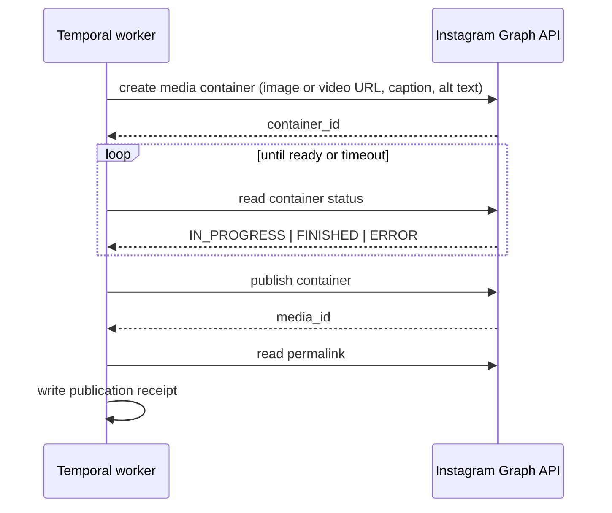

# 05. Social Connectors

Owner: Connectors Lead. Contributors: Platform Lead, Policy Owner, QA and Platform Operations.
Written 4 August 2026 against `docs/research/02-development-handoff.md` (sections 7, 8, 10, 17),
`docs/research/05-trust-safety-and-legal.md` (sections 5, 12) and
`docs/research/07-feature-parity-and-product-behavior.md`.
Every provider claim cites `docs/research/06-source-register.md`, compiled 4 August 2026, and is
marked **re-verify before implementation** because provider APIs, limits, prices and review rules
change without notice.

Security controls that connectors depend on (the token vault, scopes, step-up, SSRF rules) live in
`docs/planning/04-auth-oauth-and-security.md`. The gate a connector must pass before we call it
"supported" lives in `docs/connectors/definition-of-done.md`.

---

## 0. The rules

1. **Official APIs only.** No browser automation, no cookie replay, no scraping, no unofficial
   posting endpoints, no headless-browser workarounds. This is not a preference. A connector built
   any other way is deleted, not fixed.
2. **`unsupported` and `not_implemented` are different.** `unsupported` means the provider does
   not offer it. `not_implemented` means we have not built it yet. The UI shows them differently
   and marketing may never blur them.
3. **`unavailable` is not `0`.** A metric we could not fetch is `unavailable`. Rendering it as
   zero is a bug, not a rounding choice.
4. **Published means external evidence.** A `2xx` from a media-container step is not published.
   Published means an external post ID, or a provider status of complete, or a permalink.
5. **The capability snapshot is data.** Limits, formats and permissions come from a versioned
   snapshot per connection, never from a constant in an adapter and never from a React component.
6. **Every write is idempotent.** Where the provider offers idempotency, use it. Where it does
   not, query for the external ID before repeating a create.
7. **Clean room.** Every adapter is written from official provider documentation. No competitor
   source is copied, adapted or consulted.
8. **One authorization system.** A publish from the web app, the REST API, MCP, the CLI, a webhook
   or an Automation Rule runs the identical use case with the identical policy checks.

---

## 1. The versioned connector interface

Every connector implements this interface, reproduced from research 02 section 7. It lives in
`packages/connectors/src/contract/social-connector.ts` and is versioned: a breaking change bumps
`CONNECTOR_CONTRACT_VERSION` and every adapter must be updated in the same pull request.

```ts
interface SocialConnector {
  identity(): ProviderIdentity;
  authorization(): AuthorizationDefinition;
  discoverAccounts(input: OAuthGrant): Promise<ExternalAccount[]>;
  listDestinations?(input: DestinationRequest): Promise<ProviderDestination[]>;
  searchMentions?(input: MentionSearchRequest): Promise<MentionEntity[]>;
  getCapabilities(connection: Connection): Promise<CapabilitySnapshot>;
  validateDraft(input: ProviderDraft): Promise<ValidationResult>;
  prepareMedia(input: MediaPreparationRequest): Promise<PreparedMedia[]>;
  preview(input: ProviderDraft): Promise<CanonicalPreview>;
  publish(input: PublishRequest): Promise<PublishResult>;
  getStatus(input: StatusRequest): Promise<PublishStatus>;
  deletePost?(input: DeleteRequest): Promise<void>;
  fetchMetrics(input: MetricsRequest): Promise<MetricObservation[]>;
  refreshCredential(input: RefreshRequest): Promise<CredentialResult>;
  revoke?(input: RevokeRequest): Promise<void>;
}
```

Methods marked `?` are optional because some providers genuinely do not offer them. An optional
method that is absent renders as `unsupported`. An optional method that exists but throws
`NOT_IMPLEMENTED` renders as `not_implemented`. Get this right; it is the difference between an
honest capability page and a misleading one.

### 1.1 What each method does

**`identity(): ProviderIdentity`**
Static metadata: provider key (`x`, `linkedin`, `instagram`, `facebook_page`, `youtube`, `tiktok`,
`threads`, `bluesky`), display name, icon token, the account types this connector supports, the
official docs URL, the official policy URL, the named engineering owner, the named policy owner
and the last policy review date. This is a pure function with no network call and no credentials.
The public capability page is generated from it plus `getCapabilities()`.

**`authorization(): AuthorizationDefinition`**
Static description of how to connect: OAuth flavour (OAuth 2 with PKCE, OAuth 1.0a, or a
provider-specific official flow), authorize URL, token URL, revoke URL if one exists, the exact
scope list we request with a one-line human explanation of each (the consent screen renders these
verbatim), whether the flow is multi-step (for example Meta returns a user token from which we
exchange Page tokens), and the redirect URI. No secrets here; those come from config at runtime.

**`discoverAccounts(input: OAuthGrant): Promise<ExternalAccount[]>`**
After the OAuth callback, list the external identities this grant can publish to. For X this is
usually one user. For LinkedIn it is the member plus every organization where the member holds an
eligible Page role. For Meta it is the Pages the user administers plus any Instagram professional
account linked to each Page. For YouTube it is the channels on the Google account. The user then
chooses which to connect, and each choice becomes one `social_connection`, which counts as one of
the 30 active channels. Never auto-connect everything discovered.

**`listDestinations?(input): Promise<ProviderDestination[]>`**
Sub-targets inside a connection: X communities, LinkedIn organizations available for a member post,
Facebook groups where permitted, Pinterest boards and Reddit communities later. Results are cached
in `provider_destinations` with a refresh time. A destination that is stale beyond its TTL is
re-fetched before it can be selected at compose time.

**`searchMentions?(input): Promise<MentionEntity[]>`**
Resolve a typed string into a provider entity with an immutable external ID. This is the method
that makes a native tag real. A plain-text `@name` that was never resolved is published as plain
text and the composer must label it as such. Never let a display string masquerade as a native tag.

**`getCapabilities(connection): Promise<CapabilitySnapshot>`**
The heart of the system. Section 2. Called at connect time, on a schedule, on reconnect, when the
composer opens, at approval (the snapshot version is saved into the approved content version) and
again immediately before publish.

**`validateDraft(input): Promise<ValidationResult>`**
Deterministic validation against the snapshot: text length, media count, media type, aspect ratio,
duration, required title, required privacy choice, forbidden setting combinations, destination
validity, mention validity, disclosure requirements. Returns a list of typed issues with severity
`error` or `warning`, each with a stable code, a user-safe message key and the exact field it
applies to. No network call except where the provider itself offers a validation endpoint. This
runs at compose, at schedule and again at dispatch.

**`prepareMedia(input): Promise<PreparedMedia[]>`**
Turn a Relay media asset into whatever this provider needs: an uploaded media ID, a resumable
upload session, a container ID, or a signed public URL for providers that pull from a URL. It
records the derivative used and its checksum. It is idempotent on `(asset, connection, variant)`,
so a retry does not upload twice.

**`preview(input): Promise<CanonicalPreview>`**
A normalized structure the design system renders as a true native preview: rendered text with
entity ranges, link card behaviour, media layout, truncation point, character counter state,
destination label, privacy label. It returns data, not HTML, and it never invents a visual the
provider does not produce.

**`publish(input): Promise<PublishResult>`**
The single external side effect. Takes the approved content version, prepared media, an
idempotency key and the capability snapshot version. Returns either a terminal result (external
post ID and permalink) or a pending result (a provider job or container ID to poll). It must never
partially succeed silently: if a root post succeeds and a thread part fails, the result says so.

**`getStatus(input): Promise<PublishStatus>`**
Poll a pending publish. Returns `processing`, `published` (with external ID and permalink),
`failed` (with a classified error) or `unknown`. Used for container and asynchronous flows
(Instagram, Threads, TikTok, YouTube processing) and used defensively after any timeout to answer
"did the post actually get created?" before we consider retrying.

**`deletePost?(input): Promise<void>`**
Delete the external post where the API allows it. Deleting in Relay never implies deleting
externally; the UI asks explicitly and the receipt records both facts separately.

**`fetchMetrics(input): Promise<MetricObservation[]>`**
Return observations with the provider's own field name, the provider's definition, the raw value,
our normalized label, the unit and the observation timestamp. Never compute a metric the provider
did not return, and never fill a gap with zero. Respect provider restrictions on deriving or
combining data.

**`refreshCredential(input): Promise<CredentialResult>`**
Refresh before expiry, at 75% of the token lifetime. Store the new access token and any rotated
refresh token in one atomic transaction. A failure classifies as `USER_ACTION_REQUIRED`, raises
`connection.action_required` and puts an item in the Action Center with the exact remediation.

**`revoke?(input): Promise<void>`**
Call the provider's revoke endpoint on disconnect, then delete our stored credential regardless of
whether the provider call succeeded. A provider revoke failure must never leave us holding a token
we told the user we deleted.

### 1.2 What connectors are forbidden from doing

- Owning business logic. A connector translates between our domain and one provider. Scheduling,
  approval, cadence, duplicate detection and receipts live in `packages/application`.
- Importing anything from `packages/application` or `packages/database`. Dependencies point
  inward.
- Logging a token, a full request body, or an unsanitized provider response.
- Retrying on its own. Retry policy is a Temporal concern; the connector classifies the error and
  returns.
- Hard-coding a limit that belongs in the capability snapshot.

---

## 2. The capability model is data, not code

A `CapabilitySnapshot` is a JSON document describing what one specific connection can do right
now, given its account type, its granted permissions and the provider's current rules. It is
stored in `social_connections.capabilities_snapshot` with a version and a fetch timestamp.

```ts
type CapabilityState = 'supported' | 'unsupported' | 'not_implemented' | 'requires_permission';

type CapabilitySnapshot = {
  snapshotVersion: string;        // ULID; referenced by approved content versions
  contractVersion: string;        // CONNECTOR_CONTRACT_VERSION at fetch time
  provider: string;
  connectionId: string;
  accountType: string;            // 'user' | 'page' | 'organization' | 'channel' | 'business' | 'creator'
  fetchedAt: string;              // ISO instant
  expiresAt: string;              // hard TTL; expired snapshots must be refetched before publish
  grantedScopes: string[];
  text: {
    maxLength: number;
    countingUnit: 'utf16' | 'grapheme' | 'weighted';  // X weights some ranges differently
    linksCountAs: number | 'actual';
    supportsLineBreaks: boolean;
    supportsRichText: CapabilityState;
  };
  media: {
    images: { state: CapabilityState; maxCount: number; formats: string[]; maxBytes: number;
              minWidth: number; maxWidth: number; aspectRatios: string[]; altText: CapabilityState };
    video:  { state: CapabilityState; maxCount: number; formats: string[]; maxBytes: number;
              minDurationSec: number; maxDurationSec: number; aspectRatios: string[];
              thumbnail: CapabilityState; captions: CapabilityState };
    carousel: { state: CapabilityState; minItems: number; maxItems: number; mixedTypes: boolean };
    document: { state: CapabilityState; formats: string[]; maxBytes: number };
    mixedMediaInOnePost: boolean;
  };
  destinations: { state: CapabilityState; kinds: string[]; required: boolean };
  mentions: { lookup: CapabilityState; nativeTagging: CapabilityState; maxPerPost: number | null };
  comments: {
    scheduleFirstComment: CapabilityState;   // capability 1
    readCommentCount: CapabilityState;       // capability 2
    fetchAndReplyToComments: CapabilityState;// capability 3
    threadParts: { state: CapabilityState; maxParts: number | null };
  };
  settings: {
    privacyChoice: { state: CapabilityState; options: string[]; hasSafeDefault: boolean };
    commentControls: CapabilityState;
    duetStitch: CapabilityState;
    scheduledByProvider: CapabilityState;    // provider-side scheduling, which we do not use
    aiDisclosureField: CapabilityState;      // for example X made_with_ai, YouTube altered content
    commercialDisclosure: CapabilityState;
  };
  analytics: {
    postLevel: { state: CapabilityState; fields: string[]; earliestAvailableAfterSec: number };
    accountLevel: { state: CapabilityState; fields: string[]; windowsDays: number[] };
    deleteAfterRevocationDays: number | null;
  };
  publishing: {
    flow: 'direct' | 'container' | 'resumable_upload' | 'pull_from_url';
    requiresStatusPolling: boolean;
    providerIdempotency: CapabilityState;
    deletePost: CapabilityState;
  };
  cost: { model: 'included' | 'metered'; unit?: string; estimatorId?: string };
  limitations: Array<{ code: string; messageKey: string; severity: 'info' | 'warning' }>;
};
```

Rules:

- **Snapshot at approval, revalidate before publish.** The approved content version stores
  `snapshotVersion`. At dispatch, the worker fetches a fresh snapshot. If a capability the content
  relies on changed from `supported` to anything else, the publish stops with
  `USER_ACTION_REQUIRED` and the Action Center explains exactly which capability changed. We do not
  silently adapt approved content.
- **A snapshot past `expiresAt` cannot be used to publish.** Refetch or fail loudly.
- **`requires_permission` is a first-class state**, distinct from `unsupported`. It means the
  provider offers it but this connection lacks the scope or role, and the remediation is a
  reconnect with additional permissions, or a Page role change. The UI shows a specific fix.
- **The composer, the API, the MCP `get_capabilities` tool and the public capability page all read
  the same snapshot.** There is no second table of limits anywhere.
- **A limit is never hard-coded in a React component.** A lint rule flags numeric literals near
  the strings `maxLength`, `maxBytes` and `maxDuration` outside `packages/connectors`.

### 2.1 The three comment capabilities

This is the part most competitors get wrong, so it is called out separately and modelled as three
independent fields.

| # | Capability | What it means | Typical API surface |
| --- | --- | --- | --- |
| 1 | **Schedule a first comment or thread part** | We create a second post that is a reply to the root post, optionally after a delay, optionally from a different authorized account | The provider's normal create endpoint with a reply-to parameter |
| 2 | **Read a comment count** | We can see how many comments a post has | A `comments_count` or `reply_count` field on the post metrics response |
| 3 | **Fetch and reply to individual comments** | We can list comments on a post and post a reply to a specific one, which is what an inbox needs | A comments list endpoint plus a reply endpoint, usually behind extra permissions or review |

Most providers give us one or two, not three. The composer must state which are available for the
selected target **before** the user writes a first comment, and the connection capability panel
must list all three explicitly. V1 ships capability 1 and capability 2 wherever they are approved.
Capability 3 is `not_implemented` in V1 across every connector, and a unified comment inbox is a
post-launch, connector-by-connector project through official APIs only (research 07, "Comments").

A failed comment never invalidates a successfully published root post. The campaign state becomes
`Partially published`, the receipt shows the root as published with its permalink and the comment
part as failed with its remediation, and the Action Center gets an item.

---

## 3. Provider chapters

Every chapter below follows the same structure. The numbers are a **planning baseline captured
4 August 2026** from the sources in the source register. They exist so a junior developer can build
the fixture and the simulator. At runtime the capability snapshot is the only source of truth, and
every number here is **re-verify before implementation** by the named engineering owner during that
connector's first week.

A shared note for all Meta properties: Meta documentation was intermittently rate-limited during
research (source register). Reopen and save the exact live versions before implementation and
before any review submission.

---

### 3.1 X

**Engineering owner:** Backend/Connectors 1. **Policy owner:** Policy Owner.
**Target phase:** Phase 2, first connector (research 02 section 18).
**Sources:** X API pay-per-use pricing; Create a post; X automation rules; X developer guidelines.
All retrieved 4 August 2026. **Re-verify before implementation.**

**Supported content and account types**
User accounts. Text posts, replies (which is how we build threads), and posts with attached media.
Quote posts where the API and our policy permit. No account-type restriction beyond having API
access at the required tier.

**Authentication and permissions**
User-context OAuth 2.0 with PKCE, or OAuth 1.0a where a specific endpoint still requires it.
Scopes requested: read for identity and metrics, write for post creation, and offline access for
refresh. We request nothing beyond what the shipped features use. Access is a **paid** API; the
developer console is authoritative on tier, entitlements and current prices.

**Publishing workflow**
Direct create, no container step. Media is uploaded first and referenced by media ID.

```
1. prepareMedia: upload each asset, obtain media IDs, set alt text where present.
2. publish: create the root post with text plus media IDs.
3. If the campaign has thread parts, create each subsequent post with a reply-to
   pointing at the previous part's ID, honouring the configured delay.
4. Store the external post ID and permalink in the receipt for every part.
```

X does not offer a general idempotency token for post creation at the time of writing. Therefore,
before any retry of a create, `getStatus` queries the account's recent posts for a post matching
our content hash within the dispatch window. If one is found, we adopt it as the receipt rather
than creating a duplicate. This check is mandatory, not an optimization: duplicate posting is both
a policy violation and a billing event.

**Mentions and destinations**
Mentions are plain-text handles that X itself resolves at render time, so `searchMentions` returns
handle suggestions for authoring convenience and the composer is explicit that the tag is rendered
by X, not by a stored entity ID. Destinations: X communities, exposed through `listDestinations`
where the API permits. **Re-verify before implementation** whether community posting is available
at our access tier.

**Media limitations (planning baseline)**
Images: up to 4 per post, JPEG/PNG/WebP/GIF, animated GIF counts as the only media in a post.
Video: 1 per post. Alt text supported on images. Exact byte and duration ceilings come from the
capability snapshot at runtime.

**Comments**

| Capability | V1 state | Note |
| --- | --- | --- |
| 1. Schedule first comment / thread part | `supported` | Implemented as a reply to our own post |
| 2. Read comment count | `supported` | Reply count in post metrics, subject to paid read access |
| 3. Fetch and reply to individual comments | `not_implemented` | The API can express it, but per-read metering makes an inbox expensive and it is out of V1 scope |

**Analytics**
Post metrics are available within the paid access tier and granted scopes. Availability of specific
fields depends on the tier. Never present a field we did not receive; mark it `unavailable`.

**Rate limits and costs**
X uses pay-per-use pricing. As of 4 August 2026 X lists **$0.015 per post create** and
**$0.200 per post create containing a URL**, with separate read, user and webhook charges. Prices
can change and the developer console is authoritative. **Re-verify before implementation.**

Required product behaviour:

- Store a cost estimate on every draft targeting X, computed from the number of posts (root plus
  thread parts) and whether each contains a URL.
- Show the estimate in the composer, in the schedule confirmation and in any bulk or Automation
  Rule preview. Copy: "Estimated X API cost for this campaign: $0.44. You are billed at cost."
- Warn prominently on link-heavy bulk jobs: a 20-post campaign where each post contains a URL is
  materially more expensive than the same campaign without links.
- Reconcile the actual usage against the estimate and show both on the receipt.
- Emit a usage event to Polar for metered pass-through.
- Never write "unlimited X posting" anywhere in the product or in marketing.
- The `posts:publish` escalation threshold in `docs/planning/04-auth-oauth-and-security.md`
  section 10.3 applies: an estimated cost above the workspace threshold requires human
  confirmation even for a level 3 actor.

**Policy requirements (research 05 section 5)**
Official API only. Obtain express consent for automated actions beyond the OAuth connection and
describe clearly what will happen. Provide opt-out and revoke, and keep records. Do not publish
duplicate or substantially similar posts across accounts, manipulate trends, post unsolicited
automated replies or evade limits. Support current AI and content disclosure fields such as
`made_with_ai` where applicable and document user responsibility. Do not promise source labels or
capabilities outside the approved app configuration.

**App review**
Developer account plus a paid tier. Application describes our product, our use of each endpoint and
our automation disclosure. Start in Week 1.

**Failure and recovery**
Token revoked at execution: `USER_ACTION_REQUIRED`, reconnect prompt naming the account.
429: `TRANSIENT_PROVIDER`, back off with jitter, respect any reset hint, surface "X is rate
limiting us. We will retry at 14:05." Duplicate content rejection: `CONTENT_INVALID` with the
duplicate-detection explanation and a link to the earlier post. Insufficient account balance or
tier: `USER_ACTION_REQUIRED` with a billing remediation, never a silent skip.

---

### 3.2 LinkedIn

**Engineering owner:** Backend/Connectors 2. **Policy owner:** Policy Owner.
**Target phase:** Phase 2, second connector.
**Sources:** LinkedIn Posts API (`li-lms-2026-03`); Community Management app review
(`li-lms-2026-01`); Community Management overview (`li-lms-2026-02`); LinkedIn rate limits.
All retrieved 4 August 2026. **Re-verify before implementation**, including the API version header
value, which changes on a published schedule.

**Supported content and account types**
Member posts and organization (Company Page) posts. Text, image, video and document posts where
approved. Organization posting requires the connected member to hold an eligible Page role.

**Authentication and permissions**
OAuth 2.0 authorization code. Scopes: `w_member_social` for member posts,
`w_organization_social` for organization posts, plus the read scopes needed for identity and for
organization analytics. Advanced community access requires business and app review. Every request
carries the current LinkedIn API version header; a stale header is a common and confusing failure,
so the version is a single constant in the adapter with a comment recording its review date.

**Publishing workflow**
Register the upload, upload the binary, then create the post referencing the uploaded asset.
Text-only posts skip the upload steps. Direct create, no polling required for text and image; video
may require a processing wait, in which case `getStatus` polls until the asset is usable.

**Mentions and destinations**
`searchMentions` resolves companies and members to LinkedIn URNs, and the composer stores the URN,
not the display string. This is what makes company tagging real. Destinations: the set of
organizations the member may post as, returned by `listDestinations`. A member who loses a Page
role must be shown `requires_permission`, not a generic failure.

**Media limitations (planning baseline)**
One image, one video or one document per post in the standard flow; multi-image support depends on
the current API surface. Documents are a LinkedIn-specific format and are worth supporting because
they are unusual and high-performing. Exact ceilings from the snapshot.

**Comments**

| Capability | V1 state | Note |
| --- | --- | --- |
| 1. Schedule first comment / thread part | `supported` with approved community access, otherwise `requires_permission` | A comment on our own post |
| 2. Read comment count | `supported` where the social actions summary is available for the post type | Organization posts are more reliable than member posts here |
| 3. Fetch and reply to individual comments | `not_implemented` | The API expresses it under approved access; out of V1 scope |

**Analytics**
Organization analytics are possible with approved access. **New access to member post readback is
restricted**, so we must not promise member-post analytics. Where member analytics are unavailable,
show `unavailable` with the reason "LinkedIn does not provide this data to new applications for
member posts", which is a provider limitation, not a Relay gap, and the UI must say which.

**Rate limits and costs**
Application-level and member-level daily limits apply. Exact numbers may be visible only in the
LinkedIn Developer Portal for our specific application. The adapter therefore treats limits as
observed rather than assumed: record every rate-limit response in `provider_limits`, back off, and
show the observed ceiling in the connection panel with an "observed, not published by LinkedIn"
label. No monetary cost per post.

**App review requirements**
Community Management app review, which requires: a verified company page and verified business
identity, a working website with a matching domain and email, published privacy policy and terms,
a reviewer demo, and a scope-by-scope justification that matches the shipped product. Request only
the products and scopes the shipped product uses. Start in Week 1; this is the longest-lead review
of the six.

**Failure and recovery**
Missing Page role: `USER_ACTION_REQUIRED` with copy naming the Page and the role needed. Version
header rejected: `INTERNAL`, page the connector owner, because it means our constant is stale.
Daily limit reached: `TRANSIENT_PROVIDER` with a next-window estimate and an option to reschedule.

---

### 3.3 Instagram

**Engineering owner:** Backend/Connectors 1. **Policy owner:** Policy Owner.
**Target phase:** Phase 2, after X and LinkedIn.
**Sources:** Instagram content publishing; official Meta Instagram Postman collection; Meta
business verification. All retrieved 4 August 2026. **Re-verify before implementation**; Meta docs
change frequently and were rate-limited during research.

**Supported content and account types**
**Professional business and creator accounts only.** Consumer accounts cannot be published to
through the API, and the connect flow must say this before the user starts OAuth, not after it
fails. Feed images, feed videos, carousels and supported Reels. Stories only where the account type
and the current API permit, which is narrower; treat Stories as `requires_permission` until proven
otherwise for a given connection.

**Authentication and permissions**
Meta Login with business permissions, subject to app review and business verification. The
Instagram professional account is reached through the linked Facebook Page in the current model, so
`discoverAccounts` walks Pages then linked Instagram accounts.

**Publishing workflow: container then publish, with polling**



For carousels, create one child container per item, then a parent carousel container referencing
the children, then publish the parent.

Critical correctness rules:

- A successful container creation is **not** a publish. The state at that point is
  `Provider processing`, and the UI says so.
- The publish step is the only step that produces an external post ID.
- If the worker crashes between container creation and publish, the retry must reuse the stored
  container ID rather than creating a second container, and must call `getStatus` before
  publishing.
- If the worker crashes after publish but before the receipt is written, `getStatus` plus a recent
  media query recovers the external ID. We never re-publish a container.
- Container creation and publishing are subject to a publishing rate limit per account. Track it
  in `provider_limits`.

**Mentions and destinations**
Mentions of other accounts in a caption are plain text that Instagram resolves at render time.
Tagging users in an image is a separate API feature, `not_implemented` in V1. No destinations.

**Media limitations (planning baseline)**
Images JPEG. Carousels between 2 and 10 items. Video and Reels have aspect ratio, duration and
codec constraints that differ by product surface. Alt text supported on feed images. All exact
values from the snapshot, re-verified before implementation.

**Comments**

| Capability | V1 state | Note |
| --- | --- | --- |
| 1. Schedule first comment | `supported` | Post a comment on our own published media after publish succeeds |
| 2. Read comment count | `supported` | `comments_count` on the media object |
| 3. Fetch and reply to individual comments | `not_implemented` | The API offers comment moderation under approved permissions; out of V1 scope |

**Analytics**
Account insights and media insights vary by media type and granted permissions. Reels, feed images
and carousels do not return the same field set, and presenting them in one comparison without
labels would be misleading. Show the provider's field name and definition next to every number.

**Rate limits and costs**
Meta applies per-app and per-account rate limits, and a separate content publishing limit per
Instagram account per rolling window. Record observations, back off, and surface the remaining
budget in the connection panel where the API exposes it. No monetary cost per post.

**App review requirements**
Meta app review for each permission, plus business verification. Reviewer must be able to complete
the full flow: OAuth, account selection, composer, consent, preview, publish, analytics, disconnect
and deletion. Screen recordings required. Start in Week 1.

**Failure and recovery**
Consumer account connected by mistake: block at `discoverAccounts` with copy "Instagram needs a
professional account. Switch your account to Business or Creator in the Instagram app, then connect
again." Container error: `CONTENT_INVALID` with the provider's stated reason mapped to a field.
Token expired: `USER_ACTION_REQUIRED`. Page unlinked from the Instagram account:
`USER_ACTION_REQUIRED` naming both.

---

### 3.4 Facebook Pages

**Engineering owner:** Backend/Connectors 1. **Policy owner:** Policy Owner.
**Target phase:** Phase 2, alongside Instagram.
**Sources:** Facebook Pages API posts; official Meta Facebook Postman workspace; Meta business
verification. Retrieved 4 August 2026. **Re-verify before implementation.**

**Supported content and account types**
**Pages only.** Personal profile automation is not a target and is not offered. Text posts, link
posts, photo posts and video posts.

**Authentication and permissions**
Meta Login produces a user token; we exchange it for Page access tokens for the Pages the user
administers. Requires reviewed Page permissions. Each Page the user selects becomes one connection.
Page tokens are long-lived but revocable by a role change, so token health monitoring must track
Page role changes, not only expiry.

**Publishing workflow**
Direct create for text and link posts. Photo and video posts upload the media first. Video may
require processing, so `getStatus` polls where the response indicates processing.

**Mentions and destinations**
Page mentions in text where the API supports them, resolved to Page IDs. Groups are a possible
destination only where the official API permits it for our app; treat as `not_implemented` in V1
rather than promising it.

**Media limitations (planning baseline)** From the snapshot; Facebook is comparatively permissive
on formats and sizes relative to Instagram.

**Comments**

| Capability | V1 state | Note |
| --- | --- | --- |
| 1. Schedule first comment | `supported` | Comment on our own Page post |
| 2. Read comment count | `supported` | From post insights or the post object |
| 3. Fetch and reply to individual comments | `not_implemented` | The API supports it under approved permissions; out of V1 scope |

**Analytics**
Page insights depend on granted permissions and review outcome. Field availability varies by post
type and by Page size for some aggregate metrics; where a metric is withheld, show `unavailable`
with the provider's reason.

**Rate limits and costs**
Meta per-app and per-Page rate limits. Record and back off. No monetary cost per post.

**App review requirements**
Same Meta app review and business verification track as Instagram. Because the two share an app,
plan the review submission to cover both permission sets in one pass, and be explicit in the
submission about which product surface uses which permission.

**Failure and recovery**
Page role removed: `USER_ACTION_REQUIRED` naming the Page and the required role. App permission
revoked at the Meta level: `USER_ACTION_REQUIRED` with a reconnect path. Page unpublished or
restricted by Meta: `PERMANENT_PROVIDER` with an honest explanation and a link to the Page's status
in Meta's tools, because we cannot fix it for them.

---

### 3.5 YouTube

**Engineering owner:** Backend/Connectors 2. **Policy owner:** Policy Owner.
**Target phase:** Phase 2, in parallel, subject to audit.
**Sources:** YouTube Data API getting started; `videos.insert`; YouTube API Services policies;
YouTube spam and deceptive practices policy; altered or synthetic content disclosure. Retrieved
4 August 2026. **Re-verify before implementation.**

**Supported content and account types**
Channels on a connected Google account. Video upload with title, description, tags, category,
privacy status, thumbnail where the channel is eligible, and the altered-content disclosure where
required. Shorts are uploaded as videos that meet Shorts criteria; we do not claim a separate
"Shorts API" because there is not one.

**Authentication and permissions**
Google OAuth with `youtube.upload` at minimum, plus additional scopes for metrics and for comment
insertion. Request the minimum set for shipped features. Google's API compliance audit applies.

**The unaudited-project constraint, which is a product decision not just a technical one**
An unaudited project may upload videos **only as private**. This is a provider rule. Therefore:

- Before the connector is audited, the YouTube connector's capability snapshot reports
  `privacyChoice.options = ['private']` and a `limitations` entry with a clear message.
- The connect screen, the composer and the public capability page all state:
  "YouTube uploads publish as private until Google completes our API audit. You can change the
  video to public in YouTube Studio."
- We do **not** market YouTube as a supported connector until the audit is complete and the
  definition of done is satisfied. Until then it is labelled beta with the exact limitation shown.
  This is `requires_permission`, not `unsupported`, and not a Relay bug.

**Publishing workflow: resumable upload**

```
1. prepareMedia: start a resumable upload session, upload the video in chunks,
   resume from the last confirmed byte on interruption.
2. publish: videos.insert with the metadata, privacy status and disclosure fields.
3. getStatus: poll processing status until the video is processed or failed.
4. Set the thumbnail if the channel is eligible and one was provided.
5. Receipt records the video ID and the watch URL.
```

The resumable session is the reason a worker crash mid-upload does not cost the whole upload. Store
the session URI and the confirmed byte offset in the job state.

**Mentions and destinations**
No native mention resolution. Destinations are the channels on the account, selected at connect
time; `listDestinations` returns them for a multi-channel Google account.

**Media limitations (planning baseline)**
Long-form and short-form video. Format, size and duration ceilings depend on the channel's
verification state, which is exactly why they belong in the snapshot rather than in a constant.
Thumbnail upload requires channel eligibility, so it is `requires_permission` when the channel is
not eligible.

**Comments**

| Capability | V1 state | Note |
| --- | --- | --- |
| 1. Schedule first comment | `supported` where the comment scope is granted and comments are enabled on the video | Uses the comment thread insert endpoint |
| 2. Read comment count | `supported` | Comment count in video statistics, when the channel has not disabled comments |
| 3. Fetch and reply to individual comments | `not_implemented` | The API supports listing and replying; out of V1 scope |

Note the honest edge case: if the uploader disabled comments on the video, capability 1 fails with
`CONTENT_INVALID` and the composer should have warned at validation time by reading the video's
comment setting from the draft.

**Analytics**
Video and channel metrics under the granted scopes. YouTube policy restricts how API data may be
combined or derived, so we present provider fields with provider definitions and do not compute
composite scores from them. Quota sharding across projects is prohibited; we use one project.

**Quota and cost**
The Data API uses a daily quota in units, and `videos.insert` is expensive in quota terms relative
to read calls. There is no per-post monetary charge, but quota is a real constraint on a busy
workspace, so:

- Track quota consumption per day in `provider_limits`.
- Show remaining daily quota in the connection panel.
- When quota is exhausted, scheduled uploads become `Retry scheduled` for the next quota window
  with an honest message, not `Failed`.

**App review and audit requirements**
Google Cloud project, OAuth consent screen verification, and the YouTube API Services compliance
audit. The audit requires our privacy policy, our data handling description, evidence of user
control and revocation, and evidence that we delete stored authorized data within the required
timeline after revocation or deletion. Current policy includes a 30-day obligation in relevant
cases, so the deletion job must be built and demonstrable before the audit, not after.
Start the application in Week 1; the audit is the longest tail on this connector.

**Content policy**
Do not enable high-volume repetitive, mass-produced or misleading synthetic content. Our repeat and
Automation Rule limits exist partly for this reason. Prompt for the altered or synthetic content
disclosure where required, and store the user's declaration in the content version.

**Failure and recovery**
Quota exhausted: `TRANSIENT_PROVIDER` with the next window. Upload interrupted: resume, do not
restart. Processing failed at YouTube: `PERMANENT_PROVIDER` with YouTube's stated reason. Scope
missing for comments: `requires_permission` with a reconnect path that explains why the extra scope
is needed.

---

### 3.6 TikTok

**Engineering owner:** Backend/Connectors 2. **Policy owner:** Policy Owner.
**Target phase:** Phase 2, in parallel, subject to approval.
**Sources:** Content Posting API get started; TikTok Content Sharing guidelines; TikTok developer
guidelines. Retrieved 4 August 2026. **Re-verify before implementation.**

**Supported content and account types**
Direct Post of video, and photo posts where approved. Creator accounts through Login Kit.

**Authentication and permissions**
TikTok Login Kit, with `video.publish` authorization required for Direct Post. App approval is
mandatory for production posting.

**The unaudited-mode constraint**
In unaudited mode, posts are private and per-account and per-user caps apply. We must not market
this as production publishing. Same handling as YouTube: the capability snapshot reports the
restriction, the UI states it plainly, and the connector is not "supported" until approval plus the
definition of done.

**Publishing workflow, with mandatory consent UI**

```
1. Fetch creator info immediately before compose or before publish confirmation.
   This returns the creator's current available privacy options, whether comments,
   duet and stitch are permitted, and any posting restriction.
2. Render the real options. Do NOT default the privacy selection. The user must choose.
3. Collect the comment, duet and stitch settings as explicit user choices where the
   creator info says they are available.
4. Collect the commercial content declaration and the music rights confirmation where
   applicable.
5. Show a preview with the editable caption, title and hashtags, and obtain explicit consent.
6. Initialize the post: either upload the file directly, or provide a pull-from-URL
   source on a verified owned domain.
7. Poll publish status until the provider reports a terminal state.
8. Receipt records the post ID where the API returns one.
```

Hard requirements from TikTok's guidelines that are product requirements, not nice-to-haves:

- **Fetch creator info at publish time**, not at connect time. Options change.
- **Never default the privacy selection.** An unselected privacy is a validation error.
- **Never add a Relay watermark or logo** to content destined for TikTok.
- **Use a verified owned domain** for pull-from-URL uploads.
- **A media upload alone is not success.** Poll or await the status callback for the final state.

Because the creator info must be fresh, a TikTok post scheduled far in advance re-fetches creator
info at dispatch. If the previously chosen privacy option is no longer available, the publish stops
with `USER_ACTION_REQUIRED` and asks the user to choose again. We never silently substitute a
different privacy setting.

**Mentions and destinations**
Mentions in captions are plain text resolved by TikTok. No destinations.

**Media limitations (planning baseline)**
Video format, duration and size limits, and photo post constraints, come from the creator info
response and the snapshot. Do not hard-code them; TikTok varies them by account.

**Comments**

| Capability | V1 state | Note |
| --- | --- | --- |
| 1. Schedule first comment | `unsupported` | The Content Posting API does not provide a way for our app to comment on the post it created. This is a provider limitation, and the composer must hide the first-comment field for TikTok targets rather than showing a failing option |
| 2. Read comment count | `requires_permission` | Available through the display or insights products where approved. **Re-verify before implementation** |
| 3. Fetch and reply to individual comments | `unsupported` for our app scope in V1 | Not offered to us |

Note also that the creator may have comments disabled, which we surface from creator info.

**Analytics**
Publishing status and eligible insights per the approved products. If we are not approved for an
insights product, account and post metrics are `unavailable` with the reason "TikTok has not
approved this app for insights", which is honest and actionable.

**Rate limits and costs**
Per-app and per-user caps, tighter in unaudited mode. No monetary cost per post. Record observed
caps and show them.

**App review requirements**
Content Posting API and Direct Post approval, plus `video.publish` authorization. The review
requires demonstrating the consent UI, the creator info display, the privacy selection, the absence
of a default privacy, the commercial content declaration and the absence of an added watermark.
Build the consent UI **before** submitting, because it is the thing being reviewed.
Start in Week 1.

**Failure and recovery**
Privacy option no longer available: `USER_ACTION_REQUIRED` at dispatch. Unaudited cap reached:
`TRANSIENT_PROVIDER` with the reset window and an explicit note that approval will lift it.
Pull-from-URL domain not verified: `INTERNAL`, because that is our configuration error, and it
should be impossible to reach in production.

---

### 3.7 Threads (launch fallback)

**Engineering owner:** Backend/Connectors 1. **Policy owner:** Policy Owner.
**Status:** Launch fallback. Built only if a target connector is still awaiting production review
at the Phase 2 exit gate. See section 6.
**Sources:** Official Meta Threads Postman collection. Retrieved 4 August 2026.
**Re-verify before implementation.**

**Supported content and account types**
Text, image, video and carousel posts on a Threads account reached through Meta OAuth.

**Authentication and permissions**
Meta Threads API OAuth with the Threads content publishing permissions. Separate from the
Instagram and Facebook permission sets.

**Publishing workflow**
Container lifecycle, the same shape as Instagram: create a media container, poll until ready,
publish the container, then read the permalink. Carousels create child containers first. The same
crash-recovery rules as Instagram apply: reuse the container, never create a second one, and query
status before publishing.

**Mentions and destinations**
Plain-text mentions resolved by Threads. No destinations.

**Comments**

| Capability | V1 state | Note |
| --- | --- | --- |
| 1. Schedule first comment / thread part | `supported` | A reply container pointing at our own root post is the natural way to build a thread |
| 2. Read comment count | `supported` where Threads insights are granted | **Re-verify before implementation** |
| 3. Fetch and reply to individual comments | `not_implemented` | The API exposes reply management under permission; out of V1 scope |

**Analytics** Threads insights where granted. **Rate limits** Meta-style per-app and per-account
limits. **Cost** none per post. **App review** part of the Meta app review track.

---

### 3.8 Bluesky (launch fallback)

**Engineering owner:** Backend/Connectors 2. **Policy owner:** Policy Owner.
**Status:** Launch fallback. See section 6.
**Sources:** research 02 section 8 platform matrix; the official AT Protocol OAuth path available
at implementation time. **Re-verify before implementation**, and record the exact official
documentation URL in the source register when the connector starts, because this row currently
lacks a pinned official URL.

**Supported content and account types**
Posts, replies and image posts on an AT Protocol account.

**Authentication and permissions**
Use the official OAuth path if it is generally available at implementation time. If only app
passwords are available, treat an app password as a first-class secret in the token vault with the
same envelope encryption and the same handling rules, and be explicit in the connect UI about what
an app password is and how to revoke it. **Never treat a decentralized identity as a password
export**, and never ask a user for their main account password.

**Publishing workflow**
Direct create. Blobs are uploaded first and referenced in the post record. Replies reference the
root and parent records, which is how threads are built.

**Media limitations (planning baseline)**
Small image count per post and a modest byte ceiling. **Accessible alt text is a strong community
norm and must be required by default in our composer for Bluesky targets**, with an explicit waive
action rather than a silent omission.

**Comments**

| Capability | V1 state | Note |
| --- | --- | --- |
| 1. Schedule first comment / thread part | `supported` | Reply records |
| 2. Read comment count | `supported` | Reply count from the post thread view; fetch carefully and respect protocol limits |
| 3. Fetch and reply to individual comments | `not_implemented` | Technically expressible; out of V1 scope |

**Analytics** Public engagement counts, fetched carefully and labelled as public counts rather than
platform-reported insights. **Cost** none. **App review** none in the traditional sense, which is
precisely why Bluesky is a useful fallback: it can ship without waiting on anyone.

---

## 4. Error taxonomy and remediation

Every provider error is classified into exactly one of six classes (research 02 section 7). The
classification determines the retry policy, the user-facing state and the remediation.

| Class | Meaning | Retry | Campaign state | Who fixes it |
| --- | --- | --- | --- | --- |
| `USER_ACTION_REQUIRED` | Revoked token, missing role, expired grant, missing policy declaration, changed privacy option | Never automatically | `Action required` | The customer |
| `CONTENT_INVALID` | Size, aspect ratio, length, forbidden setting combination, duplicate | Never | `Validation needed` | The customer, in the composer |
| `TRANSIENT_PROVIDER` | 429, 5xx, temporary processing, quota window | Yes, with backoff and jitter | `Retry scheduled` | Nobody; it resolves |
| `PERMANENT_PROVIDER` | Content rejected, account restricted, post removed by the platform | Never | `Failed permanently` | The customer, with the provider |
| `INTERNAL` | Our bug, corrupted state, unexpected mapping | Once, then stop | `Failed permanently` plus a page to on-call | Us |
| `UNKNOWN` | Anything we could not classify | Never; retain sanitized evidence | `Action required` plus escalation | Us, then reclassify |

Only known-safe transient operations are retried. **When provider idempotency is unavailable, query
status or the external ID before repeating a create operation.** This sentence is the difference
between a reliable product and one that double-posts.

### 4.1 Remediation mapping

Every classified error maps to a `remediation` object with a stable code, a user-safe message key,
an optional deep link and an optional one-click action. The Action Center renders these. Copy is
specific and calm, with no em dashes.

| Remediation code | Trigger | User-facing copy | One-click action |
| --- | --- | --- | --- |
| `reconnect_account` | Token revoked or expired beyond refresh | "Your LinkedIn connection needs to be reconnected. Your scheduled posts are paused until then." | Reconnect |
| `grant_additional_permission` | `requires_permission` for a capability the draft uses | "YouTube needs permission to post comments. Reconnect and approve the comment permission to use first comments." | Reconnect with scope |
| `page_role_required` | Missing Page or organization role | "You need the Content Admin role on the Acme Page to publish. Ask a Page admin to grant it, then try again." | Retry |
| `switch_to_professional_account` | Instagram consumer account | "Instagram needs a professional account. Switch to Business or Creator in the Instagram app, then connect again." | Connect again |
| `choose_privacy_option` | TikTok privacy unset or no longer available | "Choose who can see this TikTok post. TikTok does not allow us to choose for you." | Open composer |
| `content_too_long` | Text over the snapshot limit | "This post is 312 characters over the limit for X. Shorten it or split it into a thread." | Open composer at the field |
| `media_invalid` | Format, ratio, duration or size | "This video is 4:5. Instagram Reels needs 9:16. Crop it in the picture editor or upload a different file." | Open editor |
| `duplicate_content` | Our preflight or the provider's rejection | "You published this same text to this account 3 hours ago. Change it, or publish to a different account." | Open composer |
| `provider_rate_limited` | 429 or quota | "X is rate limiting us. We will publish at 14:05." | Reschedule |
| `quota_exhausted` | YouTube daily quota | "YouTube's daily upload quota for this workspace is used up. We will upload at 00:00 UTC." | Reschedule |
| `usage_balance_required` | Metered provider action without balance | "This campaign needs $0.44 of X API usage. Add a usage balance to publish." | Open billing |
| `awaiting_provider_approval` | Connector in unaudited or beta mode | "TikTok posts publish as private until TikTok approves our app. We will tell you when that changes." | Read more |
| `provider_rejected_content` | `PERMANENT_PROVIDER` | "Instagram rejected this post. Instagram said: <sanitized reason>. We cannot retry it." | Duplicate as draft |
| `comment_failed_root_published` | Partial success | "Your post published. The first comment did not. The post is live at <permalink>." | Retry comment |
| `contact_support` | `UNKNOWN` or `INTERNAL` | "Something went wrong on our side. We have logged it with reference COR-01J8. Your content is safe as a draft." | Contact support |

Every remediation code has a test asserting that the state, the copy key and the action are wired
together, so a new error class cannot ship without a remediation.

---

## 5. Test strategy

No test may hit a live provider network (`AGENTS.md`). There are four layers.

### 5.1 Unit tests

Capability validation, metric mapping, error classification, cost estimation, preview rendering and
media derivative selection. Pure functions, fast, colocated. Property tests for the text counters,
because grapheme clustering, emoji sequences and weighted counting are where off-by-one bugs live.

### 5.2 Recorded fixtures

`packages/test-fixtures` holds redacted, saved provider responses with the date and API version
they were captured at. Every fixture is a real response shape, never an invented one, and every
fixture has a comment recording the source and the capture date. Fixtures are re-captured when a
provider version changes. A fixture containing anything token-shaped fails the secret scan and
therefore fails CI, which is the desired forcing function.

### 5.3 Provider simulators

Each provider has an in-repo simulator implementing the subset of its HTTP surface we use, with
deterministic, controllable behaviour. This is the difference between "we hope retries work" and
"we know retries work."

Every simulator must be able to produce, on demand:

| Scenario | Why it matters |
| --- | --- |
| Happy path | Baseline |
| 429 with and without a reset hint | Backoff correctness |
| 500 then success | Retry safety |
| Timeout after the provider accepted the create | The duplicate-publication trap |
| Container stuck `IN_PROGRESS` past our timeout | Polling and give-up behaviour |
| Container `ERROR` with a provider reason | Error mapping |
| Token expired mid-flow | `USER_ACTION_REQUIRED` at execution |
| Permission revoked between approval and dispatch | Capability revalidation |
| Capability changed between approval and dispatch | Approval drift handling |
| Duplicate content rejection | Preflight and classification |
| Malformed or unexpected response body | Zod parse failure classified as `UNKNOWN`, not a crash |
| Provider echoes a bearer token in an error body | Sanitizer coverage |
| Slow response, 30 seconds | Timeout handling |
| Partial success: root published, comment rejected | `Partially published` |

The simulator is also what makes the seeded `fake` provider in the local development workspace
useful: a developer can exercise the entire compose, approve, schedule, publish, receipt loop with
no provider keys at all (README, "Quick start").

### 5.4 Contract tests

Every connector runs the same contract test suite against both the recorded fixtures and the
simulator. The suite asserts that the adapter satisfies the interface, that every method returns a
schema-valid result, that every error path classifies correctly, and that no method logs a secret.
A new connector cannot merge until the shared contract suite passes unmodified. If a connector
needs the suite changed, that is a signal the contract is wrong, and it is a discussion, not a
local override.

### 5.5 Canary accounts

Real provider accounts we own, in a dedicated staging workspace, used for a scheduled smoke test.

- One canary account per connector, funded and reviewed like production.
- The canary publishes a dated, clearly labelled test post on a schedule (daily for X and LinkedIn,
  which are cheap and fast; weekly for video connectors, which are slow and expensive), reads it
  back, fetches metrics and deletes it where deletion is supported.
- Canary content is obviously a test and never impersonates real marketing.
- A canary failure opens an incident at Sev 3 and marks the connector degraded on the public status
  page. Two consecutive failures escalate to Sev 2.
- Canaries run from a separate app credential where a provider permits it, so a canary problem
  cannot exhaust the production rate limit.
- X canaries cost real money. Budget them: one plain post create per day at $0.015 is
  approximately $5.50 per year per canary, which is acceptable. Do not run a URL-containing canary
  daily at $0.200 unless the URL path specifically needs coverage; run it weekly.

### 5.6 Chaos tests

Mandatory for anything touching publishing (`AGENTS.md`): worker crash after the provider accepted,
provider timeout, duplicated webhook, revoked token at execution, DST transition. Each asserts zero
duplicate creates. Every Temporal workflow change ships with a replay test.

---

## 6. Fallback behaviour

Two different things are called "fallback". Keep them separate.

### 6.1 Launch fallback: Threads and Bluesky

If a target connector is still awaiting production review at the Phase 2 exit gate, we build
Threads or Bluesky instead so the launch has enough working connectors. This is a scope decision,
not a runtime behaviour.

Rules:

- Threads and Bluesky are **not** substitutes for a specific provider in a customer's campaign. We
  never publish to Bluesky because X failed. That would be publishing content to a place the user
  did not choose.
- The decision is made at the Phase 2 exit gate by the Connectors Lead with the founder.
- Trigger condition: a target connector has no production approval and no credible approval date
  within 3 weeks of the gate.
- Bluesky is the preferred fallback because it has no approval dependency and can therefore ship on
  a predictable date. Threads is preferred if the Meta app review for Instagram and Facebook Pages
  has already succeeded, because the marginal cost is then low.

DECISION OWNER: Connectors Lead. DEADLINE: Phase 2 exit, Week 12 (ends 1 November 2026).
RECOMMENDED DEFAULT: build Bluesky if fewer than four target connectors have production approval by
Week 11; otherwise build neither and put the effort into hardening what exists.

### 6.2 Runtime degradation

When a provider is degraded, the connector degrades honestly. It never silently substitutes.

| Situation | Behaviour |
| --- | --- |
| Provider returns 5xx broadly | Mark the connector degraded on the status page. Scheduled posts enter `Retry scheduled` with a visible next attempt. Do not fail them early. |
| Provider rate limits us | Back off with jitter, reschedule, tell the user the new time. |
| Capability lost between approval and dispatch | Stop. `USER_ACTION_REQUIRED` naming the capability. Never adapt approved content automatically. |
| Analytics unavailable | Show `unavailable` with the reason and the last successful sync time. Never show a stale number as if it were current, and never show zero. |
| One target of a multi-target campaign fails | `Partially published`. The successful targets stay published. The receipt lists each target separately. Never roll back a successful external post, and never label the whole campaign failed. |
| A thread part or first comment fails | Root stays published. `Partially published`. Retry the part independently. |
| Connector configuration missing (no keys) | The connector reports "not configured", is hidden from user-facing flows, and does not crash any other surface (README). |

---

## 7. Provider approval submission checklist

**Provider approvals are critical path and start in Week 1** (research 02 section 18, Phase 0).
Approval timelines are outside our control, so the only lever we have is starting early and
submitting something complete. A rejected submission costs weeks.

### 7.1 Week 1 (ends 16 August 2026): create every developer account

Owner: Connectors Lead, with the founder for anything requiring company identity.

- [ ] X developer account created, paid tier selected, app created, credentials in the secret
      manager (never in the repository).
- [ ] LinkedIn developer app created and associated with the verified company page.
- [ ] Meta developer account, business created, **two apps**: one login app and one publishing app
      (see `04-auth-oauth-and-security.md` section 6).
- [ ] Google Cloud project for YouTube, separate from the login project. OAuth consent screen
      started.
- [ ] TikTok developer account and app created, Content Posting API requested.
- [ ] Bluesky and Threads accounts reserved so the fallback is not blocked on account creation.
- [ ] A tracked source record created for each provider in `docs/research/06-source-register.md`
      style: URL, retrieved date, API or policy version, owner, affected features, next review date.

### 7.2 Week 1 to Week 2: the shared submission asset pack

Every provider asks for variations of the same things. Build them once. Owner: Head of Product for
copy, Policy Owner for legal pages, Connectors Lead for recordings.

- [ ] Public product URL that resolves and describes the real product.
- [ ] Terms of Service, Privacy Policy, Acceptable Use Policy, AI Policy, data deletion
      instructions and a support contact, all published and all reachable from the product.
- [ ] Verified company identity: entity name, domain and an email on that domain.
- [ ] Reviewer test accounts with safe, realistic seeded data and no placeholder content.
- [ ] Screen recordings, one per provider, showing in order: OAuth consent, account selection, the
      composer, explicit user consent, privacy and audience controls, the true preview, publish,
      the publication receipt, analytics, disconnect and data deletion.
- [ ] A scope-by-scope justification document: for each requested permission, one sentence on which
      shipped screen uses it and why the product cannot work without it.
- [ ] A statement of our automation disclosure and our anti-spam controls.

### 7.3 The submission rules that prevent rejection

- **Never request a permission for a future feature.** Reviewers check. Request the minimum for
  what ships, and submit a second review later.
- **No unfinished screens, dead links or placeholder legal text** anywhere the reviewer can reach.
  A "Coming soon" page in the footer is a rejection.
- **The recording must show the real product**, not a prototype, and the flow must match the
  written justification exactly.
- **Show the user's control**, not just our capability: consent, preview, privacy choice, disconnect
  and delete. Reviewers are looking for user agency.
- **Answer the question they asked.** A generic description of the product does not answer "why do
  you need this permission".

### 7.4 Per-provider submission tracker

| Provider | Submission | Blocking dependency | Target submit | Owner |
| --- | --- | --- | --- | --- |
| X | Paid tier plus app configuration and automation disclosure | Payment method, published policies | Week 2 (ends 23 Aug 2026) | Connectors Lead |
| LinkedIn | Community Management app review | Verified company page, verified domain and email, reviewer demo | Week 3 (ends 30 Aug 2026) | Backend/Connectors 2 |
| Meta (Instagram + Facebook Pages) | App review plus business verification, both permission sets in one pass | Business verification documents, recordings, deletion callback | Week 4 (ends 6 Sep 2026) | Backend/Connectors 1 |
| YouTube | OAuth consent verification plus API Services compliance audit | Deletion job demonstrable, privacy policy, data handling description | Week 4 (ends 6 Sep 2026) | Backend/Connectors 2 |
| TikTok | Content Posting API and Direct Post approval, `video.publish` | The consent UI must be built first, because it is what is reviewed | Week 6 (ends 20 Sep 2026) | Backend/Connectors 2 |
| Threads | Covered by the Meta app review track | Meta business verification | With Meta | Backend/Connectors 1 |
| Bluesky | None required | Confirm the official OAuth path and pin its documentation URL | Week 6 | Backend/Connectors 2 |

### 7.5 If a submission is rejected

1. Record the exact rejection reason and date in the connector's runbook.
2. Do not resubmit the same package. Fix the named issue, and check whether the same issue exists
   in the other pending submissions.
3. Update the public capability page the same day. If we told customers a connector was coming with
   a date, and the date moved, say so.
4. If a rejection puts a target connector outside the Phase 2 exit gate, trigger the fallback
   decision in section 6.1.
5. Immediately re-verify the relevant source register rows, because a rejection often means a
   policy changed under us.

---

## 8. Remaining-provider roadmap and the connector scorecard

Phase 5 (months 6 to 12) adds remaining high-demand providers **governed by a scorecard**, not by
whoever shouts loudest in a feature request thread. This exists so the connector backlog is a
ranked, defensible list rather than a popularity contest.

### 8.1 The scorecard

Score each candidate 1 to 5 on each dimension, then compute the weighted total. A candidate scoring
below 3.0 is not built, and we say so publicly on the capability page rather than leaving it as an
implied "soon".

| Dimension | Weight | 1 | 5 |
| --- | --- | --- | --- |
| **Demand** (requests from paying customers and trials, weighted by revenue) | 25% | Fewer than 3 requests | Top 3 requested, blocking deals |
| **Official API completeness** (can we publish, confirm and measure?) | 25% | Publish only, no confirmation | Publish, confirm, delete, metrics, comments |
| **Approval cost and risk** (time and probability of approval) | 20% | Opaque review, months, uncertain | No approval needed or a documented fast path |
| **Policy safety** (can we build it without enabling spam?) | 15% | The main use case is manipulation | Clean, normal publishing |
| **Maintenance burden** (API churn, breaking changes, version headers) | 10% | Breaking changes quarterly, no changelog | Versioned, deprecation notices, stable |
| **Cost** (per-operation charges) | 5% | High per-post metering | Free |

Rules:

- A score below 2 on **Policy safety** is an automatic no, regardless of the total. We do not build
  a connector whose primary demand is a behaviour our Acceptable Use Policy prohibits.
- A score below 2 on **Official API completeness** means "publish only", and if we build it, the
  capability page must show analytics as `unsupported` from day one, not `not_implemented`.
- The scorecard is re-run quarterly with fresh demand data.
- The result is published on the public capability and roadmap page, including the connectors we
  decided not to build and why. Honesty here is a differentiator and it reduces support load.

### 8.2 Candidate queue as of 4 August 2026

This is an initial ranking to be replaced by real demand data after the closed alpha. Owners are
assigned when a candidate is promoted.

| Candidate | Preliminary note | Likely gate |
| --- | --- | --- |
| Pinterest | Boards are a real destination model that our `listDestinations` already anticipates. Official API exists | Demand plus review |
| Reddit | Communities are a destination. Very high policy risk: self-promotion rules differ per subreddit and our AUP already prohibits community promotion that violates destination rules. Build only with strong per-community guardrails | Policy safety |
| Mastodon | Open API, no approval, low cost, modest demand | Demand |
| Discord | Not a social publishing surface in the same sense; webhook posting is trivial and may be better served by our existing outbound webhooks | Probably no |
| Telegram | Channel posting via the Bot API; clear official path | Demand |
| Google Business Profile | Different audience, real demand from local businesses, separate review | Demand plus review |
| WhatsApp Business | Messaging, not publishing. Our AUP prohibits unsolicited messaging, so this is out of scope unless the product direction changes | No |

DECISION OWNER: Head of Product with the Connectors Lead. DEADLINE: first scorecard run in
Week 20 (ends 27 December 2026), using closed alpha and beta demand data.
RECOMMENDED DEFAULT: build zero additional connectors before launch. Six working, honestly labelled
connectors beat nine half-working ones, and every additional connector adds a review dependency, a
canary, a runbook and a status page component.

---

## 9. Open decisions

| # | Question | Owner | Deadline | Recommended default if undecided |
| --- | --- | --- | --- | --- |
| 1 | Do we ship the X connector before X community posting is confirmed at our tier | Connectors Lead | Week 8 (4 Oct 2026) | Yes. Ship without communities and mark destinations `not_implemented` |
| 2 | Do we build the LinkedIn document post type in V1 | Head of Product | Week 9 (11 Oct 2026) | Yes. It is differentiated, LinkedIn supports it, and the incremental cost is one media path |
| 3 | Instagram Stories in V1 | Head of Product | Week 10 (18 Oct 2026) | No. Mark `requires_permission` and revisit after Meta review completes, because Story availability is narrower and we should not promise it |
| 4 | Do we ship YouTube while unaudited, with private-only uploads | Founder with Policy Owner | Week 11 (25 Oct 2026) | Yes, clearly labelled beta with the private-only limitation shown before connect. Do not call it supported |
| 5 | Same question for TikTok unaudited mode | Founder with Policy Owner | Week 11 (25 Oct 2026) | Yes, same treatment. Never market unaudited posting as production publishing |
| 6 | Canary cadence and budget for metered providers | Connectors Lead | Week 12 (1 Nov 2026) | Daily plain-text canary for X, weekly URL canary, weekly for video connectors |
| 7 | Bluesky auth: official OAuth or app password | Backend/Connectors 2 | Week 12 (1 Nov 2026) | Official OAuth if generally available at implementation time; otherwise app password with explicit UI about what it is and how to revoke |
| 8 | Do we build capability 3 (fetch and reply to comments) for any connector before launch | Head of Product | Week 14 (15 Nov 2026) | No. Keep it `not_implemented` everywhere and ship a real inbox post-launch, connector by connector |
| 9 | Public capability page generation: automatic from snapshots or manually reviewed | Connectors Lead | Week 13 (8 Nov 2026) | Generated from versioned connector metadata **and** manually reviewed before publish, per research 03 section 7 |
| 10 | Where the connector policy review calendar lives | Policy Owner | Week 6 (20 Sep 2026) | In the repository next to each connector runbook, with the next review date in the runbook front matter so a stale review is visible in a diff |

---

## 10. Cross-references

- Security controls connectors depend on: `docs/planning/04-auth-oauth-and-security.md`.
- The gate before a connector may be called supported: `docs/connectors/definition-of-done.md`.
- Product behaviour these connectors must deliver:
  `docs/research/07-feature-parity-and-product-behavior.md`.
- Platform operating rules: `docs/research/05-trust-safety-and-legal.md` section 5.
- Every provider claim: `docs/research/06-source-register.md`, compiled 4 August 2026.
