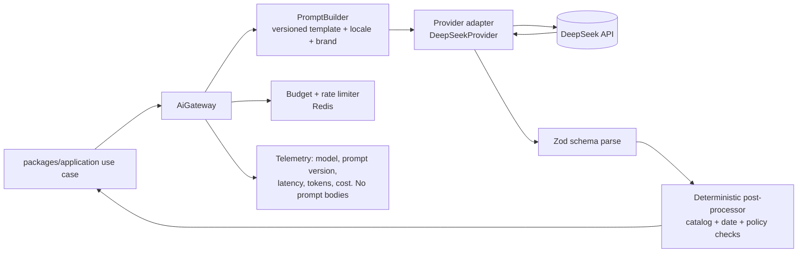
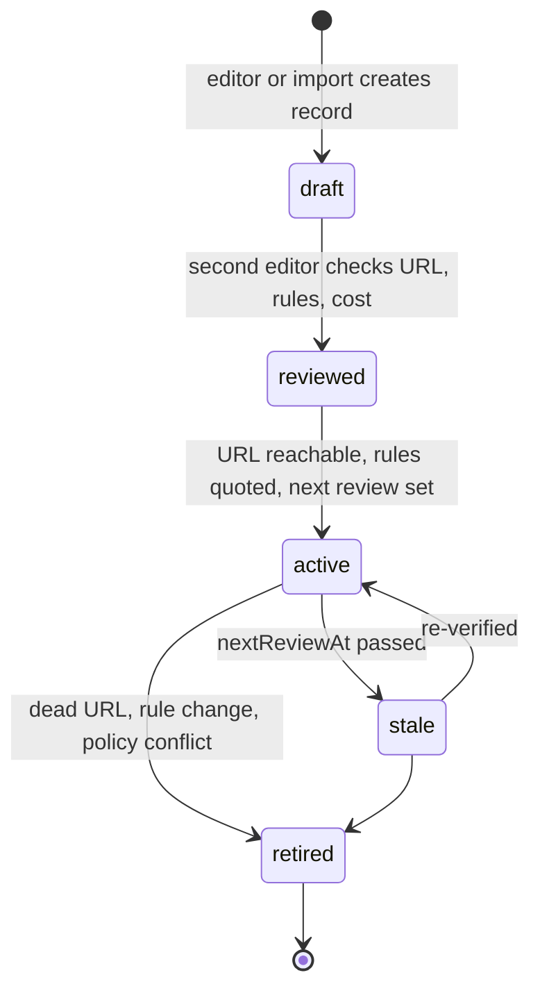

# 07. AI, Growth Advisor and Localization

**Status:** authoritative for `packages/ai` and `packages/i18n`.
**Owner:** AI Lead. **Co-owners:** Product Lead (Growth Advisor scope), Localization Lead (30 locales),
Security Lead (prompt injection and data handling), Catalog Editor (opportunity and tool records).
**Compiled:** 4 August 2026 from `docs/research/02-development-handoff.md` sections 11 and 12,
`docs/research/07-feature-parity-and-product-behavior.md`, and
`docs/research/03-product-ux-and-localization.md`. Provider facts cite
`docs/research/06-source-register.md` (compiled 4 August 2026).

Two things this document is here to prevent: a model inventing a URL, and anyone claiming the product
"supports 30 languages" without saying which kind of language they mean.

---

## 1. Scope in one paragraph

V1 uses one text model, `deepseek-v4-flash`, behind a provider-neutral gateway, to draft, rewrite,
adapt per platform, transcreate into 30 content languages, write alt text, review claims and platform
fit, summarize analytics, and turn a confirmed business profile into one versioned GrowthPlan.
**V1 generates no images and no video.** There is no endpoint, no button, no quota, no meter, no dormant
client, no environment variable and no marketing sentence implying otherwise. The shipped interface is
English only, built so that adding a locale is a catalog file plus a config entry.

---

## 2. AI gateway architecture

### 2.1 Why a gateway

Product code must never import a vendor SDK. The gateway exists so a model can be evaluated, swapped or
run side by side without touching a use case, and so every call is uniformly budgeted, redacted,
validated and logged.



### 2.2 Interface

Defined in `packages/ai/src/gateway.ts`. Adapters live in `packages/ai/src/providers/`.

```ts
export interface AiTask<TOut> {
  readonly id: AiTaskId;              // 'draft.variant', 'growth.plan', ...
  readonly promptVersion: string;     // '2026-08-04.3'
  readonly schema: ZodType<TOut>;     // structured output contract
  readonly mode: 'thinking' | 'fast';
  readonly maxOutputTokens: number;
  readonly timeoutMs: number;
  readonly budgetCents: number;       // hard ceiling per invocation
}

export interface AiGateway {
  run<TOut>(task: AiTask<TOut>, input: AiInput): Promise<AiResult<TOut>>;
}

export interface AiResult<TOut> {
  output: TOut;                       // already schema-parsed and post-processed
  meta: {
    provider: string; model: string; promptVersion: string;
    inputTokens: number; outputTokens: number; costMicros: number;
    latencyMs: number; attempts: number; degraded: boolean;
  };
}
```

`AiInput` carries `workspaceId`, `brandId`, `locale`, `contentLanguage`, typed `variables`, and
`untrustedSources[]`. Untrusted sources (imported site copy, RSS bodies, social text, webhook payloads,
uploaded files) are always passed in that array, never concatenated into the instruction text.

### 2.3 Model configuration

```text
AI_PROVIDER=deepseek
DEEPSEEK_API_KEY=
DEEPSEEK_BASE_URL=https://api.deepseek.com
DEEPSEEK_MODEL=deepseek-v4-flash
AI_PROMPT_VERSION=
```

Only `.env.example` placeholders exist in the repo. `deepseek-v4-flash` and `deepseek-v4-pro` are the
current identifiers; `deepseek-chat` and `deepseek-reasoner` were retired on 24 July 2026 and must not
appear anywhere in the codebase, including comments and fixtures. Source:
`https://api-docs.deepseek.com/updates/` and `https://api-docs.deepseek.com/api/list-models`, verified
4 August 2026, **re-verify before implementation**. Token pricing at
`https://api-docs.deepseek.com/quick_start/pricing`, verified 4 August 2026, is volatile and must be
re-verified before any financial commitment; the economics model in
`docs/planning/08-billing-entitlements-and-economics.md` treats it as an assumption, not a fact.

`deepseek-v4-pro` is not used in V1. If a task cannot meet quality on flash, the decision is recorded as
an ADR with the measured eval delta and the cost delta, not switched silently.

### 2.4 Budgets, timeouts, degradation

| Task | Mode | Timeout | Max output | Budget | Degradation when exceeded |
| --- | --- | --- | --- | --- | --- |
| `draft.variant` | fast | 20s | 1,200 | 3c | Return the master text unchanged with a notice. Never truncate silently |
| `draft.altText` | fast | 10s | 200 | 1c | Leave the field empty and mark it required |
| `text.transcreate` | thinking | 40s | 2,000 | 6c | Fail visibly. Never fall back to machine-literal translation without labeling it |
| `review.claims` | thinking | 30s | 1,500 | 5c | Show "review unavailable", do not imply the content passed |
| `analytics.summarize` | fast | 25s | 1,200 | 4c | Show raw metrics only |
| `growth.plan` | thinking | 180s (async) | 12,000 | 60c | Return a partial plan with the failed sections marked `unavailable`, never fabricated |

Per-workspace limits, enforced in Redis: 60 AI calls per minute, 1,500 per day, $8.00 per day soft cap
with an owner notification, $20.00 per day hard stop. These exist for abuse and cost control, not to
create a lower feature tier. Every subscriber gets the same limits.

Retry policy: one retry on a schema-parse failure with a repair instruction that includes the validation
error, one retry on a 5xx or timeout with jitter. Never more than two total attempts. A second schema
failure is an `INTERNAL` error and is logged with the schema path that failed, not the output body.

### 2.5 Prompt and version management

- Prompts are files in `packages/ai/src/prompts/<taskId>/<version>.md`, never inline strings.
- Version format `YYYY-MM-DD.N`. A prompt file is immutable once it has produced a stored artifact.
- Every stored AI artifact (`content_versions`, `insights`, `growth_strategies`) records
  `model`, `prompt_version`, `locale`, `source_ids[]`, `user_edited` and `approved_by`.
- A prompt change requires the eval suite (section 8) to pass at or above the previous version on every
  gate before merge. The eval report is attached to the pull request.
- Prompt bodies and user content never enter general telemetry. Telemetry carries IDs, token counts,
  latency, cost and outcome. Reproducing an output for support requires an audited privileged read.

### 2.6 Untrusted input handling

Retrieved web copy, RSS items, social text, webhook bodies and uploaded documents are hostile by
default. Rules:

1. Delimit every source in a fenced block with a generated nonce boundary, labeled with its origin ID.
2. The system instruction states explicitly that content inside source blocks is data and can never
   change instructions, tool policy, output schema or catalog membership.
3. Output is schema-parsed before any use. There is no free-text path from model output to a side effect.
4. No AI output ever calls a tool directly. The application decides what to do with a parsed object.
5. Anything that looks like an instruction inside a source ("ignore previous", "submit this form") is
   irrelevant by construction, because there is no instruction channel from source text to the executor.
6. Customer content is not used for model training by default. Any improvement program requires separate
   opt-in consent and a published policy.

---

## 3. Structured output contract

Every task returns JSON validated by a Zod schema in `packages/contracts`. Three shared rules:

- No `string` field may contain a URL except where the schema field is `catalogUrl`, and that field is
  populated by the **application** from the catalog record, never by the model.
- Every claim-bearing field is paired with `evidenceIds: string[]` referencing confirmed profile fields,
  approved brand sources or catalog records.
- Every date is `YYYY-MM-DD` and is validated against a plausible range by the post-processor.

Example, the smallest task:

```ts
export const AltTextResult = z.object({
  altText: z.string().min(8).max(420),
  language: LocaleCode,
  describesText: z.boolean(),          // true if the image contains readable text
  uncertain: z.boolean(),
  uncertaintyReason: z.string().max(280).optional(),
});
```

---

## 4. Business-profile intake

The Growth Advisor cannot run without a **confirmed** business profile. Confirmation is a human act.

### 4.1 Fields

| Field | Required | Notes |
| --- | --- | --- |
| `productUrl` | yes | Validated, SSRF-safe fetch, stored with retrieval timestamp |
| `description` | yes | User written or user-confirmed from the fetched page |
| `category` | yes | Enum plus free text |
| `targetCustomer` | yes | Free text, becomes an assumption if inferred |
| `markets[]`, `contentLanguages[]` | yes | ISO country and locale codes |
| `objective` | yes | Enum: awareness, sign-ups, sales, hiring, community, support deflection |
| `conversionEvent` | yes | Named event plus how it is measured |
| `existingChannels[]` | yes | May be empty, empty is a valid answer |
| `proofAssets[]` | no | Case studies, data, demos. Each carries a consent flag |
| `weeklyCapacity` | yes | Posts per week the team can realistically produce |
| `competitors[]` | no | Names only, never scraped |
| `prohibitedClaims[]`, `prohibitedTopics[]` | yes | May be empty. Enforced by the post-processor |

`completenessScore` is derived, not asked. It gates nothing but is shown so the user understands why a
plan is thin.

### 4.2 Facts versus assumptions

Imported site copy and uploaded files are **untrusted source material**. The intake produces two lists:

- `confirmedFacts[]`: the user typed it or explicitly confirmed an extracted value. Each carries the
  source ID it came from.
- `assumptions[]`: the model inferred it. Each carries `basis` and remains an assumption until the user
  promotes it.

An assumption may inform strategy shaping. **An assumption may never appear in generated marketing copy,
a claim, a pitch draft or an exported plan without the word "assumption" attached.** This is enforced in
the post-processor, not by prompt wording alone.

### 4.3 Endpoints

```text
POST /v1/growth/business-profiles
POST /v1/growth/business-profiles/{id}/confirm
```

Confirmation freezes a `business_profile_version`. A GrowthPlan always references the exact version it
was generated from, so a later profile edit never rewrites an approved plan.

---

## 5. The GrowthPlan schema

One versioned schema serves the UI, REST, MCP and all three export formats. There is no second
representation anywhere.

```ts
export const GrowthPlan = z.object({
  schemaVersion: z.literal('growthplan/1'),
  planId: IdOf('plan'),
  businessProfileVersionId: IdOf('bpv'),
  createdAt: z.string().datetime(),
  model: z.string(), promptVersion: z.string(),
  status: z.enum(['draft', 'approved', 'superseded']),

  businessSnapshot: z.object({           // 1
    confirmedFacts: z.array(Fact),
    assumptions: z.array(Assumption),
    missingInformation: z.array(z.string().max(240)),
  }),

  goalsAndMetrics: z.object({            // 2
    objective: Objective,
    conversionEvent: z.string().max(120),
    baseline: Measure.nullable(),        // null, never 0, when unknown
    target: Measure,
    window: z.object({ weeks: z.number().int().min(1).max(26) }),
    measurementMethod: z.string().max(400),
  }),

  audiencesAndChannels: z.object({       // 3
    audiences: z.array(Audience).min(1).max(3),
    channels: z.array(z.object({
      platform: PlatformId,
      priority: z.number().int().min(1).max(6),
      rationale: z.string().max(400),
      nativeFormats: z.array(z.string().max(60)).max(6),
      platformLimitations: z.array(z.string().max(240)).max(6),
      evidenceIds: z.array(z.string()),
    })).min(1).max(6),
  }),

  contentSystem: z.object({              // 4
    pillars: z.array(Pillar).min(3).max(5),
    recurringSeries: z.array(Series).max(4),
    proofAssets: z.array(ProofAsset).max(10),
    ctaLibrary: z.array(z.string().max(140)).min(3).max(8),
    localeAdaptations: z.array(LocaleAdaptation).max(30),
    cadence: Cadence,                    // must be <= weeklyCapacity
  }),

  ugcPlan: UgcPlan,                      // 5, see section 7
  opportunities: z.array(OpportunityMatch).max(10),   // 6, catalog IDs only
  toolRecommendations: z.array(ToolMatch).max(5),     // 7, catalog IDs only
  calendarProposal: z.array(ProposedItem).max(28),    // 8, four weeks
  risksAndUnknowns: z.array(Risk),                    // 9
});
```

Section 9 is not optional decoration. It must list every unsupported claim the model wanted to make,
every missing permission, every stale catalog record it excluded, and every assumption the plan leans on.
An empty `risksAndUnknowns` on a plan built from an incomplete profile is treated as a generation
failure by the post-processor.

### 5.1 Four-week content plan

`calendarProposal` holds at most 28 `ProposedItem` rows:

```ts
const ProposedItem = z.object({
  week: z.number().int().min(1).max(4),
  dayOfWeek: z.number().int().min(1).max(7),
  platform: PlatformId,
  accountHint: z.string().max(80).nullable(),   // resolved by the app, not the model
  pillarId: z.string(),
  format: z.string().max(60),
  brief: z.string().max(900),                    // a brief, not finished copy
  suggestedCta: z.string().max(140),
  locale: LocaleCode,
  approvalRequired: z.literal(true),
  measurementTag: z.string().max(60),
  estimatedEffortMinutes: z.number().int().min(5).max(480),
  evidenceIds: z.array(z.string()),
});
```

These are **proposals**, never scheduled posts. `Accept as draft` creates a normal draft through the same
application service as the composer. `Add as calendar proposal` creates a placeholder that still requires
a human to open, complete and approve it. Nothing on this path can publish.

Rendered as a 28-row table, never as 28 cards (see `docs/planning/06-product-ux-and-design-system.md`
section 5.11).

---

## 6. Promotion opportunity catalog

### 6.1 Principle

The opportunity finder helps a user prepare a relevant submission. It is not a link-building bot. V1 does
not submit forms, create accounts, scrape or email contacts, post into communities, buy or exchange
links, bypass moderation, or promise SEO or reach.

### 6.2 Record shape

Stored in `growth_opportunities`. Every field is filled by a human editor, never by a model.

`id`, `name`, `canonicalUrl`, `organization`, `type` (directory, community, publication, launch platform,
integration marketplace, partner, newsletter), `audience`, `regions[]`, `languages[]`, `categories[]`,
`submissionMethod`, `selfPromotionRules`, `cost`, `effortHours`, `requirements[]`, `sourceSnapshotHash`,
`reviewer`, `retrievedAt`, `lastVerifiedAt`, `nextReviewAt`, `state`, `retiredReason`.

### 6.3 Verification workflow



| State | Visible to customers | Usable by the model | Rule |
| --- | --- | --- | --- |
| `draft` | no | no | Editor working copy |
| `reviewed` | no | no | Awaiting a second pair of eyes |
| `active` | yes | yes | Requires `lastVerifiedAt` within the review interval |
| `stale` | yes, labeled `Stale` with the date | no | Excluded from new plans; existing plans keep it with the label |
| `retired` | no | no | Historical matches keep an immutable snapshot of what was shown |

Review intervals: opportunity records monthly, and always immediately before a submission brief is shown
and immediately after any user reports a rejection or rule change. Tool records: high-change entries
weekly, all active records monthly (`docs/research/06-source-register.md`, "Growth-opportunity and
creative-tool catalogs").

**Launch reality:** the catalog starts empty. The owner populates it. An empty Opportunities tab that
says "We have no verified opportunities that fit this business yet" is the correct V1 behaviour and is
better than one invented URL. This is a scope decision, not a defect.

### 6.4 Admin import

CSV or JSON import creates records in `draft` only. Import records the importer, the file hash and the
row count in the audit log. No import path can create an `active` record.

---

## 7. UGC strategy

`ugcPlan` produces exactly one campaign concept in V1:

- Campaign objective and how it ties to `conversionEvent`.
- Participant profile: who is asked, why they would say yes, and who must be excluded (employees,
  affiliates and anyone with an undisclosed material connection).
- Five prompt angles.
- A short brief template the user sends to participants.
- Desired proof: what a useful submission actually contains.
- Rights and consent checklist: written permission, scope of use, duration, territory, ability to
  withdraw, minors excluded, music and third-party rights.
- Incentive description and the disclosure language that must accompany any incentivized post.
- Review criteria and a reuse plan.

Hard boundaries, enforced in the post-processor: never suggest undisclosed testimonials, never draft a
testimonial as if a customer wrote it, never propose creator discovery or outreach automation, never
propose contract automation, never generate synthetic UGC or an avatar. A generated string containing a
first-person customer claim without a `consentAssetId` is rejected.

---

## 8. Creative Tool Radar

Same catalog machinery as opportunities, table `tool_catalog`. Maximum five results per request, always.

Each shown record must carry: `Best for`, `Why it fits` (referencing a plan item), limitations, required
skills and time, output handoff into Post Array, rights and privacy caveats, price with the date it was
checked, and an affiliate disclosure sentence when the link is commercial. Ranking is computed from fit
only. Affiliate status is a display attribute and is excluded from the ranking function by construction,
which is covered by a unit test asserting that flipping `isAffiliate` does not change the returned order.

Weekly catalog updates do not mean weekly notifications. Users opt into a monthly digest or a
material-change alert. Default is off.

---

## 9. Export: one schema, three formats

```text
GET /v1/growth/plans/{id}/export?format=markdown|json|yaml
```

All three render from the same validated `GrowthPlan` object through pure functions in
`packages/ai/src/export/`. There is no second model call and no separate prose generator. Guarantees:

- JSON is the schema verbatim. YAML is the same object, block style, no anchors, no aliases.
- Markdown is deterministic: same plan in, byte-identical file out. Stable heading IDs so a diff in
  source control is readable.
- No secrets, no tokens, no internal database IDs beyond the public prefixed IDs, no private source
  bodies. Only source titles and IDs appear.
- URLs in exports are rendered by the exporter from `active` or `stale` catalog records, with the
  verification date immediately next to the link and a `Stale` marker where applicable.
- Every export carries a header block: plan ID, plan version, business profile version, model, prompt
  version, generation timestamp and the sentence "Recommendations are suggestions. Nothing in this file
  has been submitted, published or scheduled."

Round-trip test: `json -> parse -> yaml -> parse` must produce a deep-equal object, and the Markdown
exporter must be snapshot-tested against three golden plans (rich, minimal, empty-catalog).

---

## 10. Hallucination prevention

This is the load-bearing section. Three independent layers, each of which alone would be insufficient.

### 10.1 Layer 1: the model cannot express a URL

The GrowthPlan schema has no free-form URL field. Opportunities and tools are returned as:

```ts
const OpportunityMatch = z.object({
  opportunityId: z.string().regex(/^opp_[0-9A-HJKMNP-TV-Z]{26}$/),
  fitExplanation: z.string().max(600),
  requiredAsset: z.string().max(240),
  pitchDraft: z.string().max(1200),
  effortHours: z.number().min(0.25).max(40),
  evidenceIds: z.array(z.string()).min(1),
});
```

The retrieval step passes only `active` catalog records into the prompt, each with its ID and a
summarized description. The model selects and explains. The application resolves IDs to names and URLs
when rendering. A URL never travels through the model in either direction.

### 10.2 Layer 2: the deterministic post-processor

`packages/ai/src/postprocess/growthPlan.ts` runs after schema parse and before anything is persisted or
shown. It **rejects the generation** (does not silently repair) when any of the following holds:

| # | Rejection rule |
| --- | --- |
| R1 | Any `opportunityId` or `toolCatalogId` is not in the set that was passed into the prompt |
| R2 | Any referenced catalog record is not in state `active` at post-processing time |
| R3 | Any `evidenceIds` entry is not a confirmed profile fact, an approved brand source, or a passed catalog record |
| R4 | More than 10 opportunities, more than 5 tools, more than 28 calendar items, more than 5 pillars |
| R5 | Any string matches a URL, bare domain, email address or phone-number pattern outside the fields where the exporter injects them |
| R6 | Any date is malformed, in the past where a future date is required, or more than 26 weeks ahead |
| R7 | Cadence exceeds the confirmed `weeklyCapacity` |
| R8 | Any text implies automatic submission, automated outreach, guaranteed ranking, guaranteed reach, guaranteed backlinks, or bulk directory submission (matched against a maintained phrase list plus a semantic check) |
| R9 | Any text asserts a claim listed in `prohibitedClaims` or touches a `prohibitedTopic` |
| R10 | Any first-person customer testimonial string without a `consentAssetId` |
| R11 | An assumption is stated as a fact (assumption text appears outside `assumptions[]` without the assumption marker) |
| R12 | `risksAndUnknowns` is empty while `missingInformation` is non-empty |
| R13 | Any metric value is `0` where the underlying data is actually unknown (must be `null`) |

On rejection: one repair attempt with the specific rule IDs that failed appended to the instruction. A
second failure surfaces to the user as "We could not produce a plan we trust. Nothing was saved." with a
correlation ID, and files an internal alert. **A rejected generation is never partially shown.**

### 10.3 Layer 3: rendering

The renderer only knows how to render catalog records it looks up itself. Even if layers 1 and 2 failed,
there is no code path that turns a model-authored string into a hyperlink.

### 10.4 Regression corpus

`packages/test-fixtures/ai/hallucination/` holds at least 40 adversarial cases: prompt-injected site
copy that instructs the model to add a URL, a profile that begs for a backlink guarantee, an empty
catalog, a catalog where every record is `stale`, a profile with `weeklyCapacity: 1`, RTL and CJK
profiles, and a source document containing a fake "system" block. Every case asserts the expected
rejection rule fires. This suite runs on every prompt version change and blocks merge.

---

## 11. Localization

### 11.1 The three concepts, kept separate forever

| Concept | Stored on | Example | Never |
| --- | --- | --- | --- |
| Interface locale | `users.locale` | `en` | Changed by picking a content language |
| Content language | `post_variants.locale`, brand defaults | `ja` | Changed by the browser's `Accept-Language` |
| Audience market | `brand_locale_rules.market` | `pt-BR` | Inferred from the interface locale |

Changing one never silently changes another. The UI states which one a control affects.

### 11.2 The honest V1 statement

Use this wording, or wording that preserves both halves:

> The Post Array interface ships in English in V1. You can create and adapt content in 30 languages today.
> Additional interface languages are planned and will be labeled when they arrive.

Never write "Post Array supports 30 languages" without the interface and content distinction. This applies to
the marketing site, the pricing page, app store listings, provider review submissions, sales email and
the API documentation.

### 11.3 The 30 planned content languages

English, Spanish, Portuguese, French, German, Italian, Dutch, Polish, Czech, Swedish, Norwegian, Danish,
Finnish, Turkish, Russian, Ukrainian, Arabic, Hebrew, Hindi, Bengali, Urdu, Indonesian, Malay,
Vietnamese, Thai, Filipino/Tagalog, Simplified Chinese, Traditional Chinese, Japanese, Korean.

Notes that change implementation: Portuguese distinguishes `pt-BR` and `pt-PT` content conventions.
Spanish supports regional preferences (`es-ES`, `es-MX`, `es-AR` at minimum). Chinese is two written
locales, not one language with a toggle. Arabic, Hebrew and Urdu are RTL.

### 11.4 Rollout

| Stage | Interface | Content generation |
| --- | --- | --- |
| Closed alpha | English, plus `en-XA` pseudo-locale and `ar-XB` RTL test locale in CI only | English, Spanish, German for eval bring-up |
| Paid beta | English only, shipped | All 30 after passing the eval gates in 11.6 |
| V1 launch | **English only** | All 30 |
| V1.1 | 12 human-reviewed locales: en, es, pt-BR, fr, de, it, ja, ko, zh-Hans, ar, hi, id. Beta-labeled until human review completes | All 30 |
| Later | Remaining 18 interface locales, staged, each beta-labeled until reviewed | All 30 |

### 11.5 Engineering rules

- ICU MessageFormat for every string. Plurals and selects in the message, never in code.
- Keys are intent-based and stable: `composer.validation.overCharacterLimit`, not `Too_long`.
- No string concatenation, no interpolating one translated fragment into another.
- Locale-aware dates, numbers, currency, relative time, week start and 12/24 hour preference. Store an
  ISO instant plus the IANA time zone, always.
- Logical CSS properties everywhere. No fixed widths on text containers. CI runs the pseudo-locale at
  +40% expansion and fails on overflow or clipping.
- Correct CJK line breaking. No forced capitalization transforms.
- RTL mirrors layout and directional icons. It does **not** mirror media scrub controls, timeline
  chronology, platform logos or code blocks.
- Localize everything a customer reads: emails, auth screens, billing explanations, consent text, errors,
  documentation and support macros. Navigation is the easy part and the least important.
- Terms and Privacy acceptance is versioned per language. Which language is legally controlling is a
  decision for counsel (see 11.8, L3).
- Missing translation falls back to English for that key. Never a raw key, never a half-interpolated
  string, never a mixed-language sentence.

### 11.6 Translation and transcreation evaluation

Machine output is never described as native human copy. Gates per content language before that language
is offered for generation:

| Gate | Method | Threshold |
| --- | --- | --- |
| Grounding | Automated check that every factual token traces to a confirmed fact or approved source | 100%, zero tolerance |
| Glossary adherence | Protected terms untranslated, preferred translations used | >= 98% on a 100-item set |
| Formality and register | Native reviewer rubric, 1 to 5 | Mean >= 4.0, no item below 3 |
| Platform fit | Length, hashtag and emoji norms per platform per locale | >= 95% pass |
| Harmful or non-compliant output | Red-team set of 30 prompts per locale | Zero failures |
| Idiom handling | Model must return `uncertain: true` plus a rationale when no clean equivalent exists | >= 90% recall on a seeded idiom set |

Every transcreation result returns `rationale` and `uncertainty`. The composer shows a side-by-side
comparison with the source, lets the user lock phrases that must not change, and labels the output
"Machine transcreation, not reviewed by a native speaker" until a reviewer marks it.

Reviewer sourcing and per-locale reviewer identity is a Localization Lead decision (11.8, L1).

### 11.7 Brand memory and glossary

Per brand, per locale:

- Audience and market.
- Formality level, pronoun and honorific policy.
- Forbidden idioms, emoji and hashtag norms.
- Protected terms: product names and phrases that must never be translated, stored in `glossary_terms`
  with preferred and prohibited translations plus context.
- Approved claims and required regional legal disclosures.
- CTA phrasing and link destination per market.
- Native-reviewer-approved examples, used as few-shot exemplars.

Brand memory is retrieval, not fine-tuning. It is injected as structured context for the specific brand
and locale of the request, and it is scoped by `workspace_id` like any other tenant data. One workspace's
brand memory can never appear in another workspace's generation; this is covered by an RLS test and an
AI-gateway unit test asserting the retrieval query is workspace-scoped.

### 11.8 Open localization decisions

| # | Question | Owner | Deadline | Recommended default |
| --- | --- | --- | --- | --- |
| L1 | Native reviewer sourcing for the 12 V1.1 locales | Localization Lead | 16 Oct 2026 | Contract two reviewers per locale through a vetted agency. Budget 20 hours per locale for the first pass |
| L2 | Do we ship a locale picker in an English-only V1 | Product Lead | 16 Oct 2026 | Yes. It lists English as the only interface language and links to the separate content-language setting, so the distinction is learned early |
| L3 | Legally controlling language for Terms and Privacy | Founder with counsel | 30 Nov 2026 | English controlling, with translations marked "for convenience". Counsel confirms per market |
| L4 | Pseudo-locale in production behind a flag | Web Lead | 4 Sep 2026 | CI and staging only. Never reachable in production |

---

## 12. Why V1 does not generate images or video

### 12.1 The product statement

Use this copy verbatim where the boundary needs explaining. It contains no em dashes.

> We focus on helping you plan, approve, publish and learn. We do not generate images or video in V1
> because brand-ready media needs more than a short prompt: it needs your complete visual system,
> accurate product details, licensed assets, people and usage permissions, and careful review. Creative
> models also change quickly. We recommend currently verified specialist tools and make it easy to bring
> their finished work into your campaigns while you keep creative control.

### 12.2 The reasoning

1. A one-paragraph onboarding description cannot reproduce a brand's visual system, product details,
   approved claims, licensed assets, likeness permissions and campaign context reliably.
2. Media models change rapidly in quality, price, latency, licensing, safety and output controls.
   Hard-coding one generator creates churn and lock-in while distracting from reliable publishing.
3. Generated media introduces rights, consent, disclosure and provenance review that must not hide behind
   a one-click scheduler button. Several providers require synthetic-content disclosure
   (`https://support.google.com/youtube/answer/14328491`, verified 4 August 2026,
   **re-verify before implementation**).
4. Customers already use stronger purpose-built tools. Accepting finished assets with provenance is more
   useful than a weak in-app generator.

### 12.3 What "excluded" means in code

No generation endpoint. No UI affordance in any state, including disabled or behind a flag. No
entitlement, no quota, no usage meter, no Polar product. No dormant provider client, no unused SDK
dependency, no environment variable, no database column, no feature flag named for it. No marketing
sentence that implies it exists or is coming imminently. A CI grep gate fails the build on
`generateImage`, `generateVideo`, `image_generation`, `video_generation` and the known creative-provider
SDK package names outside this document.

Uploaded and imported media is fully supported: upload, URL import, webhook and API ingestion, MIME
sniffing, checksum, malware scan, metadata extraction, crop, resize, rotate, compress, format conversion,
platform aspect presets, thumbnails, alt text, rights declaration, provenance retention and versioning.

### 12.4 Criteria that would justify reconsidering

Reconsideration requires **all seven**, evidenced, reviewed by the Founder and Security Lead, and
recorded as an ADR:

1. A brand-kit model exists in the product (colours, type, logo rules, product photography rules,
   approved claims) and is used by at least 40% of active workspaces.
2. A rights and likeness consent workflow exists, with stored consent artifacts and expiry.
3. Provenance and disclosure are automatic: C2PA-style metadata retained where the provider supplies it,
   and the platform disclosure field set where the platform requires it.
4. A provider evaluation harness exists with at least two providers scored on quality, cost, latency,
   licensing terms, safety behaviour and output controls, re-runnable on demand.
5. Cost controls exist: per-workspace budget, hard stop, and a cost estimate shown before the action,
   matching the existing X metering pattern.
6. Demonstrated demand: at least 25% of surveyed active workspaces name in-app generation as a top-three
   missing capability, and at least 10 design partners commit to testing it.
7. Legal review confirms the licensing and indemnity position for commercial output in our top five
   markets.

Until all seven hold, the answer is no, and the product says so plainly rather than hinting at a roadmap.

---

## 13. AI test and evaluation plan

| Layer | What it covers | Gate |
| --- | --- | --- |
| Schema unit tests | Every task schema accepts golden outputs and rejects mutated ones | Merge |
| Post-processor tests | All 13 rejection rules, each with a passing and a failing fixture | Merge |
| Hallucination corpus | 40+ adversarial cases (10.4) | Merge on prompt change |
| Prompt-injection suite | Injected instructions in site copy, RSS, social text, uploaded files, webhook bodies | Merge |
| Tenant isolation | Brand memory and catalog retrieval are workspace-scoped | Merge |
| Locale evals | The six gates in 11.6, per content language | Before offering that language |
| Cost and latency | p95 latency and cost per task against the budgets in 2.4 | Weekly, alert on regression |
| Determinism | Exporters produce byte-identical output for a fixed plan | Merge |
| Redaction | No prompt body, customer text or token appears in logs, traces or error payloads | Merge |

---

## 14. Open AI decisions

| # | Question | Owner | Deadline | Recommended default |
| --- | --- | --- | --- | --- |
| A1 | Do we allow `deepseek-v4-pro` for `growth.plan` if flash misses a quality gate | AI Lead | 2 Oct 2026 | No for V1. Improve the prompt and retrieval first. Revisit with measured eval and cost deltas in an ADR |
| A2 | Second provider adapter for redundancy | AI Lead with Tech Lead | 20 Nov 2026 | Build the adapter interface now, ship one provider. Add a second only if DeepSeek availability drops below 99.5% over 30 days |
| A3 | Daily AI spend hard stop per workspace | Product Lead | 18 Sep 2026 | $20.00 per day hard stop, $8.00 soft alert. Same for every subscriber, no tiering |
| A4 | Catalog editor staffing before launch | Founder | 4 Sep 2026 | One part-time editor from week 13. Launch with a small verified catalog rather than a large unverified one |
| A5 | Opportunity catalog minimum size to enable the tab | Product Lead | 6 Nov 2026 | Enable at any size, including zero. The empty state is honest and is better than padding |
| A6 | Consent flow for a future model-improvement program | Security Lead with counsel | 30 Nov 2026 | Do not build it in V1. Publish the "we do not train on your content" policy and keep it true |
