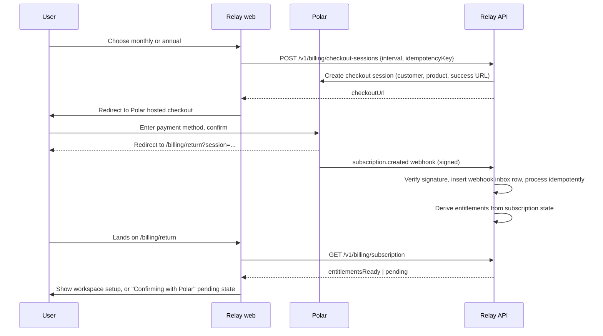

# 08. Billing, Entitlements and Economics

**Status:** authoritative for `packages/billing` and the Billing settings surface.
**Owner:** Founder (pricing and commercial policy). **Co-owners:** Tech Lead (webhook inbox,
entitlements), Product Lead (billing UX copy), Security Lead (fraud, refunds, data on cancellation),
Finance/Ops (ledger, payouts, reconciliation).
**Compiled:** 4 August 2026 from `docs/research/02-development-handoff.md` section 14,
`docs/research/07-feature-parity-and-product-behavior.md`, `docs/research/04-marketing-and-growth.md`
and `docs/research/05-trust-safety-and-legal.md`. Provider facts cite
`docs/research/06-source-register.md` (compiled 4 August 2026).

Every price, fee and rate in this document that a third party controls is marked
**re-verify before implementation**. Nothing here may be quoted to a customer without checking the live
source first.

---

## 1. The commercial model in nine lines

1. One public plan. No feature tiers. No free forever plan. No lifetime deal.
2. **$29 per month** or **$300 per year**, which is **$25 per month billed annually, save $48 per year**
   (13.8%). Never say "20% off": it is not true for these prices.
3. Both intervals unlock every shipped feature, 30 active channels and unlimited team members.
4. Both intervals start with a **seven-day trial** through Polar: payment method collected, **$0 due
   today**, exact conversion date and amount shown before confirming, Polar's pre-conversion reminder,
   self-service cancellation.
5. Entitlements come only from verified Polar webhook state plus periodic reconciliation. Never from the
   browser redirect.
6. **Do not claim a "$2 hold"** or any temporary authorization amount. Polar's trial documentation
   establishes payment-method collection and a deferred first charge, not that hold.
7. Managed X API usage is metered and passed through **at cost**, shown before the action and reconciled
   after.
8. No AI image or video credits, products, meters or add-ons exist.
9. Failed payment leads to a disclosed grace period and then read-only. Never silent deletion, never
   silent dispatch.

---

## 2. Polar product setup

Polar is Merchant of Record and handles sales tax and VAT collection and remittance. It does not handle
our corporate income tax. Source: `https://polar.sh/docs/merchant-of-record/introduction`, verified
4 August 2026.

### 2.1 Products to create

Create in the Polar sandbox first, then production. Record the IDs in the environment, never in source.

| Product | Type | Price | Interval | Trial | Env var |
| --- | --- | --- | --- | --- | --- |
| Relay Monthly | Recurring subscription | $29.00 USD | month | 7 days | `POLAR_MONTHLY_PRODUCT_ID` |
| Relay Annual | Recurring subscription | $300.00 USD | year | 7 days | `POLAR_ANNUAL_PRODUCT_ID` |
| X API usage | Usage-based meter | pass-through, see section 8 | monthly in arrears | n/a | `POLAR_X_USAGE_METER_ID` |

`POLAR_TRIAL_DAYS=7` is a config value that must match the Polar product configuration. A startup check
fails loudly if the configured product's trial length does not equal `POLAR_TRIAL_DAYS`, because a
mismatch would make our on-screen conversion date a lie.

There is no third product. In particular there is no image product, no video product, no credit pack and
no seat add-on.

### 2.2 What must never be created in Polar

Creating any of these in the Polar dashboard is a policy violation, not a mistake to be fixed later:
media-generation meters, per-seat prices, per-channel prices, feature-gated product variants, or a
discounted "lite" plan. If a commercial experiment needs one of these, it needs a founder decision and an
update to this document first.

---

## 3. The seven-day trial

### 3.1 Timeline

Assume the customer confirms checkout on 4 August 2026 at 14:00 UTC on the monthly interval.

| When | What happens | Who does it |
| --- | --- | --- |
| Day 0, 14:00 UTC | Checkout confirms. $0.00 charged. Subscription created as `trialing`. | Polar |
| Day 0, +seconds | `subscription.created` webhook arrives, signature verified, entitlements granted. | Relay |
| Day 0 | In-app confirmation: "$0.00 charged today. Your first charge is $29.00 on 11 August 2026." | Relay |
| Day 4 | Polar sends its pre-conversion reminder. | Polar |
| Day 6 | Relay sends a trial status summary with the exact amount and date, what the workspace achieved, an export link and a `Manage or cancel` link. It must not obscure or contradict Polar's reminder. | Relay |
| Day 7, 14:00 UTC | Polar charges $29.00 if not cancelled. Subscription becomes `active`. | Polar |
| Day 7 | Relay sends exactly one of: payment receipt and continuity note, cancellation confirmation, or failed-payment remediation. Never a generic success message. | Relay |

Source for trial mechanics: `https://polar.sh/docs/features/subscriptions/trials`, verified
4 August 2026, **re-verify before implementation**.

### 3.2 Disclosure required beside the primary action

Rendered before the user leaves for Polar's hosted checkout, and repeated on the Billing settings page.
No em dashes.

> $0.00 due today. Your seven-day trial ends on 11 August 2026 and your card is charged $29.00 per
> month from that date unless you cancel. Cancel in Settings before 11 August 2026 and you will not be
> charged. Managed X API usage is billed separately at cost.

For annual: "$300.00 per year, which is $25.00 per month billed annually. You save $48 per year."

We retain the exact disclosure text version shown, with a timestamp, in `consents`, so we can prove what
the customer saw.

### 3.3 Trial abuse prevention

- Enable Polar's repeat-trial prevention. Source:
  `https://polar.sh/docs/features/subscriptions/trials`, verified 4 August 2026.
- We do **not** fingerprint cards, store PANs or run our own payment risk scoring. That is Polar's job
  and doing it ourselves would create needless PCI and privacy exposure.
- Product-side controls, which are about abuse of the service rather than of the payment method:
  one active trial per verified email identity; connector OAuth requires a verified email; publishing
  volume during a trial is capped at the ordinary fair-use rate, not lower; the metered X spend cap
  during a trial defaults to $5.00 and requires an explicit raise.
- A legitimate second trial (agency evaluating for a new client, a bounced signup) is granted by support
  through a documented, audited override. There is a support path; there is no self-service loophole.

---

## 4. Checkout flow



**The redirect grants nothing.** If the webhook has not arrived when the user lands, the return page
shows a calm pending state that polls for up to 60 seconds, then offers "Check again" and a support link.
Reconciliation (section 5.4) closes any gap within 15 minutes even if the webhook never arrives.

The checkout session is created server-side with an idempotency key so a double-click cannot create two
subscriptions.

---

## 5. Webhooks, the inbox, and entitlements

### 5.1 Events consumed

`subscription.created`, `subscription.updated`, `subscription.active`, `subscription.canceled`,
`subscription.uncanceled`, `subscription.revoked`, `order.created`, `order.paid`, `order.refunded`,
`customer.updated`, `benefit_grant.*` where applicable. Source:
`https://polar.sh/docs/integrate/webhooks/events`, verified 4 August 2026,
**re-verify before implementation**. The handler must tolerate unknown event types by storing them and
taking no action, never by throwing.

### 5.2 The webhook inbox

Table `billing_webhook_inbox`:

| Column | Purpose |
| --- | --- |
| `id` | Our ID |
| `provider_event_id` | Polar's event ID. **Unique index.** This is the idempotency guarantee |
| `event_type` | For routing and metrics |
| `signature_state` | `verified` or `rejected`. Rejected bodies are stored for forensics but never processed |
| `body_hash` | sha256 of the raw body |
| `payload` | Raw JSON, retained per the billing retention class |
| `received_at`, `processed_at` | Lag measurement |
| `result` | `applied`, `noop`, `superseded`, `failed` |
| `attempts`, `last_error` | Sanitized |

Processing rules:

1. Verify the signature **before parsing for side effects**. An unverified body is inert data.
2. Insert the inbox row inside the same transaction that applies the change. If the unique index rejects
   the insert, the event is a duplicate and processing stops with `result = noop`.
3. Events can arrive out of order. Compare Polar's `modified_at` on the subscription against our stored
   value and mark an older event `superseded` rather than applying it.
4. Processing is a pure function of the payload plus current state. Retrying is always safe.
5. `failed` rows are retried with backoff and raise an alert after three failures. They are never
   discarded.

### 5.3 Entitlement derivation

Entitlements are **derived**, never hand-set. One function, one table of truth:

| Polar subscription status | Relay entitlement state | Publish and schedule | AI | Analytics read | Data export | Banner |
| --- | --- | --- | --- | --- | --- | --- |
| `trialing` | `full` | yes | yes | yes | yes | Trial, N days left, exact date and amount |
| `active` | `full` | yes | yes | yes | yes | none |
| `past_due` (within grace) | `full_grace` | yes | yes | yes | yes | Payment failed, we will retry, read-only on DATE |
| `past_due` (grace expired) | `read_only` | no new dispatch | no | yes | yes | Read-only, how to fix |
| `canceled` before trial end | `full_until_period_end` | yes until the date | yes | yes | yes | Access ends on DATE, no charge will be made |
| `canceled` after a paid period | `full_until_period_end` | yes until the date | yes | yes | yes | Access ends on DATE |
| `revoked` / `unpaid` | `read_only` | no | no | yes | yes | Read-only, how to restore |
| No subscription | `none` | no | no | no | yes | Start a trial |

The single entitlement bundle for `full`: every shipped feature, 30 active channels, unlimited team
members, unlimited drafts and standard scheduled posts under fair use, all approved connectors,
approvals, analytics, API, MCP, CLI, webhooks, automation, DeepSeek text assistance under the abuse and
cost limits in `docs/planning/07-ai-growth-advisor-and-localization.md` section 2.4.

Channel count enforcement: a workspace may hold at most 30 **active** connections. Exceeding it is
prevented at connect time with a clear message. We never auto-disconnect an account to enforce a limit.

### 5.4 Reconciliation

A scheduled job every 15 minutes lists Polar subscriptions modified since the last cursor and compares
them to our stored state. Any drift is corrected, recorded as an audit event and counted on the
`entitlement_drift` metric. A daily full sweep compares every active workspace. Webhook delivery is not
the only source of truth and must never be treated as such.

Alert thresholds: any drift correction that grants or removes `full` fires an alert immediately. More
than five drifts in an hour pages the on-call engineer.

---

## 6. Customer portal, interval change, cancellation

- Payment methods, invoices, receipts and cancellation are handled in **Polar's hosted customer portal**.
  We link to it. We do not rebuild it. Source:
  `https://polar.sh/docs/features/customer-portal/introduction`, verified 4 August 2026.
- Interval change (monthly to annual or back) is offered in Relay and executed through Polar. The
  confirmation states the proration outcome and the next charge date and amount before confirming.
- Cancellation is self-service, reachable in two clicks from Settings, and never requires contacting
  support. The confirmation, when cancelling before trial conversion, reads:
  "You will not be charged. Your access continues until 11 August 2026."
- **No retention dark patterns.** No discount ambush, no "are you sure you want to lose everything", no
  multi-step maze, no support-only cancellation. We may ask one optional reason question with a skip
  button, and we may offer pause or export where those genuinely fit the stated reason.
- Cancellation offers, on one calm screen: export your data, download receipts, keep read-only access,
  delete the workspace.

---

## 7. Failed payment, grace, refunds

### 7.1 Grace timeline

| Day | State | Behaviour |
| --- | --- | --- |
| 0 | `past_due` | Polar begins its retry schedule. Relay stays fully functional. Owner and billing-admin emailed with the exact amount, the reason class returned by Polar, and a portal link. Banner in app |
| 1 to 7 | `full_grace` | Everything continues, including scheduled dispatch. Banner states the exact date read-only begins |
| 8 | `read_only` | New publishing and scheduling stop. AI stops. Reading, analytics, receipts and export continue |
| 8 | Scheduled work | Approved scheduled posts are set to `Paused by billing` with an Action Center item. They are **not** cancelled and **not** dispatched. Temporal workflows are signalled to pause, not terminated |
| 8 to 37 | `read_only` | Payment at any point restores `full` and offers to resume each paused post with a fresh time, never a silent backfill of missed slots |
| 38 | Subscription ends | Data retained per the retention classes in `docs/research/05-trust-safety-and-legal.md`. Export remains available. Social connections are revoked at our end and the user is told, because holding provider tokens for a non-customer is not defensible |

Never silently delete content. Never silently dispatch a post the customer may not want any more. Both
of those are explicit product requirements, and both are covered by tests in section 12.

### 7.2 Refunds

- Refunds are issued through Polar. Polar as Merchant of Record handles the tax consequences.
- Published policy: full refund within 14 days of the first charge if the customer asks, no interrogation.
  After that, pro-rata refunds at our discretion for a service failure attributable to us. Mandatory
  consumer rights in the customer's jurisdiction always override this policy and the policy page says so.
- Metered X usage that we already paid to X is **not** refunded, and this is stated before the first
  metered action. Refunding it would mean paying a provider on a former customer's behalf.
- A refund triggers `order.refunded`, which reverses any affiliate commission (section 9) and is recorded
  in the immutable ledger as an adjustment, never as an edit.
- Deletion of a workspace is never made conditional on paying an outstanding invoice, except that we
  retain the billing records the law requires us to retain.

---

## 8. Provider usage metering

### 8.1 What is metered

Only X, in V1. X uses pay-per-operation pricing. As of 4 August 2026 X lists **$0.015 per post create**
and **$0.200 per post create containing a URL**, with separate read, user and webhook charges. Source:
`https://docs.x.com/x-api/getting-started/pricing`, verified 4 August 2026. The X developer console is
authoritative and prices change. **Re-verify before implementation and before any customer-facing price
is rendered.**

Prices are stored in a versioned `provider_price_book` table with an effective date, not hard-coded. The
UI renders the price book value plus its verification date. If the price book is older than 30 days, the
estimate is shown with a "prices last checked DATE" note.

### 8.2 Before the action

The composer cost panel and the schedule confirmation show, per target:

```
X: 1 post create containing a URL     $0.200
X: 2 post creates (thread items)      $0.030
Estimated total                       $0.230
Billed at cost. Prices published by X, checked 4 August 2026.
```

Automation Rules show the maximum possible cost per run and per week before activation. Bulk operations
warn when the estimate exceeds the workspace spend alert.

### 8.3 After the action

Each publish attempt records the operations actually performed on the receipt. A nightly job reconciles
our recorded operations against X's reported usage and writes an adjustment line when they differ. The
receipt shows both the estimate and the reconciled actual (see
`docs/planning/06-product-ux-and-design-system.md` section 5.4).

### 8.4 How it is billed

- **Decision:** meter through Polar usage-based billing, billed monthly in arrears at cost, with a spend
  alert and an optional hard pause. Source:
  `https://polar.sh/docs/features/usage-based-billing/introduction`, verified 4 August 2026.
- Rejected alternative: a prepaid balance. Prepaid balances create expiry, refund and unclaimed-property
  obligations for a line item that will be a few dollars a month for most workspaces.
- **At cost means at cost.** No markup, no rounding in our favour. Amounts accumulate as integer
  micro-dollars per operation and are summed before conversion to cents at invoice time.
- Defaults: spend alert at $25.00 per month, hard pause **off**, trial spend cap $5.00. Turning the hard
  pause on is one checkbox and is recommended in the UI for agencies.
- When the hard pause triggers, X publishing stops with an Action Center item. Other connectors are
  unaffected. Nothing is deleted and no post is silently dropped.

### 8.5 Other providers

LinkedIn, Meta, YouTube and TikTok do not charge per operation today, so nothing is metered for them.
If any provider introduces per-operation pricing, it is added to the price book and disclosed before the
first charged action, never applied retroactively.

---

## 9. Affiliate and referral accounting

### 9.1 Terms

| Parameter | Decision | Rationale |
| --- | --- | --- |
| Commission rate | 20% recurring | The research range is 20 to 30%. 20% keeps referred-cohort margin above the 55% floor in section 10.4 |
| Duration | 12 months from the referred subscription's first paid charge | Bounded liability, still meaningful to a partner |
| Basis | Net revenue: the paid amount minus Polar fees and any refund | We never pay commission on money we did not receive |
| Trial | No commission during the trial. The first commission accrues on the first successful charge | Prevents card-collection farming |
| Hold | 45 days from the charge, then payable | Covers the refund and chargeback window |
| Attribution | Last non-direct touch within 60 days, stored at signup, immutable thereafter | Simple, explainable, not gameable by re-clicking |
| Self-referral | Prohibited. A partner cannot earn on their own workspace or a workspace they administer | Basic fraud control |
| Review condition | Never conditional on a positive review, rating or endorsement | Legal and ethical requirement |

Disclosure is mandatory in every partner placement, and partner terms require it explicitly.

### 9.2 The ledger

`commission_ledger` is **append only**. There is no update path and no delete path; the table has an
`INSERT`-only grant and a database trigger that rejects `UPDATE` and `DELETE`.

| Entry type | Created when | Sign |
| --- | --- | --- |
| `accrual` | `order.paid` on a referred subscription | + |
| `hold` | Same moment as the accrual, 45 days | informational |
| `release` | Hold expires with no refund or dispute | informational |
| `reversal_refund` | `order.refunded` | - |
| `reversal_chargeback` | Dispute notice | - |
| `reversal_fraud` | Fraud review decision | - |
| `payout` | Included in a payout batch | - |
| `adjustment` | Manual correction, requires a reason and two approvers | +/- |

A correction is always a new compensating entry. Balance is a sum over entries, never a stored mutable
number.

### 9.3 Fraud review

Automatic hold, requiring human review before payout, when any of these fire: more than 20 referrals in
24 hours from one partner; more than 30% of a partner's referrals cancel within the trial; referred
signups sharing an email domain with the partner; referred workspaces with zero connected accounts and
zero published posts at day 30; a referral whose payment method later charges back.

Held commissions are visible to the partner with the reason category and an appeal path. We do not
accuse; we state what is on hold and why, and we resolve it within 10 business days.

---

## 10. Unit economics

### 10.1 Assumptions

Every row is an assumption to be replaced with measured data by 20 December 2026. Owner: Finance/Ops.

| Input | Value | Source and confidence |
| --- | --- | --- |
| Polar fee | 5% + $0.50 per transaction | `https://polar.sh/docs/merchant-of-record/fees`, verified 4 August 2026. Lower on paid Polar tiers. **Re-verify before launch** |
| International card fee | 1.5% on an assumed 40% of volume | Same source. Modelled as 0.6% of price |
| Fixed platform cost | $1,150 per month | Supabase Pro $300, Temporal Cloud $250, managed Redis $90, hosting $350, Sentry and PostHog $120, email $40. Estimates, **re-verify** |
| Variable infrastructure | $0.35 per subscriber per month | Compute and database beyond the fixed floor |
| Storage and egress | $0.45 per subscriber per month | Assumes 15 GB stored media and 25 GB egress at blended rates |
| AI text (DeepSeek) | $0.70 per subscriber per month | Derived from the task budgets in doc 07 at a modelled usage profile. DeepSeek pricing is volatile, **re-verify** |
| Support | $1.80 per subscriber per month | 3.0 blended minutes at $0.60 per minute fully loaded. Most subscribers never contact support |
| Monthly / annual mix | 65% monthly, 35% annual | Assumption to be measured |

Managed X API usage is excluded from these figures on both sides, because it is passed through at cost
and is neither revenue nor margin.

### 10.2 Gross margin by scale

Variable cost per subscriber per month: monthly plan $5.42, annual plan $4.74. The difference is the
Polar fee, which is charged once a year on the annual product.

| Paying subscribers | Fixed cost per sub | Monthly plan margin | Annual plan margin | Blended margin (65/35) |
| ---: | ---: | ---: | ---: | ---: |
| 250 | $4.60 | 65.4% | 63.4% | 64.8% |
| 500 | $2.30 | 73.4% | 71.8% | 72.9% |
| 670 | $1.72 | 75.4% | 74.1% | **75.0%** |
| 1,000 | $1.15 | 77.3% | 76.4% | 77.1% |
| 2,000 | $0.58 | 79.3% | 78.7% | 79.2% |
| 5,000 | $0.23 | 80.5% | 80.1% | 80.4% |

**The finding, stated plainly:** the 75% gross margin gate is met from approximately **670 paying
subscribers**. Below that we operate under the target. That is a deliberate pre-scale investment, not a
reason to introduce feature tiers or cut the plan. Review date 20 December 2026, owner Founder. If we are
below 670 subscribers at that date, the levers in 10.3 are pulled in order, and creating a cheaper
feature-gated tier is explicitly not one of them.

### 10.3 Margin levers, in the order we would use them

1. Move Polar to a paid tier if the fee reduction exceeds its cost at our volume. No customer impact.
2. Reduce the fixed floor: self-host Temporal or right-size Supabase. Engineering effort, no customer
   impact.
3. Move media storage and egress to Cloudflare R2 through the existing storage adapter. Egress is the
   fastest-growing line as video use rises.
4. Tighten the AI daily soft cap and improve prompt efficiency. Applies equally to every subscriber, so
   it is not a hidden tier.
5. Deflect support with better docs, better error messages and better connector remediation. This is the
   single largest controllable variable line.
6. Adjust the clearly disclosed fair-use or active-channel boundary, with notice. This is the last resort
   and it is done in public, in the plan description, never as a quiet change.

### 10.4 Referred-subscriber economics

At 1,000 subscribers, a referred monthly subscriber in the first 12 months:

| Line | Amount |
| --- | ---: |
| Revenue | $29.00 |
| Polar fee and card fee | -$2.12 |
| Infrastructure, storage, AI, support | -$4.45 |
| Affiliate commission, 20% of net | -$5.38 |
| Gross profit | $17.05 |
| Margin | **58.8%** |

Floor: referred-cohort margin must stay above 55%. Guardrail: referred subscriptions are capped at 30% of
new subscriptions in any month; beyond that, new partner applications pause until the mix recovers. The
75% blended target in 10.2 is measured on the non-referred base plus referred subscribers past their
12-month commission window, and the referred cohort is reported separately. Both numbers are reported to
the Founder monthly. Hiding the referred cohort inside a blended average would make the blended number
meaningless.

### 10.5 What we measure, monthly

MRR and ARR, net revenue retention, logo churn, trial-to-paid conversion, refund and chargeback rate,
gross margin including Polar fees, provider APIs, AI, storage, egress and support, support minutes per
subscriber, AI cost per subscriber, X pass-through volume (reported but excluded from margin),
entitlement drift count, and referred versus organic cohort margin.

Conversion quality is measured as retained publishing at day 30, not as cards collected. A trial that
collects a card and never publishes is a failure we should be able to see.

---

## 11. Pricing risks

| # | Risk | Likelihood | Impact | Response |
| --- | --- | --- | --- | --- |
| P1 | DeepSeek raises token prices materially | Medium | Medium | AI is 13% of variable cost. The gateway makes a provider swap a config change. Re-verify pricing monthly (`docs/research/06-source-register.md` recheck schedule) |
| P2 | X raises per-operation prices | Medium | Low to margin, high to trust | Pass-through means margin is unaffected. Update the price book, notify workspaces with active X connections before the new price applies |
| P3 | Polar fees change or the MoR relationship ends | Low | High | Keep the billing package provider-neutral behind an interface. Do not scatter Polar types through the application layer |
| P4 | $29 is too low for agencies running 30 channels | Medium | Medium | Support cost per subscriber is the tell. If agency cohorts exceed the support budget, adjust the disclosed fair-use boundary, not the feature set |
| P5 | $29 is too high for solo creators | Medium | Medium | Do not create a cheaper tier. Compete on reliability and receipts. Measure with the price validation research in `docs/research/04-marketing-and-growth.md` |
| P6 | Annual plan margin is structurally thinner and annual mix rises | Medium | Low | Annual improves cash and retention, which is worth 1.3 margin points. No action unless the mix passes 60% annual |
| P7 | Trial abuse at scale | Low | Low | Polar controls plus the product-side controls in 3.3. Watch the trial-to-publish ratio |
| P8 | Affiliate fraud | Medium | Medium | Holds, the automatic review triggers in 9.3, the 30% new-subscription cap |
| P9 | A customer is surprised by an X bill | Medium | High to trust | Cost shown before every action, spend alert on by default, hard pause one checkbox away, reconciled amount on every receipt |
| P10 | Chargebacks from a confusing trial | Low | Medium | The disclosure text is retained with a timestamp and version, so we can show exactly what the customer agreed to |

---

## 12. Billing test plan

Every row is an automated test unless marked manual. All run against the Polar sandbox
(`POLAR_SERVER=sandbox`) or recorded fixtures. No test touches production Polar.

**Checkout and trial**
1. Monthly checkout creates a `trialing` subscription and grants `full` only after the verified webhook.
2. Landing on the return URL before the webhook shows the pending state and grants nothing.
3. A forged webhook signature is stored with `signature_state = rejected` and grants nothing.
4. The conversion date and amount rendered in app equal the values Polar reports, to the second.
5. A product whose Polar trial length differs from `POLAR_TRIAL_DAYS` fails the startup check.
6. Double-submitting checkout with the same idempotency key creates exactly one session.

**Webhooks and entitlements**
7. The same `provider_event_id` delivered twice applies once and records `noop`.
8. Out-of-order `subscription.updated` events resolve to the latest `modified_at` and mark the older
   `superseded`.
9. An unknown event type is stored and takes no action, without throwing.
10. Reconciliation corrects an entitlement that a dropped webhook left stale, within one cycle.
11. Every status in the 5.3 table maps to exactly the entitlements listed, table-driven.

**Failure and grace**
12. `past_due` keeps publishing working for exactly seven days, then flips to `read_only`.
13. On entering `read_only`, approved scheduled posts become `Paused by billing`. Assert none are
    dispatched and none are deleted.
14. Paying during read-only restores `full` and offers resume with a new time, never a backfill.
15. Day 38 cancellation retains data, keeps export available, and revokes provider tokens with a user
    notification.

**Cancellation and refunds**
16. Cancelling during the trial produces "You will not be charged" and no charge occurs at conversion.
17. Cancelling after a paid period retains access to the period end, exactly.
18. `order.refunded` writes a `reversal_refund` ledger entry and does not mutate the accrual.
19. Workspace deletion is not blocked by an unpaid invoice.

**Metering**
20. A post containing a URL estimates $0.200 and a plain post estimates $0.015 from the price book, not
    from a constant.
21. The reconciled actual differing from the estimate writes an adjustment and updates the receipt.
22. The hard pause stops X publishing and leaves other connectors untouched.
23. Micro-dollar accumulation over 1,000 operations converts to cents with no rounding gain to us.
24. An expired price book renders the "prices last checked" note.

**Affiliate**
25. Commission accrues on first paid charge, never during the trial.
26. A refund inside the hold window nets the accrual to zero through a reversal entry.
27. `UPDATE` and `DELETE` on `commission_ledger` are rejected by the database.
28. Self-referral is blocked at attribution time.
29. Each fraud trigger in 9.3 places a hold and notifies the partner with a reason category.

**Copy compliance (manual, per release)**
30. No surface anywhere says "20% off".
31. No surface anywhere mentions a card hold of any amount, including "$2".
32. No product-visible billing string contains an em dash.
33. No image or video credit, product, meter or upsell exists in Polar or in the app.
34. The annual copy reads "$25/month billed annually, save $48/year" and the arithmetic is correct.

---

## 13. Open billing decisions

| # | Question | Owner | Deadline | Recommended default |
| --- | --- | --- | --- | --- |
| B1 | Polar plan tier: Starter versus a paid tier | Founder with Finance/Ops | 21 Nov 2026 | Start on Starter. Move when the fee saving exceeds the tier cost at measured volume |
| B2 | Refund window length | Founder with counsel | 30 Nov 2026 | 14 days, full, no interrogation. Mandatory consumer rights always override |
| B3 | Grace period length before read-only | Product Lead | 6 Nov 2026 | 7 days grace, 30 further days read-only, then subscription ends |
| B4 | Default X spend alert and whether hard pause defaults on | Product Lead | 6 Nov 2026 | Alert $25.00, hard pause off, trial cap $5.00. Recommend the pause to agencies in the UI |
| B5 | Affiliate commission rate and duration | Founder | 20 Nov 2026 | 20% for 12 months on net revenue. Revisit only with the cohort margin report in hand |
| B6 | Non-USD pricing | Founder | 20 Dec 2026 | USD only in V1. Polar handles tax. Local pricing needs measured demand and a rounding policy first |
| B7 | Discount codes and partner promotions | Founder | 20 Dec 2026 | None in V1. A code is a second price, and a second price is the beginning of tiers |
| B8 | Whether a workspace can hold more than 30 channels for an extra fee | Founder | 20 Dec 2026 | No. 30 is the plan. Revisit as a disclosed plan change, never as a hidden add-on |
| B9 | Annual-to-monthly downgrade proration policy | Finance/Ops | 6 Nov 2026 | Credit the unused portion to the Polar balance, apply to future invoices, no cash refund except where law requires it |
