# 09. Infrastructure, DevOps and Observability

Owner: technical lead (platform), security lead (secrets and access). Status: approved for
implementation. Last revised 4 August 2026.

Companion documents: `docs/planning/02-system-architecture.md` (what runs),
`docs/planning/03-database-and-tenancy.md` (data and policies). Scope authority is
`docs/research/07-feature-parity-and-product-behavior.md`. Dashboards in section 11 are the
named set from `docs/research/02-development-handoff.md` section 16.

Provider-dependent claims cite `docs/research/06-source-register.md`, compiled 4 August
2026. Pricing figures move; rows marked **re-verify before implementation** must be
rechecked before anyone commits money or code to them.

---

## 1. Environments

| Environment | Purpose | Data | Provider credentials | Who can reach it |
| --- | --- | --- | --- | --- |
| **local** | Development on a laptop | Seeded fake data, fake connector | None required. The app boots with zero provider keys | The developer |
| **preview** | One per pull request | Freshly seeded ephemeral database | Sandbox only; real connectors report "not configured" | Anyone with the link, behind basic auth |
| **staging** | Release candidate soak, provider review demos, restore drills | Seeded plus a small set of operator-owned real accounts | Sandbox and provider *review* apps | The team |
| **production** | Customers | Real | Production provider apps | On-call, through audited access |

### Local

`pnpm docker:up` starts Postgres, Redis, Temporal and Mailpit. `pnpm db:migrate &&
pnpm db:seed` then `pnpm dev`. Ports are in the README. The seeded workspace includes a
**fake provider** so the whole compose, approve, schedule, publish, receipt and analytics
loop is exercisable offline with no provider account at all. An absent optional service
degrades to a truthful "not configured" message; it never crashes an unrelated surface.

### Preview

Every pull request gets a web deployment, an API deployment and an ephemeral database
seeded from scratch. Preview **never** points at the staging or production database, never
holds a production secret, and never registers a real provider callback URL. Preview
environments are destroyed when the PR closes, and unconditionally after 7 days.

Temporal in preview uses a dedicated namespace with a PR-scoped task queue prefix, so a
preview worker can never pick up a staging or production task.

### Staging

Staging is production-shaped: same regions, same instance classes one size down, same
migration path, same deploy mechanism, same alerting rules routed to a non-paging channel.
It is where provider reviewers are sent, so it must never contain placeholder legal text,
dead links or unfinished screens (`docs/research/02` section 8, review plan).

### Production

Single region at launch, plus a cross-region encrypted backup copy. Multi-region active
serving is explicitly out of scope for V1.

**DECISION OWNER:** technical lead. **DEADLINE:** end of week 2.
**RECOMMENDED DEFAULT:** primary region chosen for proximity to the largest launch
geography and compatibility with the data-transfer mechanism decided in
`docs/research/05` section 13.

---

## 2. CI/CD gates

Every gate below is a merge blocker. `pnpm verify` (typecheck, lint, test) is the local
pre-commit gate; CI runs the full set.

| # | Gate | Command | Fails when |
| --- | --- | --- | --- |
| 1 | Lint | `pnpm lint` | Style, or a forbidden cross-package import (`apps/web` importing `@relay/database` or `@relay/connectors`, `design-system` importing anything but `react` and `@relay/i18n`, any import of another package's `src/**`) |
| 2 | Format | `pnpm format:check` | Prettier drift |
| 3 | Typecheck | `pnpm typecheck` | `strict` plus `noUncheckedIndexedAccess` violations, undocumented `any` |
| 4 | Unit and contract tests | `pnpm test` | Any failure. Connector contract tests run against recorded fixtures and the in-repo simulator; **no test may hit a live provider network** |
| 5 | Migrations and RLS | `pnpm db:migrate` then `pnpm --filter @relay/database test` against Postgres 16 | A migration fails from empty; a cross-workspace read, insert or `workspace_id` reassignment succeeds; a table with `workspace_id` has no policy; an append-only table accepts `UPDATE` |
| 6 | Temporal replay | `pnpm --filter @relay/worker test:replay` | A recorded history from `packages/test-fixtures` fails to replay against the current workflow code. Mandatory for every workflow change |
| 7 | Catalog lint | `pnpm --filter @relay/i18n test` plus the catalog checker | Missing ICU parameter, plural gap, hard-coded user-facing string, **em dash in product-visible copy**, untranslated key, pseudo-locale overflow. Also validates `growth_opportunities` and `tool_catalog` seed records: every record needs an official URL, a reviewer, a `last_verified_at` and an active state |
| 8 | Secret scan | `gitleaks` over full history | Any credential-shaped string outside `.env.example` placeholders |
| 9 | Build | `pnpm build` | Any app fails to build |
| 10 | Duplicate-publication suite | part of gate 4, tagged | Worker crash after provider accepted, provider timeout, duplicated webhook, revoked token at execution, or a DST transition produces a duplicate external post |
| 11 | Dependency and container scan | scheduled daily plus on PR | A known-exploited or critical vulnerability with a fix available |
| 12 | Accessibility and visual regression | on `apps/web` changes | WCAG 2.2 AA failure, or a visual diff in light or dark mode or RTL that a human has not approved |

The current `.github/workflows/ci.yml` already implements gates 1 to 5, 7, 8 and 9. Gates 6,
10, 11 and 12 are added as the corresponding apps land.

CI hygiene, already in place and not to be regressed: triggers are `push` and
`pull_request` only, so no untrusted event payload is available; `permissions: contents:
read`; no event data is interpolated into a `run:` step.

### Pipeline

```mermaid
graph LR
    PR["Pull request"] --> G["Gates 1-12 in parallel"]
    G -->|all green| PV["Preview deploy + seeded DB"]
    PV --> RV["Human review + design review"]
    RV --> M["Merge to main"]
    M --> ST["Deploy staging: migrate, then apps"]
    ST --> SM["Smoke: auth, compose, schedule,<br/>publish to fake connector, receipt, RLS probe"]
    SM -->|green| MAN["Manual approval"]
    MAN --> PRD["Deploy production: migrate, then rolling apps"]
    PRD --> CAN["Canary: 10% for 15 minutes,<br/>watch error rate, publish success, latency"]
    CAN -->|healthy| FULL["100%"]
    CAN -->|unhealthy| RB["Roll back apps. Migrations roll forward only."]
```



---

## 3. Infrastructure services

| Service | Choice | Notes |
| --- | --- | --- |
| Web (`apps/web`) | Node runtime, autoscaled, behind the CDN | Next.js 16, RSC. No provider credential is ever present in this process |
| API (`apps/api`) | Node runtime, autoscaled, min 2 instances | NestJS 11. Holds OAuth callbacks, webhooks, the OAuth issuer |
| MCP (`apps/mcp`) | Node runtime, autoscaled, min 2 | Separate scaling and rate limits from the API |
| Links (`apps/links`) | Edge or a small always-warm Node service on a **separate registrable domain** | No cookies, no session, no DB write on the hot path |
| Worker (`apps/worker`) | Node, no public ingress, autoscaled on Temporal task-queue backlog | Temporal workers, media pipeline, outbox dispatcher, reconcilers |
| Postgres | Supabase | Connection pooling through the pooler; migrations use the direct URL |
| Redis / Valkey | Managed, single primary plus replica | Rate limits, short locks, idempotency acceleration, short-link cache |
| Temporal | Temporal Cloud (section 7) | |
| Object storage | Supabase Storage behind our adapter (section 9) | |
| Email | Resend or equivalent | Transactional only |
| CDN and WAF | In front of web, api, mcp and links | Bot rules on links, rate rules on api |

Worker autoscaling is driven by task-queue backlog and schedule-to-start latency, not CPU.
A media-heavy worker pool is separated from the publishing pool so a slow transcode never
delays a dispatch.

---

## 4. Secrets and KMS

| Rule | Detail |
| --- | --- |
| Repository | Only `.env.example` placeholders. No real key in any file, including tests and fixtures |
| Storage | Platform secret manager per environment. No secret in a CI variable that a PR from a fork can read |
| Access | Production secrets are readable by the deploy role and by named on-call humans with MFA. Every human read is logged |
| Rotation | Provider client secrets and the short-link hash key every 12 months or on suspicion. OAuth issuer signing key every 6 months with an overlap window. Webhook signing secrets are customer-rotatable at any time |
| Envelope encryption | Social tokens use a KMS master key (`TOKEN_ENCRYPTION_KMS_KEY_ID`) wrapping a per-connection data key. `key_version` on every ciphertext supports online re-encryption |
| Hashed, never stored | API key secrets, OAuth client secrets, webhook signing secrets: Argon2id, shown once |
| Local development | `TOKEN_ENCRYPTION_LOCAL_KEY` and `OAUTH_SIGNING_LOCAL_KEY` are 32-byte development keys. The config schema refuses to start in production if either is set |
| Startup validation | `packages/config` parses the environment with Zod at boot, per service. A missing connector credential disables that connector with a truthful admin message; a missing core value fails fast and loudly |

---

## 5. Deployment strategy

- **Rolling deploys with a canary.** 10% of traffic for 15 minutes, watched on error rate,
  p95 latency and publish success. Automatic rollback of application code on breach.
- **Migrations run before application code**, always expand-and-contract, always backward
  compatible with the previous release, because two versions run concurrently during a
  rolling deploy. Migrations roll **forward** only; recovery from a bad migration is a new
  migration plus, if necessary, point-in-time restore.
- **Workers deploy last.** Temporal workers must not start executing a new workflow version
  before the API that creates those workflows is live. Workflow versioning uses Temporal's
  patching mechanism, and the corresponding replay test is committed with the change.
- **Feature flags** are used for product rollout, never as a substitute for the approval
  policy or an authorization check. A flag can hide a surface; it can never grant one.
- **Kill switches** exist per connector, per workspace, per automation rule, per agent
  credential and for the short-link service. They are operator-flippable in seconds and are
  audited.

---

## 6. Database migrations in the pipeline

1. Migration SQL is reviewed by the security lead when it touches a policy, grant, role or
   constraint.
2. CI applies every migration from empty against Postgres 16, then runs the RLS suite, then
   runs the policy-coverage check that every `workspace_id` table has a policy.
3. Staging applies the migration against a restored copy of a production-sized dataset once
   per release, and the wall-clock duration is recorded.
4. Production applies it in a dedicated step with a statement timeout and a lock timeout.
   `create index concurrently`. No table rewrite over 1 million rows outside a documented
   window.
5. Data backfills are separate, batched, resumable, idempotent jobs.

---

## 7. Temporal deployment: Cloud versus self-hosted

### Recommendation: **Temporal Cloud** at launch. Revisit at roughly 20 million actions per month.

**What self-hosting actually costs.** A production Temporal cluster is four services
(frontend, history, matching, worker) plus a persistence store and a visibility store. To
run it safely we would add: a second Postgres or Cassandra cluster sized for history
retention, Elasticsearch or an equivalent for advanced visibility, capacity planning for
shard counts that cannot be changed later without a migration, upgrade choreography across
versions, and 24/7 ownership of a component whose failure mode is "customers' scheduled
posts stop going out". Realistically that is 0.3 to 0.5 of an engineer permanently, plus
roughly $250 to $600 per month of infrastructure at our launch volume. At a fully loaded
engineering cost, the human half alone is well over $4,000 per month.

**What Temporal Cloud costs.** Consumption-based on actions, plus storage. Our launch volume
is small: a scheduled post is on the order of 30 to 60 actions across the campaign workflow,
its target children, media preparation, status polling and receipt writes. Even at 100,000
published targets per month, that is single-digit millions of actions, which lands in the
low hundreds of dollars per month territory. **Re-verify current Temporal Cloud pricing
before committing budget**; the source register was compiled 4 August 2026 and does not
pin a Temporal price sheet.

**Why Cloud wins for us right now.**

| Factor | Temporal Cloud | Self-hosted |
| --- | --- | --- |
| Time to first durable workflow | Hours | 1 to 2 weeks |
| Ongoing operational load | Namespace, retention, mTLS or API key | A cluster, two datastores, upgrades, shard planning |
| Failure blast radius | Vendor SLA and on-call | Our on-call, at 3 a.m., during a customer's scheduled campaign |
| Cost at launch volume | Hundreds of dollars per month | Hundreds of dollars per month **plus** half an engineer |
| Cost at very high volume | Grows with actions | Amortizes; this is the crossover |
| Data residency control | Namespace region choice | Total |

**When to revisit.** When monthly Temporal Cloud spend exceeds roughly $2,500, or when a
data-residency requirement cannot be met by a Cloud region. At that point the economics
favour self-hosting because the fixed human cost is amortized over far more volume.

**Guardrails either way.** Namespace per environment (`relay-prod`, `relay-staging`,
`relay-preview`). Retention 30 days in production, 7 in staging, 3 in preview. Task queues
are named per purpose (`relay-publishing`, `relay-media`, `relay-analytics`,
`relay-webhooks`) so pools scale independently. Credentials are per-namespace API keys with
no cross-namespace access. **No token, no post body and no PII ever enters a workflow input,
an activity input, a search attribute or a history.**

**DECISION OWNER:** technical lead. **DEADLINE:** end of week 2.
**RECOMMENDED DEFAULT:** Temporal Cloud.

---

## 8. Queues and rate limiting

Temporal is the durable work engine. Redis is the fast, lossy coordination layer. Neither
substitutes for the other.

| Concern | Where | Notes |
| --- | --- | --- |
| Scheduled publishing, retries, delays, repeats | Temporal | Durable, replayable |
| Fan-out to customer webhooks | Temporal (`WebhookDeliveryWorkflow`) | Exponential retry with jitter, delivery log, dead letter, disable on persistent failure |
| Outbox dispatch | Worker polling Postgres with `FOR UPDATE SKIP LOCKED` | At-least-once; every consumer is idempotent |
| API rate limits | Redis token bucket | Dimensions: workspace, credential (API key, OAuth grant, service account), route, connector cost, abuse risk |
| Provider rate limits | Redis per-connection budget, informed by `provider_limits` observations | Honours `Retry-After`. A 429 becomes `retry_scheduled`, never a failure |
| Short-link abuse | Redis counters at the edge, per source and per slug prefix | Enumeration is throttled; slugs are not sequential |
| AI budget | Redis counter plus a Postgres monthly ledger | Per-workspace monthly cap, default 25 USD from `.env.example` |
| Idempotency | Postgres `private.idempotency_keys` is authoritative; Redis is an accelerator | If Redis is cold, we are slower, never wrong |

Rate-limit responses are honest: HTTP 429 with `Retry-After`, a stable error code, and a
user-safe message key. If Redis is unavailable, consequential writes **fail closed** (a
429 is better than an unlimited publish loop) and reads fail open.

---

## 9. Object storage and the R2 adapter

`packages/application` depends on a `StorageAdapter` interface, never on a vendor SDK:

```text
putSigned(key, contentType, maxBytes, ttl) -> signed upload URL
getSigned(key, ttl)                        -> short-lived read URL
head(key) -> { bytes, contentType, etag }
delete(key)
copy(from, to)
```

Object keys are `ws/{workspace_id}/{asset_id}/{purpose}`. Buckets are private. There is no
public read. Every read is a short-lived signed URL scoped to a single object.

**Why the adapter exists on day one.** Video and image delivery to provider fetch endpoints
is egress-heavy, and egress is the line item that surprises people. Cloudflare R2 charges no
egress fee, which is the specific reason it is the named alternative. Moving is then a
config change plus a background copy job, not a refactor.

**Migration plan when triggered:** dual-write new objects to both backends, background-copy
existing objects verifying SHA-256, flip reads, verify for 7 days, stop writing to the old
backend, delete after 30 days.

**DECISION OWNER:** technical lead. **DEADLINE:** review monthly once storage egress exceeds
1 TB per month. **RECOMMENDED DEFAULT:** stay on Supabase Storage until the cost dashboard
shows egress is a top-three cost line.

---

## 10. Monitoring: logs, metrics and traces

Every flow carries `correlation_id`, `workspace_id`, `job_id`, `connection_id` and
`provider`. Sensitive identifiers are hashed or redacted in broad telemetry.

| Signal | Tool | Rules |
| --- | --- | --- |
| Logs | Structured JSON through `@relay/observability`, which redacts by default | No `console.log` in shipped code. **Never** a token, a post body, a customer email, an AI prompt body or a raw provider payload. Retained 30 days |
| Metrics | OpenTelemetry to the collector | RED per surface, plus the domain metrics below |
| Traces | OpenTelemetry, sampled: 100% of errors, 100% of publish workflows, 5% of reads | Spans cross web to API to worker to provider via `correlation_id` |
| Errors | Sentry | Typed `RelayError` codes group cleanly. PII scrubbing on |
| Product analytics | PostHog, consent-aware | No content, no provider identifiers |

Domain metrics that matter more than CPU:

`publish_attempt_total{provider,content_type,account_type,classification}`,
`publish_success_ratio`, `schedule_dispatch_latency_seconds`,
`provider_processing_latency_seconds`, `duplicate_prevention_events_total`,
`token_time_to_expiry_seconds`, `token_refresh_failures_total`,
`webhook_delivery_lag_seconds`, `webhook_failure_ratio`, `analytics_freshness_seconds`,
`analytics_coverage_ratio`, `ai_latency_seconds`, `ai_cost_usd`, `ai_eval_score{locale}`,
`provider_cost_usd{provider,workspace}`, `polar_webhook_lag_seconds`,
`entitlement_drift_total`, `outbox_undispatched_age_seconds`, `rls_denial_total`.

### 11. Named dashboards

These are the dashboards from `docs/research/02` section 16. Each one exists, has an owner,
and is linked from the on-call runbook.

| Dashboard | Shows | Owner |
| --- | --- | --- |
| **Publish success** | Success ratio by provider, content type and account type; failure breakdown by the six error classes | connectors lead |
| **Schedule and provider latency** | Dispatch latency p50/p95/p99 against the 60 s p95 target; provider processing latency by connector | technical lead |
| **Error classes and remediation** | Volume per class; how many `action_required` items customers actually resolve, and how long it takes | product |
| **Token health** | Time to expiry distribution per connector; refresh success ratio; connections in incident | connectors lead |
| **Duplicate prevention** | Idempotency conflicts, adopt-existing-external-ID events, `recreateOnUnknown: false` stops | technical lead |
| **Webhook lag and failure** | Delivery lag, failure ratio by endpoint, dead-letter depth, endpoints auto-disabled | API lead |
| **Analytics freshness and coverage** | Age of the newest observation per connector; percentage of receipts with any metric; unavailable-metric counts | analytics lead |
| **AI latency, cost and evals** | Latency, cost per workspace, eval regression by locale, budget-cap hits | AI lead |
| **Provider cost and gross margin** | Provider and API cost per active subscription; margin per workspace; X cost per post with and without a URL | founder |
| **Polar reconciliation** | Webhook lag, inbox backlog, entitlement drift between Polar state and our `entitlements` table | billing lead |

---

## 12. SLOs, alerting and the status page

### Service level objectives

| SLO | Target | Window |
| --- | --- | --- |
| Valid scheduled posts execute successfully | 99.5%, excluding provider outage, revoked authorization, invalid content and account enforcement | 30 days |
| Scheduler dispatch latency | p95 under 60 seconds | 7 days |
| Duplicate external posts caused by us | Zero | Always |
| Web availability | 99.9% | 30 days |
| API availability | 99.9% | 30 days |
| Redirect service availability | 99.95% | 30 days |
| Webhook delivery within 60 seconds | 99% | 7 days |
| Analytics freshness within the connector's stated cadence | 95% | 7 days |

Actual dispatch and publish timestamps are always shown to the user, so the SLO is
verifiable by the customer rather than asserted by us.

### Alerting

| Severity | Meaning | Route | Examples |
| --- | --- | --- | --- |
| **Sev-1** | Customers cannot publish, or we may be publishing twice | Page immediately | Publish success below 90% for 10 minutes; duplicate-publication detector fires; database unreachable; Temporal namespace unreachable |
| **Sev-2** | Degraded, customer-visible | Page during hours, ticket overnight | One connector down; dispatch latency p95 above 5 minutes; outbox undispatched age above 10 minutes; webhook dead-letter growing; a restore exercise fails |
| **Sev-3** | Needs attention this week | Ticket | Analytics stale on one connector; AI eval regression; cost anomaly; token refresh failure rate rising |

Alerts are symptom-based. "CPU is high" is not an alert. "Scheduled posts are not
dispatching" is.

### Public status page

Components are **per connector and per surface**, exactly as
`docs/research/07` requires, with honest partial outages:

Surfaces: Web app, REST API, MCP server, Short links, Scheduling and publishing engine,
Analytics ingestion, Webhook delivery.
Connectors: X, LinkedIn, Instagram, Facebook Pages, YouTube, TikTok, plus Threads and
Bluesky if they ship as fallbacks.

Component states: Operational, Degraded, Partial outage, Major outage, Maintenance. A
connector awaiting provider approval is shown as **"Not yet available"**, which is a
different thing from an outage and is labelled differently. This is the same distinction the
product makes between `not_implemented` (we have not built it) and `unsupported` (the
provider does not offer it), and the status page must not blur it.

Status page updates are posted within 15 minutes of a Sev-1 or Sev-2 declaration, updated at
least every 60 minutes, and closed with an incident history entry. Maintenance notices go up
at least 48 hours ahead. We do not promise a 24/7 response time or an SLA until staffing
supports it.

---

## 13. Backups, disaster recovery and cost controls

Backup settings, RPO/RTO objectives and the restore exercise cadence are in
`docs/planning/03-database-and-tenancy.md` section 10. They are owned jointly and must not
be duplicated here with different numbers.

Infrastructure-side additions:

- Infrastructure is declared as code and reviewed. A production resource created by hand is
  an incident, not a shortcut.
- Object storage versioning is on; noncurrent versions expire after 30 days.
- A quarterly game day exercises one scenario end to end: region loss, Temporal outage, or
  a mass token expiry. The outcome is a dated record and a follow-up ticket.

### Cost controls

| Control | Mechanism |
| --- | --- |
| Provider API cost | Estimated per draft before scheduling, reconciled after publishing, and passed through at cost. **X lists $0.015 per post create and $0.200 per post create containing a URL as of 4 August 2026** (X API pay-per-use pricing, source register; **re-verify before implementation**). Link-heavy bulk jobs show a warning with the estimate before confirmation |
| AI cost | Per-workspace monthly cap (default 25 USD), per-request timeout, structured outputs to avoid retries, prompt-version tracking so a regression is attributable |
| Storage egress | Tracked per workspace; the R2 adapter exists specifically so this is switchable (section 9) |
| Temporal actions | Actions per published target tracked as a unit-economics metric on the provider-cost dashboard |
| Analytics sync | Cadence is per connector and configurable, because analytics reads are billable on X |
| Preview environments | Destroyed on PR close, unconditionally after 7 days |
| Budget alarms | Alert at 50%, 80% and 100% of the monthly infrastructure budget, routed to the founder |

"Unlimited X posting" is never an acceptable promise. Managed X API usage is metered and
passed through at cost, disclosed beside the purchase action.

---

## 14. Operational runbooks

Each runbook lives at `docs/runbooks/<name>.md` and follows the same shape: detection,
immediate containment, diagnosis, remediation, customer communication, follow-up. The
summaries below are the contract those files must satisfy.

### 14.1 Token mass-expiry

**Detection.** Token health dashboard shows a cliff in time-to-expiry, or
`token_refresh_failures_total` spikes for one provider. Often follows a provider policy
change or an app-review outcome.

**Immediate.** Pause dispatch for the affected connector so jobs hold in `retry_scheduled`
rather than burning attempts against 401s. Do not mass-delete credentials.

**Diagnose.** Is it one workspace (a customer revoked at the provider), one provider (a
policy or app change), or us (a broken refresh workflow, an expired client secret, a clock
problem)? Check the provider's status and developer changelog before assuming it is us.

**Remediate.** If ours: fix, deploy, resume, let `TokenRefreshWorkflow` catch up. If the
provider's: raise `connection.action_required` for the affected connections with a specific
message naming the provider and the exact reconnect step, mark the status page component
degraded, and hold scheduled jobs rather than failing them.

**Communicate.** One in-app Action Center item per affected connection plus one email. Say
what happened, what the customer must do, and what happens to already-scheduled posts. Never
"Authentication failed".

**Follow-up.** If more than 5% of connections for a provider expired at once, that is a
Sev-2 postmortem.

### 14.2 Provider outage

**Detection.** Error rate for one connector crosses the circuit-breaker threshold, or the
provider's own status page reports an incident.

**Immediate.** Open the circuit breaker for that connector. Jobs stay in `retry_scheduled`
with a visible next-attempt time. Mark the status page component. Publish a banner naming
the connector, never a generic "something went wrong".

**Diagnose.** Confirm against the provider status page and developer forum. Distinguish a
full outage from targeted rate limiting from an enforcement action against one customer
account.

**Remediate.** Half-open the breaker on a low-volume probe. When healthy, resume with a
staggered release so we do not self-inflict a thundering herd. Extend the retry budget for
jobs that would otherwise have exhausted attempts during the outage.

**Communicate.** Status page within 15 minutes; hourly updates; a closing note that names
which posts were delayed and confirms none were duplicated.

**Follow-up.** Record the outage duration against the affected connector's reliability
record. Recurring outages inform the connector scorecard.

### 14.3 Duplicate publication suspected

This is the highest-severity class of bug in the product. Treat it as Sev-1 on suspicion,
not on confirmation.

**Detection.** `duplicate_prevention_events_total` behaving unexpectedly, a customer report,
two `publication_receipts` for the same content version on the same connection, or a unique
constraint violation on `(provider, connection_id, external_post_id)`.

**Immediate.** Pause the affected workflow type globally with the kill switch. Do not delete
anything at the provider yet. Snapshot the relevant `publish_attempts`, receipts and
Temporal histories before they age out.

**Diagnose.** Walk the attempt timeline. The questions, in order: did the create activity
retry after a timeout? Did the status query return inconclusive and the connector's
`recreateOnUnknown` allow a recreate? Did two workflows start with different IDs for the
same job (an idempotency-key bug)? Did a customer legitimately schedule the same content
twice?

**Remediate.** Fix the classification or the workflow ID derivation. Add the exact history
as a replay-test fixture in `packages/test-fixtures` before shipping the fix, so the bug can
never return silently. Offer to delete the duplicate at the provider where the connector
supports `deletePost`, with the customer's explicit consent. Never delete a customer's
external post without asking.

**Communicate.** Contact affected customers directly, name the posts, explain what happened
and what we did. Duplicate posts can put a customer in breach of a provider's duplicate
content rules, so this is a trust event, not a bug report.

**Follow-up.** Mandatory postmortem. Re-examine every connector's `recreateOnUnknown`
setting; the default is `false` for a reason.

### 14.4 Polar webhook backlog

**Detection.** `polar_webhook_lag_seconds` rising, `billing_webhook_inbox` unprocessed count
growing, or entitlement drift appearing on the reconciliation dashboard.

**Immediate.** Confirm we are still accepting and persisting deliveries. **Persisting the
raw event is the priority**; processing can lag safely, losing the event cannot. Check
signature verification is not rejecting everything after a secret rotation.

**Diagnose.** Is it Polar delivering slowly, our endpoint returning non-2xx, our processor
crashing on one malformed event, or a poison-pill row blocking the queue head?

**Remediate.** Move the poison event to a quarantine table and continue. Run the
`BillingReconcileWorkflow` immediately to pull authoritative state from the Polar API rather
than waiting for redelivery. **Entitlements come only from verified Polar state plus
reconciliation, never from a browser redirect**, so reconciliation is always the safe
recovery path.

**Customer impact rule.** If we cannot confirm a customer's state, **do not downgrade
them**. Grant continued access and resolve it afterwards. Never disconnect social accounts
or delete content because of a billing-state uncertainty. A trialing customer must not be
locked out because our inbox is behind.

**Follow-up.** If drift affected any customer's access, notify them and confirm the
resolution.

### 14.5 Temporal worker wedged

**Detection.** Task-queue backlog growing while worker CPU is idle; schedule-to-start
latency climbing; workflows stuck in one state; dispatch latency SLO burning.

**Immediate.** Check worker health and Temporal namespace connectivity. Do **not** terminate
workflows. Terminating a publish workflow mid-dispatch is exactly how a duplicate happens.

**Diagnose.** Common causes, in likelihood order: a non-deterministic workflow change
deployed without a patch (the replay test would have caught it, so also ask why it did not);
an activity blocking on an external call without a timeout; a poison workflow that panics
the worker on replay; a connection pool exhausted by a slow query; a deploy where workers
came up before the API.

**Remediate.** For a determinism break, roll back the worker deployment; workflow histories
are intact and resume. For a poison workflow, quarantine it by ID and reset it to the last
good event rather than terminating. For pool exhaustion, raise limits and fix the query.
Scale worker replicas and confirm the backlog drains.

**Follow-up.** Add the failing history to the replay fixtures. If a determinism break
reached production, the replay gate has a hole; fix the gate in the same week.

### 14.6 Short-link abuse

**Detection.** A spike in redirect volume on one slug or workspace, an abuse report, a
safe-browsing flag on the redirect domain, or the destination scanner flagging a link after
creation.

**Immediate.** Disable the specific slug through the kill switch; it propagates through
Redis in seconds. If the domain itself is flagged, disable the offending workspace's links
rather than the whole domain, and verify the redirect domain is still separate from the
session domain (it is, by design, and this is why).

**Diagnose.** Is it one compromised customer account, a customer deliberately abusing the
service, or a bug allowing an open redirect or a redirect chain to an unsafe destination?
Check whether the destination changed after approval, which is an audited action.

**Remediate.** Re-scan every active destination for the workspace. Suspend the workspace's
link creation if abuse is deliberate, following the enforcement process in
`docs/research/05` section 3: preserve the reason, the rule version, the evidence hash and
the appeal path. If it is a bug, patch the safety gate and re-scan all active links
globally.

**Communicate.** Notify the customer of the specific action taken and the appeal path,
without revealing detection details that would help evasion. If the domain was flagged
externally, request review and post to the status page under the Short links component.

**Follow-up.** Historical click reports must still show the destination that was active at
the time. Never rewrite history to hide an abuse event.

---

## 15. Open items

| # | Open item | Decision owner | Deadline | Recommended default |
| --- | --- | --- | --- | --- |
| 1 | Hosting platform for web, api, mcp, worker, links | technical lead | end of week 2 | One platform for all five, chosen for rolling deploys, secret management and a private network to Postgres. Avoid splitting across vendors at this size |
| 2 | Temporal Cloud versus self-hosted | technical lead | end of week 2 | Temporal Cloud (section 7) |
| 3 | Primary production region | technical lead with founder | end of week 2 | Nearest the largest launch geography, compatible with the transfer mechanism in `docs/research/05` section 13 |
| 4 | Status page vendor versus self-built | technical lead | end of week 14 | A hosted status page. It must stay up when we do not, which rules out hosting it on our own infrastructure |
| 5 | Log retention beyond 30 days | security lead | before paid launch | 30 days for application logs, 180 for security events, per doc 03 section 7 |
| 6 | Monthly infrastructure budget and alarm thresholds | founder | end of week 4 | Alarm at 50%, 80% and 100% of an agreed monthly figure |
| 7 | On-call rotation before paid launch | founder | end of week 16 | Business-hours on-call with best-effort overnight until staffing supports more. Do not advertise 24/7 or an SLA we cannot staff |
| 8 | Canary automation versus manual promotion | technical lead | end of week 6 | Automated rollback on error-rate and publish-success breach; manual promotion to 100% until the signal is trusted |
| 9 | Chaos and game-day scenario for the first quarter | technical lead | end of week 12 | Mass token expiry, since it is the most likely real event |
| 10 | Whether preview environments are exposed publicly | technical lead | end of week 3 | Behind basic auth, always. A preview environment is not a demo environment |
