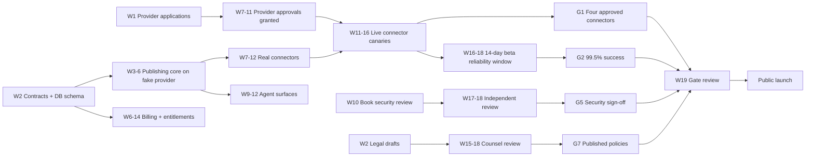

# 11. Delivery Roadmap

Owner: Technical Lead (TL). Approver: Founder.
Baseline: `docs/research/02-development-handoff.md` section 18, adjusted for the canon in
`docs/research/07-feature-parity-and-product-behavior.md` and for the fact that most of this
codebase is implemented by parallel agents and junior developers.

**Calendar.** Week 1 begins Monday 10 August 2026. Week 20 ends Sunday 27 December 2026.
The last two weeks fall across a holiday period in most markets. The plan therefore targets
the **go/no-go gate review in week 19 (14 to 20 December 2026)** and gives the founder an
explicit choice of launching in week 20 or holding the public launch to week 21 beginning
5 January 2027. Recommended default: hold the public launch to 5 January 2027 and use week
20 for canary soak, support readiness and content staging. A launch nobody is staffed to
support is worse than a two-week delay.

---

## 1. How this plan is built for parallel agents

Four rules make the work fan out without collisions. They matter more than the schedule.

1. **Contract first.** `packages/contracts` and `packages/database` land before anything
   that consumes them. A workstream blocked on a contract writes against the contract and
   leaves `// TODO(owner): depends on <package>`. It does not invent a local type and it
   does not edit another package to unblock itself.
2. **Disjoint package ownership.** Every workstream owns a set of packages and apps that no
   other workstream writes to. Cross-package needs are raised as a contract change request
   to the owning workstream, not as a direct edit. The ownership table is section 3.
3. **Simulator before provider.** Every product feature is built and tested against the
   `fake` provider and the simulators in `packages/test-fixtures` before a real provider
   adapter exists. This decouples the entire product from provider approval timelines,
   which are the single largest schedule risk.
4. **One integration point per week.** Each workstream merges to trunk at least daily, but
   cross-workstream integration checkpoints happen at a fixed time each week (Thursday) so
   that contract drift is caught in hours, not weeks.

Anti-pattern to avoid: a "backend team" and a "frontend team" both editing
`packages/application`. That package has exactly one owning workstream.

---

## 2. Phases

| Phase | Weeks | Theme | Exit criteria |
| --- | --- | --- | --- |
| 0 | 1 to 2 | Proof, contracts and provider applications | ADRs recorded; all six provider applications submitted; contracts and database schema v1 merged; one text publish and one video upload proven in a sandbox or simulator; clean-room and threat-model policy written |
| 1 | 3 to 6 | Trustworthy core | An internal user can draft, approve, schedule, cancel and observe a publish on the `fake` connector, with RLS enforced, an immutable content version, an idempotency key, a Temporal workflow, a receipt and a full audit trail |
| 2 | 7 to 12 | Connectors and agent surfaces | Closed alpha with at least four live connectors including one video connector; an agent-created draft reaches human-approved publication through MCP; REST, CLI and webhooks share the same authorization and receipts |
| 3 | 13 to 16 | Analytics, Growth Advisor, multilingual content and beta | 25 design partners in a controlled beta; analytics with definitions and freshness; Growth Advisor with catalog-backed opportunities and tools; deletion and export tested; billing reconciliation live |
| 4 | 17 to 20 | Hardening, security review and launch | All seven go/no-go gates in `docs/planning/10-testing-quality-and-release.md` section 17 signed; paid plans live; canaries monitored; support coverage staffed |
| 5 | Months 6 to 12 | Expansion | Remaining providers by connector scorecard, additional interface locales, n8n and Make packages, embedded SDK beta, agency features |

---

## 3. Workstreams and package ownership

| ID | Workstream | Owns (exclusive write access) | Primary role |
| --- | --- | --- | --- |
| WS-0 | Foundation and contracts | root tooling, `.github/`, `packages/contracts`, `packages/config`, `packages/observability` | TL |
| WS-1 | Data, tenancy and security | `packages/database`, `packages/authz`, credential vault inside `packages/application/src/credentials` | TL with BE2 |
| WS-2 | Publishing core | `packages/application`, `apps/worker` | BE2 |
| WS-3 | Connectors | `packages/connectors`, `packages/test-fixtures`, `docs/connectors` | BE1 |
| WS-4 | Web product | `apps/web` product routes | FE1 |
| WS-5 | Design system and copy | `packages/design-system`, `packages/i18n`, `apps/web` marketing routes | DES with FE2 |
| WS-6 | Agent surfaces | `apps/api`, `apps/mcp`, `apps/cli` | BE1 from week 9, FE2 for the developer console UI |
| WS-7 | Billing | `packages/billing`, billing routes in `apps/api` and `apps/web/settings/billing` | BE2 |
| WS-8 | AI and Growth Advisor | `packages/ai`, growth use cases in `packages/application/src/growth` | TL with FE2 |
| WS-9 | Analytics and links | `packages/analytics-domain`, `apps/links` | BE2 with FE2 |
| WS-10 | Compliance, provider approvals, launch ops | `docs/security`, `docs/runbooks`, legal pages content, provider dossiers | Founder with QA |

`packages/application/src/growth` is a documented carve-out: WS-8 owns that directory,
WS-2 owns the rest of the package. The boundary is enforced by CODEOWNERS.

---

## 4. Week by week, five to seven person team

Staffing assumed: **TL** (technical lead, also security), **BE1** (backend and connectors),
**BE2** (backend, publishing and billing), **FE1** (frontend and product), **FE2**
(frontend and agent or developer surfaces, joins week 5), **DES** (design and copy, 60%),
**QA** (quality and platform operations, joins week 5). Founder covers product, provider
applications, legal and marketing throughout.

### Phase 0

**Week 1 (10 to 16 August). Applications go out on day one.**

- Founder: register the developer accounts and submit or start applications for X,
  LinkedIn, Meta (Instagram and Facebook Pages), Google or YouTube, and TikTok. This is the
  critical path and it starts before any product code exists. Draft the reviewer script,
  the demo storyboard and the policy page skeletons the reviewers will ask for.
- TL: ADRs for Supabase, Temporal, Prisma with reviewed SQL for RLS, Polar, the
  provider-neutral AI gateway, and the clean-room policy. Threat model v1.
- TL: monorepo, CI, environments, secret scanning, dependency boundary lint.
- BE1: spike one text publish and one resumable video upload against sandboxes or, where a
  sandbox is unavailable, the simulator. Record what is blocked by approval.
- DES: clickable prototype of connect, compose, approve, schedule and receipt.
- Estimate: 5 to 7 person-weeks.

**Week 2 (17 to 23 August). Contracts land.**

- WS-0: `packages/contracts` v1: connector interface, capability snapshot, draft, receipt,
  error taxonomy, metric, entitlement, webhook payloads, `RelayError`, `newId`.
- WS-1: `packages/database` schema v1 with RLS policies, plus the RLS test harness.
- WS-3: `fake` provider and the first simulators.
- Founder: policy page drafts, entity and support address, domain and brand.
- Exit review Thursday of week 2: contracts frozen for the next two weeks except by an
  explicit change request.
- Estimate: 6 to 8 person-weeks.

### Phase 1

**Week 3.** Auth, workspaces, roles, invitations, memberships, audit events. Design system
tokens and primitives. Media upload with MIME sniffing and checksum. Storage adapter.

**Week 4.** Content items, immutable content versions, post variants, approval requests and
decisions. Composer shell against the `fake` provider capability data. Credential vault with
envelope encryption and a rotation test.

**Week 5.** Publish jobs, attempts, receipts, idempotency. Temporal workflow skeleton with
the durable timer, revalidation step and cancel signal. FE2 and QA join. QA stands up the
E2E, a11y, pseudo-locale and visual harnesses.

**Week 6.** Master draft with per-target overrides, live limits, mention resolution and
destination selection, all against the `fake` connector. Duplicate publication tests DUP-1
to DUP-6 green. Polar sandbox, product configuration and the entitlement model.

Phase 1 exit review, Thursday week 6. Estimate for weeks 3 to 6: 24 to 30 person-weeks.

### Phase 2

**Week 7.** X connector: OAuth, discover accounts, capabilities, validate, publish, status,
receipt, cost estimator showing $0.015 per post create and $0.200 per post create containing
a URL (X pay-per-use pricing, `docs/research/06-source-register.md`, verified 4 August 2026,
re-verify before implementation). Calendar month and week views.

**Week 8.** LinkedIn connector, member and organization, plus the provider review demo
recording. Short-link service with SSRF and open-redirect protection. Queue and action
center.

**Week 9.** MCP OAuth with read, draft and validate tools only. REST `/v1` with idempotency,
cursor pagination and OpenAPI. Connector health, incidents and remediation UI. Meta
connectors begin, gated on app review progress.

**Week 10.** Consequential MCP tools behind approval levels. CLI with stable `--json`.
Outbound webhooks with signing, retries and a delivery log. Instagram and Facebook Pages
publish paths. DeepSeek gateway with structured output, redaction and cost budgets.

**Week 11.** YouTube and TikTok, subject to approval. Threads or Bluesky fallback decision
point (see section 6). Sets, Signatures, repeats and delayed comment sequences. Closed alpha
opens with 8 to 12 users.

**Week 12.** Third-party OAuth developer console: app registration, PKCE consent, scopes,
grant inspection and revocation, sandbox mode. Automation Rules engine with the sentence
builder, preview, kill switch and policy checks. RSS autopost.

Phase 2 exit review, Thursday week 12. Estimate for weeks 7 to 12: 36 to 45 person-weeks.

### Phase 3

**Week 13.** Analytics ingestion, metric definitions, freshness, unavailable states,
account and post views.

**Week 14.** Explainable feedback, experiment tags, comparisons against the account's own
trailing baseline. Short-link click analytics with bot classification. Usage metering for X
and AI tokens, plus billing reconciliation.

**Week 15.** Growth Advisor: business profile intake, `GrowthPlan` schema, plan generation
with catalog-only opportunities and tools, Markdown, JSON and YAML export, accept-as-draft.
Admin catalog with draft, reviewed, active, stale and retired states. Multilingual content
evaluation across all 30 content languages.

**Week 16.** Deletion and export end to end. Status page per surface and per connector.
Support runbooks. Accessibility and responsive hardening. Controlled beta opens with 25
design partners. The 14-day reliability measurement window begins no later than the Monday
of week 16.

Phase 3 exit review, Thursday week 16. Estimate for weeks 13 to 16: 24 to 30 person-weeks.

### Phase 4

**Week 17.** Independent security review begins (booked in week 10, not week 17). Load
testing and the first full game-day series. Onboarding and time-to-first-publish
optimization.

**Week 18.** Security findings remediated. Legal pages finalized with counsel. Public docs,
examples, changelog, roadmap. Incident simulation. Beta reliability window closes and the
report is written.

**Week 19.** Go / no-go gate review with the founder. Marketing content staged. Pricing
page, checkout and trial lifecycle verified end to end against Polar sandbox and then a
single real production purchase by the founder.

**Week 20.** Canary soak, support staffing, launch communications ready. Public launch on
the founder's call, or hold to 5 January 2027 per the recommended default.

Estimate for weeks 17 to 20: 16 to 22 person-weeks. Total 106 to 135 person-weeks, which is
consistent with 6 people for 20 weeks at a realistic 90% allocation.

---

## 5. Critical path and dependencies

**The critical path is provider approval, then the 14-day beta reliability window, then the
gate review.** Everything else has slack. Three consequences:

1. Applications are submitted in week 1, before the product exists, using the reviewer demo
   recorded against the `fake` provider plus honest "in development" framing where a
   reviewer permits it. Where a reviewer requires a working public product, submit the
   application shell in week 1 and complete the demo submission the week the connector is
   feature complete.
2. The 14-day window must start by the Monday of week 16. If it slips past the Monday of
   week 17, the launch moves. This is the single date to protect.
3. The independent security review is booked in week 10 for a week 17 start. External
   reviewers have lead times of four to eight weeks. Booking it in week 16 guarantees a
   slipped launch.

**Other hard dependencies by ID.** Contracts (WS-0 week 2) block WS-2, WS-3, WS-4, WS-6.
Database and RLS (WS-1 week 2 to 3) block everything that persists. The credential vault
(week 4) blocks every real connector. The Temporal workflow (week 5) blocks receipts, which
block analytics and the action center. The entitlement evaluator (week 6) blocks any paid
gating. The `GrowthPlan` schema (week 13) blocks the advisor UI and its exports.

---

## 6. Provider approval plan

Treat each provider as an independent project with an owner, a dossier and a weekly status.

| Provider | Owner | Submit | Expected decision | Fallback if not approved by week 14 |
| --- | --- | --- | --- | --- |
| X | Founder with BE1 | Week 1 | Paid access is largely self-serve; cost approval is a business decision, not a review | None needed. Metered pass-through is the gate |
| LinkedIn | Founder with BE1 | Week 1, resubmit with demo week 8 | 4 to 8 weeks after a complete demo | Ship member posting only if organization access is delayed, and label organization publishing `not_implemented` |
| Meta (Instagram, Facebook Pages) | Founder with BE1 | Week 1 business verification, week 9 app review | 4 to 10 weeks, business verification is the long pole | Activate Threads fallback |
| YouTube | Founder with BE2 | Week 1 project, week 10 compliance audit | Audit can take 4 or more weeks | Ship private-only upload, labelled honestly as "uploads are private until our API audit completes". Do not market it as public publishing |
| TikTok | Founder with BE2 | Week 1, audit request week 11 | Variable | Ship in unaudited mode to private only, labelled honestly, or hold the connector |
| Threads (fallback) | BE1 | Activate week 11 if Meta is delayed | Uses the Meta app already in review | n/a |
| Bluesky (fallback) | BE1 | Activate week 11 if two or more targets are delayed | No approval gate | n/a |

**Fallback decision point: Thursday of week 11.** Rule: if fewer than four target connectors
will be production-capable by week 15, activate Threads and Bluesky immediately. Threads and
Bluesky are launch fallbacks, not additions to scope. Activating both costs roughly two
person-weeks because the connector contract already exists.
DECISION OWNER: Founder. DEADLINE: Thursday 22 October 2026 (week 11).
RECOMMENDED DEFAULT: activate Bluesky in week 11 regardless, because it has no approval gate
and it de-risks G1 for two person-weeks. Activate Threads only if Meta review has not
produced a decision by week 11.

Never label a connector "supported" until its definition of done is satisfied. A provider
that does not offer a capability is `unsupported`; a capability we have not built is
`not_implemented`.

---

## 7. Milestones

| ID | Milestone | Week | Exit criteria |
| --- | --- | --- | --- |
| M0 | Applications submitted, contracts frozen | 2 | Six provider dossiers open; `packages/contracts` and the database schema merged; ADRs recorded |
| M1 | Fake-provider publish loop | 6 | Draft to approval to schedule to publish to receipt, RLS enforced, DUP-1 to DUP-6 green |
| M2 | First real connector publishes | 8 | X and LinkedIn publish to canary accounts with receipts and cost estimates |
| M3 | Agent parity | 10 | The same post can be created and published from web, REST, MCP and CLI, producing identical receipts and obeying the same approval policy |
| M4 | Closed alpha | 11 | Four live connectors including one video connector; 8 to 12 external users |
| M5 | Feature complete for V1 | 14 | Every row of the pricing feature matrix in `docs/research/07` is implemented, tested and labelled truthfully |
| M6 | Controlled beta open, reliability window starts | 16 | 25 design partners onboarded, telemetry and cohort reporting live |
| M7 | Security and legal clear | 18 | Zero open critical or high findings; counsel sign-off on all seven policy documents |
| M8 | Go / no-go | 19 | All seven gates signed by the founder |
| M9 | Public launch | 20 or 5 January 2027 | Paid checkout live, canaries green, support staffed |

---

## 8. Two to three person plan

This is a different plan, not the same plan with optimism applied. With three people the
20-week scope is roughly 110 person-weeks against a realistic capacity of about 54. The
honest options are to cut scope by half or to extend to 30 weeks. This plan does both,
modestly: **28 weeks to public launch with a materially reduced V1**.

Staffing: **TL** (full stack, security, Temporal, connectors), **FS** (full stack, product
and web), and either **DES at 40%** or the founder acting as designer and QA. If there are
only two people, add four weeks.

### What the small team ships at launch

- Three connectors, not six: **X, LinkedIn and Bluesky**. Bluesky is included because it has
  no approval gate and it satisfies the "four approved connectors" gate only if a fourth
  arrives, which leads to the gate amendment below.
- Web app plus REST API plus MCP **read and draft tools only**. No CLI at launch. No
  third-party OAuth developer console at launch.
- Composer with master draft and per-target overrides, live limits, previews, calendar month
  and list views, approvals, receipts, action center.
- Temporal scheduling, idempotency, receipts, duplicate protection. Not negotiable.
- Supabase auth with Google and email plus password. No Facebook login, no magic link, no
  username alias at launch.
- Polar seven-day trial, one plan, entitlements from verified webhooks plus reconciliation.
  Not negotiable.
- Analytics: account-level and post-level for the three shipped connectors, with definitions
  and freshness. No experiment tagging, no comparison view at launch.
- Short links: yes, because they are a differentiator and the redirect service is small. But
  no branded domains at launch.
- DeepSeek text assistance: draft, rewrite, shorten, tone, alt text, platform-fit check.
  Transcreation for 30 content languages, because it is the same code path.
- English-only interface, pseudo-locale and RTL in CI. Unchanged, because it is cheap now
  and expensive later.
- RLS, envelope-encrypted vault, idempotency, immutable versions, receipts, audit log.
  Not negotiable. These are the product.

### What the small team explicitly cuts or delays

| Item | Decision | Ships |
| --- | --- | --- |
| Instagram, Facebook Pages, YouTube, TikTok | Delay. Meta and Google review cycles alone consume more calendar than the team has | Weeks 29 to 40, one per three weeks |
| Threads | Delay with Meta | With Meta |
| CLI | Delay. The REST API and MCP cover the agent story | Week 30 |
| Third-party OAuth developer console | Delay. Use workspace API keys at launch, which is a smaller and safer surface | Week 32 |
| Automation Rules engine | Cut to a single rule type: "when an RSS item arrives, create a draft". The full trigger, condition and action engine is post-launch | Full engine week 34 |
| Growth Advisor | Delay entirely. It depends on a curated catalog that does not exist yet and on an eval harness in 30 languages | Weeks 29 to 34 |
| Creative Tool Radar and promotion opportunities | Delay with the advisor. An empty catalog is worse than no feature | With the advisor |
| UGC planning | Delay with the advisor | With the advisor |
| Affiliate and referral portal | Delay. Track referrals manually in a spreadsheet against Polar order IDs until volume justifies the ledger | Week 36 |
| Sets and Signatures | Keep Signatures (small). Delay Sets | Sets week 30 |
| Repeats and delayed comment sequences | Keep delayed comments and threads, which providers make cheap. Delay repeat series | Repeats week 31 |
| Customer groups | Delay. Brands plus filters cover the agency case adequately at launch | Week 31 |
| Non-generative picture editor | Cut to crop, resize and platform aspect presets. Delay rotate, background canvas, format conversion and compression tuning | Week 30 |
| Inbound custom integrations | Delay. Outbound webhooks only at launch | Week 32 |
| Realtime collaboration | Cut. Autosave plus optimistic concurrency with a conflict banner | Not planned for V1.x |
| Visual regression suite | Reduce to six screens instead of thirteen | Expand week 30 |
| Load testing | Reduce to one scripted k6 scenario plus two game days instead of eight | Expand post-launch |
| Additional interface locales | Unchanged. Still English only | V1.1 |

### Small-team phases

| Phase | Weeks | Content |
| --- | --- | --- |
| 0 | 1 to 3 | ADRs, contracts, database and RLS, CI, provider applications for X and LinkedIn on day one, `fake` provider, clickable prototype |
| 1 | 4 to 10 | Auth, workspaces, roles, media, content versions, approvals, Temporal, receipts, composer on the `fake` provider, duplicate tests |
| 2 | 11 to 17 | X, LinkedIn and Bluesky connectors. REST API. MCP read and draft. Short links. Action center. Calendar. Signatures. Delayed comments |
| 3 | 18 to 22 | Polar trial and entitlements, analytics with definitions, DeepSeek gateway and text features, deletion and export, status page |
| 4 | 23 to 26 | Closed alpha with 8 users, then controlled beta with 12 to 15 partners. The 14-day reliability window starts by the Monday of week 24 |
| 5 | 27 to 28 | Security review remediation, legal pages, gate review, launch |

Booking notes for the small team: submit provider applications in week 1, and **book the
independent security review in week 12 for a week 25 start**. A three-person team cannot
absorb a four-week reviewer lead time discovered late.

### Gate amendments required by the small-team plan

G1 in the research brief requires four approved connectors including one video platform.
A three-connector launch does not meet it.

DECISION OWNER: Founder. DEADLINE: end of week 10 of the small-team plan.
RECOMMENDED DEFAULT: keep G1 as written and add a fourth non-video connector (Threads if
Meta business verification clears, otherwise Mastodon or a second text network chosen in
week 10), and **launch without a video connector**, stating plainly on the pricing and
connector pages that video platforms are in provider review with an expected date. The
alternative, holding the launch until YouTube or TikTok clears audit, risks an open-ended
delay on someone else's timetable. Launching honestly without video is the lower-risk
choice. Do not launch while claiming video support.

Every other gate (G2 duplicate-free reliability, G3, G4 deletion and export, G5 independent
security review, G6 English copy review plus content-language evaluation, G7 counsel-reviewed
policies) holds unchanged for the small team. Those are the reasons the product is
trustworthy, and they are not the parts to compress.

---

## 9. Estimate ranges by area

Person-weeks, including tests and documentation, for the full-team plan. Multiply by 1.3 for
a team that is mostly junior, which the small-team plan already assumes.

| Area | Low | High | Notes |
| --- | --- | --- | --- |
| Foundation, contracts, CI, observability | 5 | 7 | Front-loaded, blocks everything |
| Database, RLS, authz, credential vault | 7 | 10 | The RLS test generator pays for itself |
| Publishing core and Temporal | 10 | 14 | Duplicate protection is most of the cost |
| Connectors, per connector | 2.5 | 5 | X and LinkedIn at the low end, Instagram, YouTube and TikTok at the high end because of media pipelines and consent UI |
| Web product | 16 | 22 | Composer alone is 6 to 9 |
| Design system, copy, i18n scaffolding | 6 | 9 | |
| Agent surfaces (REST, MCP, CLI, OAuth console) | 10 | 14 | The developer console is 4 to 6 of this |
| Billing | 5 | 7 | Trial lifecycle and reconciliation dominate |
| AI gateway and Growth Advisor | 9 | 13 | Evals in 30 languages are 3 to 4 |
| Analytics and short links | 8 | 11 | |
| Automation Rules and RSS | 5 | 7 | |
| QA, load, game days, canary | 8 | 11 | |
| Compliance, provider dossiers, launch ops | 7 | 10 | Mostly founder time |

---

## 10. Weekly operating rhythm

- **Monday**: 20-minute workstream standup. Each workstream states what it will merge and
  what contract it needs from another workstream.
- **Thursday**: integration checkpoint. Trunk is exercised end to end by the smoke suite,
  contract change requests are accepted or rejected, and the provider approval board is
  updated. This is when phase exits are declared.
- **Friday**: risk register review (`docs/planning/13-risk-register-and-open-decisions.md`),
  and one decision from the open-decision list is closed. If no decision is closed for two
  consecutive weeks, the founder is blocking and it is escalated in writing.
- Every phase exit is a written decision by the TL and the founder recorded as a comment on
  the milestone issue. A phase does not "roughly" exit.
